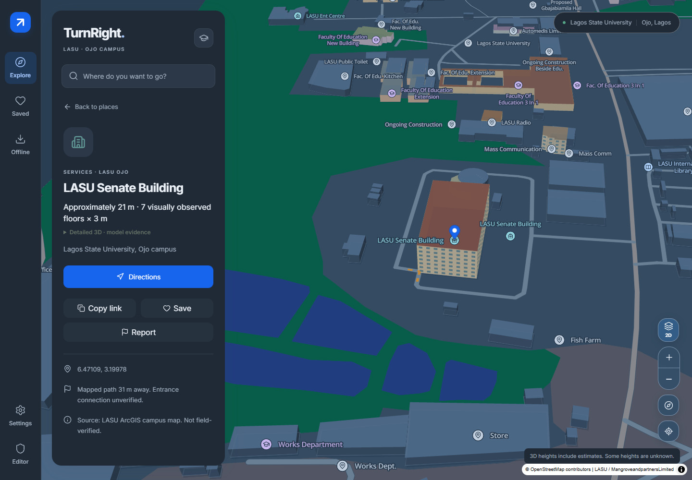
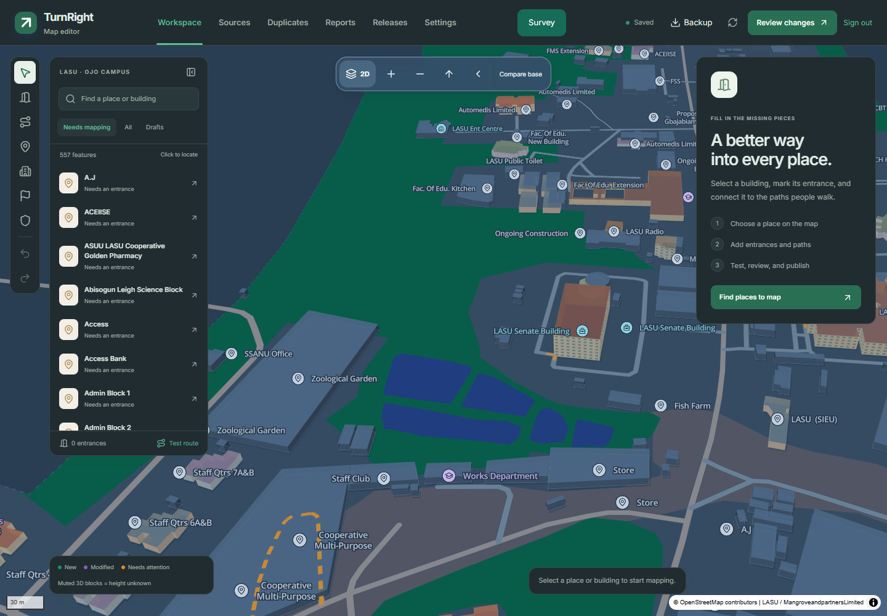
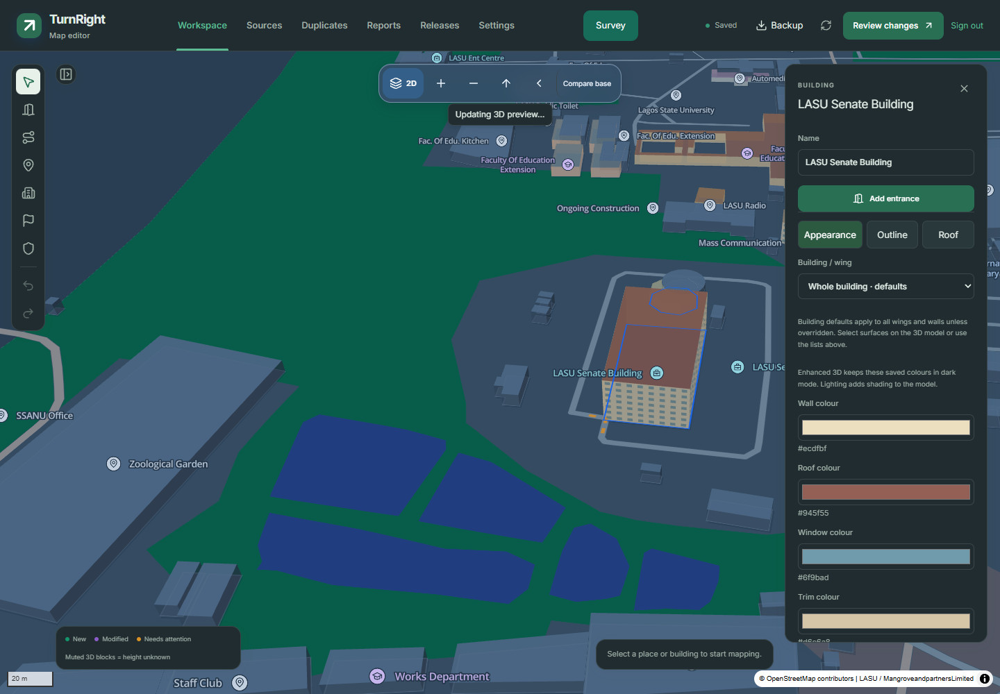
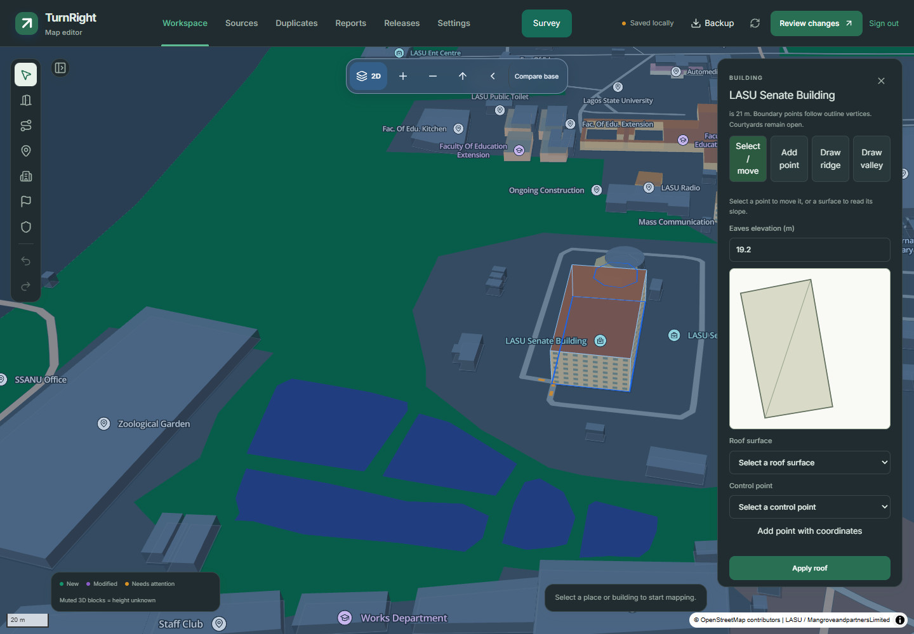
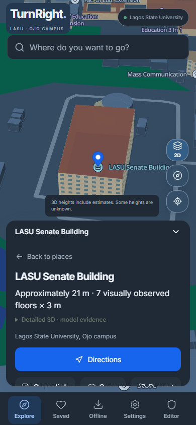
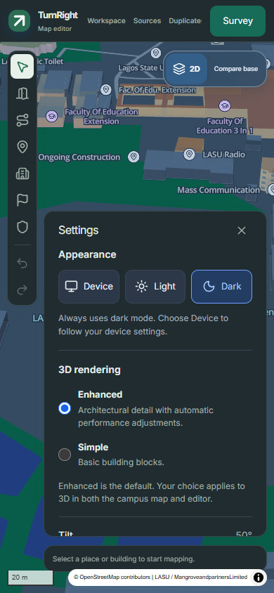
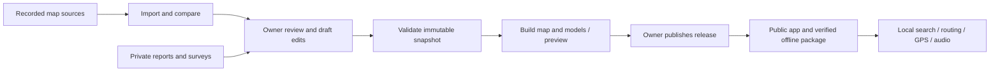

# TurnRight

**Find your way around LASU Ojo — online or offline.**

TurnRight is a campus walking-navigation PWA for Lagos State University, Ojo, with a private owner editor for maintaining paths, entrances, building appearances and reviewed releases. Search, routing, GPS processing and navigation audio run on the device.

[Open TurnRight](https://turnright.vercel.app/) · [Owner editor](https://turnright.vercel.app/admin) · [Deployment guide](docs/DEPLOYMENT.md) · [Report a software issue](https://github.com/mrglasswillbreak/TurnRight/issues)



> **Project status:** An independent, non-commercial personal project, not an official LASU service. Routes and modeled details combine recorded sources, reviewed corrections and explicitly illustrative estimates. Campus routes have **not been field-verified**. A mapped approach is not a confirmed building entrance, and missing steps information does not establish step-free access.

## Contents

- [Screenshots](#screenshots)
- [Features](#features)
- [Quick start](#quick-start)
- [Using the public map](#using-the-public-map)
- [Appearance and 3D](#appearance-and-3d)
- [Owner editor](#owner-editor)
- [Building appearance and roofs](#building-appearance-and-roofs)
- [Review and publication](#review-and-publication)
- [Walking surveys](#walking-surveys)
- [Offline operation and recovery](#offline-operation-and-recovery)
- [Map data and coverage](#map-data-and-coverage)
- [Architecture](#architecture)
- [Configuration and hosting](#configuration-and-hosting)
- [Development and verification](#development-and-verification)
- [Repository structure](#repository-structure)
- [Troubleshooting](#troubleshooting)
- [Documentation](#documentation)
- [Contributing and licensing](#contributing-and-licensing)

## Screenshots

**Owner workspace:** explore the campus, select features and review mapping work while keeping the map visible.



**Building inspector:** edit building, wing and wall appearances alongside the enhanced preview.



**Roof-plan editing:** review a wing outline, roof controls and elevations before applying a custom roof.



| Public destination details | Editor Settings |
| --- | --- |
|  |  |

Captured from the running application on **15 September 2026** using real MapLibre/Three.js rendering, checked-in campus geometry and local test fixtures for owner authentication and API responses. The roof draft is a demonstration; these captures contain no private owner reports or production draft changes. Phone images use browser emulation and do not establish physical-device acceptance. [Capture sources and reproduction](docs/assets/screenshots/README.md).

## Features

| Area | Current behavior |
| --- | --- |
| Exploration | Local place search, categories, aliases, saved places, recent selections, provenance, category badges and recorded street names. |
| Walking directions | Worker-based A* routing, the shortest permitted walk and up to two sufficiently different alternatives when available. Recorded steps are shown; missing data stays unknown. |
| Navigation | Foreground GPS, spoken maneuvers, remaining distance and ETA, manual origins, recentering, route following, sustained-deviation rerouting and arrival detection. |
| Destination sharing | Copy a stable place link or use native sharing; published aliases resolve old IDs and missing destinations offer a search fallback. |
| Appearance | Shared Device/Light/Dark settings in the public map and editor, a single opposite-action 2D/3D button, Enhanced by default and a remembered Simple option. |
| Enhanced buildings | Modeled walls, windows, trim, wings and roofs; original material colours in both themes, with automatic detail levels and simple fallback. |
| Owner editing | Autosave, grouped undo/redo, explicit connections, recoverable drawings and roof plans, guided repairs, duplicate review and field-level conflict resolution. |
| Building editing | Inherited building/wing/wall styles, stable surface identities, facade controls, roof presets, custom ridge/valley plans and immediate worker previews. |
| Offline | Verified, resumable package downloads, explicit updates, integrity repair, prepared owner workspaces and immediate local recovery exports. |
| Data maintenance | Source comparison, reference/roof proposals, validation, release-impact and route checks, immutable preview/publish/rollback. |
| Reports and surveys | Private student reports with local offline drafts; owner-only walking surveys, entrance markers, touch review and recoverable private sync. |

Driving, cycling, indoor positioning, satellite imagery, background navigation, public user accounts and public user reviews are outside this release.

## Quick start

Use **Node.js 22.13+ within the 22.x line**, npm, Git and a WebGL-capable browser. Python 3.12+ is needed for importer scripts and their tests.

```sh
git clone https://github.com/mrglasswillbreak/TurnRight.git
cd TurnRight/web
npm ci
npm run dev
```

Open the URL printed by Vite, normally [localhost:5173](http://localhost:5173). The bundled seed supports public exploration and route previews without API keys. The production campus can have newer owner-published corrections and models than this development seed.

To test the production PWA locally:

```sh
npm run build
npm run preview
```

Open [127.0.0.1:4173](http://127.0.0.1:4173), choose **Offline → Download campus map** and wait for readiness. Development mode does not provide the production service-worker lifecycle. Vite does not serve Vercel `/api` functions; connected administration and report submission require the configured hosted application. Browser tests supply isolated API fixtures.

## Using the public map

1. Search for a building, faculty or service, or narrow the map with a category.
2. Open its details to check provenance, walking coverage and any building evidence. Save, share or report the place.
3. Choose **Directions**, then a current-location or manual origin. Compare the available alternatives and connection notices.
4. Choose **Start walking**, allow location/audio and keep the application visible. Use mute, repeat, the instruction list and **Follow me** as needed.

Poor or stale GPS pauses maneuver progression. Rerouting requires sustained deviation to reduce false turns from jitter. Guidance ends at the mapped endpoint, which may be a nearby approach rather than an entrance.

Optional compass and motion assistance provides Travel-up, North-up and Phone-up orientation with GPS fallback. The purple cone is phone direction; the blue arrow is travel direction. Permissions are optional and can be retried from Settings. Motion hints are advisory: there is no step counting, dead reckoning or background navigation. Raw sensor readings remain in memory. [Sensor behavior and device checks](docs/MOTION.md).

## Appearance and 3D

**Settings → Appearance** is available in both the public map and owner editor:

| Option | Behavior |
| --- | --- |
| **Device** — default | Follows the device's light/dark preference and reacts to system changes. |
| **Light** | Keeps the interface and map light. |
| **Dark** | Uses dark panels, blue-grey terrain and streets, green vegetation and blue water. |

Explicit choices persist across reopening and synchronize between tabs on the same origin. Storage failure retains the choice for the current session and shows a message. Changing the theme keeps the mounted map, camera, selection, drawing and roof draft.

The map has **one view button**: **3D** switches into 3D; **2D** returns to 2D. There is no attached chevron. **Settings → 3D rendering** offers Enhanced and Simple; Enhanced is the default and an existing saved Simple choice is respected. Editor Settings also provides live **Tilt** in 3D and **Building opacity**.

Enhanced architecture retains its **original wall, window, roof and trim colours in both themes**, including older model packages and draft previews. Dark lighting adds neutral shading. Illustrative 2D footprints and Simple blocks use the slate palette. Material colour is separate from source evidence: a modeled detail is not necessarily a measured or photographed reconstruction.

Enhanced detail reduces at wider zooms and returns automatically on zooming in. Basic extrusions remain available where models are absent or unusable. Height evidence distinguishes measured/recorded heights, floor-based estimates and illustrative unknowns. [Rendering and dark styling](docs/DARK-MAP-STYLING.md).

## Owner editor

The [private editor](https://turnright.vercel.app/admin) requires the single allowlisted GitHub owner. Backend authorization and database policies protect drafts, reports, source proposals and releases.

- **Workspace:** select buildings, places, entrances or paths; edit properties, draw geometry, inspect mapping needs and test routes.
- **Sources:** compare imported records and their geometry, review reference-based appearance suggestions and inspect proposed roofs.
- **Settings:** change theme, 3D rendering, tilt and opacity without leaving unfinished work.
- **Reports and Releases:** review submitted issues and the release pipeline separately from live editing.

Autosave preserves draft edits. A continuous field interaction is one undo step; blur, Enter, selection changes or another command finish the group. Undo restores related geometry, surface identities and styles together. Drawing gestures are protected against accidental tool changes, and unfinished work can be resumed after reopening.

Errors offer the failed operation's recovery, such as **Retry save**, **Retry export**, **Retry route**, **Retry 3D preview** or renewed sign-in. Save failures and other task errors remain separate. Reads have bounded timeouts; a prepared owner workspace can be offered after network failure even when the browser claims to be online.

Conflict review compares base, local and server values. Independent field/surface changes merge; conflicting values need an explicit choice. Geometry changes and dependent connections or surface assignments are reviewed together.

Guided repairs select the affected feature and open the relevant control. Proposed geometry is previewed before **Apply reviewed repair**. Opening **Duplicates** makes no edit: review survivors, removals and redirected entrances before applying one undoable batch. [Editor guide](docs/EDITOR.md) · [Reliability and conflict handling](docs/EDITOR-RELIABILITY.md).

## Building appearance and roofs

Select a building to open **Appearance**, then choose the building, a wing or a wall through the inspector or model picking.

1. Set wall, roof, window and trim colours; window visibility/spacing; height or floors; supported roof form/pitch; and evidence notes.
2. Building defaults flow to wings and then walls. **Use inherited value** clears an individual override. Swatches show the resolved saved colours.
3. Use **Outline** for footprint editing. Stable part/ring/vertex/wall identities preserve styles through movement and reordering. Split walls inherit style; ambiguous joins or changed source geometry require reassignment or reset.
4. Use **Roof** for the selected wing. Draw ridge/valley constraints, move control points, enter elevations and inspect calculated surface slopes.
5. Review the result and choose **Apply roof** to commit one undoable change, or **Cancel roof** to restore the previous roof.

Roof plans store editable control points, constraints and boundary attachments, rather than generated triangles. Attached points follow footprint vertices; moving a wing moves its roof. The shared constrained triangulator preserves concave footprints and courtyards. Invalid constraints, incompatible elevations, degenerate surfaces and heights above the declared total block applying or publishing the affected roof.

Standard flat/hip/gable controls work on supported shapes. Window spacing accepts 0.5–20 m, with a 4 m default; supported standard pitch accepts 1–60° within the footprint and height limits. Custom roofs use point elevations. Unknown heights and approximate roof proposals remain explicitly illustrative.

Preview workers rebuild affected buildings after a short debounce, reject stale replies and retain the last valid preview on failure with **Retry 3D preview**. Selection does not hide enhanced models. Outline drawing, connection work and surveying suppress obstructing detail where needed. Settings and view changes preserve unfinished roof work.

Reference and roof batches require review; photographic support and inferred details are distinguished. They do not add unsupported paths, furniture or surveyed-height claims. [Building editor](docs/BUILDING-EDITOR.md) · [Roof plans](docs/BUILDING-ROOFS.md) · [Reference research](docs/BUILDING-REFERENCE-RESEARCH.md).

## Review and publication

**Saving a draft and deploying application code do not publish campus changes.**

1. Import source candidates with **Check now** or the scheduled source job. Incomplete imports retain the last successful source set.
2. Compare property rows and before/after geometry; raw records remain under Details. Review baseline reconciliation when approved sources differ from a published baseline.
3. Resolve blocking validation issues and inspect release impact: added/changed/deleted features, entrance and connectivity changes, and Clinic–Senate, Clinic–Law and Clinic–Library route results.
4. **Build review preview** flushes pending saves and creates an immutable release snapshot. The release worker independently validates it and regenerates the visual catalogue/sectors with the same building and roof rules as the editor.
5. Review the hosted preview, then use the owner's **Publish** action. Publication is recorded only after deployment/promotion succeeds. Keep the previous release for rollback.

Job status refreshes while its review panel is open. Publication and job submissions are checked before repetition; a failed action is not treated as published. Closures remain active until explicitly reopened and republished; an expected reopening date is only a review flag.

| Workflow | Purpose |
| --- | --- |
| `source-update.yml` | Daily/on-demand source import and comparison |
| `release.yml` | Reviewed preview, publication and rollback |
| `preview.yml` | Manual seed-based preview deployment |
| `bootstrap.yml` | Initial accepted source baseline without overwriting an existing baseline |

For local source candidates, run `python scripts/import_campus.py --download --output data/candidates` from the repository root. `node scripts/package.mjs` builds the seed package for development. Neither replaces the reviewed production release workflow.

## Walking surveys

On an owner phone session, choose **Survey** and prepare it online before a field visit. The workflow is **record → mark entrances → finish → adjust/connect → save survey → apply to map draft**.

Recording uses foreground GPS in north-up 2D. Pause/resume is explicit; backgrounding or reopening requires Resume. Stale fixes, implausible jumps and poor accuracy are excluded. Gaps remain separate sections. Entrance placement pauses for a deliberate building/place association.

Review supports trimming, splitting, vertex movement and explicit endpoint connections. Correcting an existing path retains geometry outside the selected section and preserves boundary junctions and metadata. Paths crossing at the same level connect automatically. Each path has **Connect crossings automatically** and **Crossing level** controls; bridges, tunnels, restrictions and missing gate spans remain separate where appropriate. See [connection controls](docs/EDITOR.md#control-automatic-connections).

Local recordings are owner-scoped and recoverable. Private sync preserves conflicting versions for review; raw sample tracks and timestamps are excluded from public packages. Field verification on physical Android and iPhone remains outstanding. [Survey guide and field record](docs/SURVEY.md).

## Offline operation and recovery

An initial online visit and a completed download are required. Installation and download are separate: use the browser's install/Add to Home Screen action, then download the campus package.

| Content | Storage / behavior |
| --- | --- |
| App shell, UI, fonts, map/model/routing workers | Service-worker precache |
| Campus geometry, routing, glyphs, audio, visual catalogue and model sectors | Size/hash-verified CacheStorage assets with IndexedDB package records |
| Preferences, saved places, private editor/survey recovery and report drafts | Local browser storage, scoped where appropriate |

Downloads are resumable and activate atomically after integrity checks. Interrupted or corrupt updates retain the working package and can reuse valid assets. **Offline** shows the actual downloaded version, coverage and model readiness. A known newer map requires an explicit download; it waits to activate during navigation. **Settings → Install update** activates a waiting application update with editing/navigation safeguards.

**Download local recovery** immediately exports the owner workspace without waiting for the server, including pending edits, unfinished geometry/roof work, undo history, save receipts and baseline information. Full server backup export is a separate online operation. Prepare an owner workspace online before relying on offline reopening.

Storage can be evicted or unavailable. Keep recovery exports for important work; do not clear site storage while unsynchronized work is pending. Offline reports remain drafts until explicitly submitted. Offline closures are only as current as the downloaded package.

## Map data and coverage

TurnRight combines OpenStreetMap and permitted LASU ArcGIS layers with reviewed owner corrections. Source IDs, access tags and provenance remain available. No external tile service or satellite imagery is required.

The repository seed is **`lasu-4e4c8008b38b`**. A verified production snapshot on 15 September 2026 was **`lasu-2f6ca683a0fb`**, with **45 assets / 4,798,173 bytes**, including the owner's roof release. The live/downloaded version can advance independently; the app's Offline screen is authoritative for the user's installed package.

Seed coverage is a reproducible baseline, not a claim about later owner releases:

| Seed metric | Value |
| --- | --- |
| Source place records, including duplicates | 219 |
| Places with a mapped approach | 206 |
| Approaches on the largest path component | 201 |
| Places without an approach | 13 |
| Confirmed connected entrances | 0 |
| Walking graph components | 5 |
| Campus field verification | Pending |

A mapped approach uses existing paths near the destination, without inventing the final connection. Reviewed student-access corrections permit specified internal roads, the Faculty of Law driveway and International Library gate; other restrictions, barriers, parking aisles and closures remain in force. Visual appearance changes do not modify routing.

The roof assessment covered 380 footprints and proposed 46 wing roofs across 44 buildings; most are illustrative, with photographic support for three building forms. This is a dated assessment, not a guarantee that every building has an accurate model. [Coverage and access](docs/CAMPUS-ACCESS.md) · [Machine-readable seed coverage](data/coverage-report.json) · [Roof coverage](docs/BUILDING-ROOF-COVERAGE.md).

## Architecture

| Layer | Technology / responsibility |
| --- | --- |
| UI | React 19, TypeScript, Vite 8, Tailwind CSS 4, shadcn/Base UI |
| Map and geometry | MapLibre GL JS 6; packaged GeoJSON, Terra Draw and explicit graph connections |
| Architecture rendering | Three.js in the shared WebGL context; sector loading, material caching, detail levels and fallback |
| Building generation | Shared worker/release mesh rules; Delaunator with Constrainautor for custom roofs |
| Routing | Dedicated worker, A* and bounded alternatives |
| Offline | Workbox, `vite-plugin-pwa`, IndexedDB and CacheStorage |
| Audio and sensors | Packaged Web Audio clips, optional local speech, foreground GPS and optional motion/orientation |
| Administration | Supabase Auth/PostgreSQL/PostGIS, RLS and single-owner API authorization |
| Hosting/jobs | Vercel application/API; GitHub Actions with Python and Node scripts |



Published navigation does not require the admin database to be available. Model appearance and optional recovery fields use existing JSON properties; source geometry and routing remain separate from display classifications. [Architecture details](docs/ARCHITECTURE.md).

## Configuration and hosting

Public seed exploration requires no credentials. Connected administration/reports need [web/.env.example](web/.env.example), Supabase GitHub OAuth, the owner allowlist, database migrations and workflow configuration.

Apply the migrations in order through **[006_reconciliation_safe_updates.sql](supabase/migrations/006_reconciliation_safe_updates.sql)**. They include private surveys and safe baseline reconciliation. Follow the deployment guide's base setup and the reconciliation notes in the production record.

| Variables | Scope |
| --- | --- |
| `VITE_SUPABASE_URL`, `VITE_SUPABASE_ANON_KEY` | Browser-visible authentication URL and public key |
| `SUPABASE_URL`, `SUPABASE_SERVICE_ROLE_KEY`, `ADMIN_USER_ID` | Server-only database access and owner identity |
| `GITHUB_REPOSITORY`, `GITHUB_WORKFLOW_TOKEN` | Server-side workflow dispatch |
| `REPORT_RATE_SALT` | Server-only report rate-limit buckets |
| `SOURCE_REDISTRIBUTION_APPROVED` | Build-time source-rights gate |
| `PUBLISHED_MAP_URL` | Stable HTTPS origin whose approved package ordinary app builds preserve |

Do not put privileged keys in `VITE_` variables or commit real environment files. Additional GitHub Actions deployment secrets are listed in [DEPLOYMENT.md](docs/DEPLOYMENT.md).

Vercel uses **`web` as the project root**, **Node 22**, **`npm run build`** and **`dist`** output, with repository files outside the root available. Main-branch code changes deploy the application. `PUBLISHED_MAP_URL` fetches and verifies the currently published package so a UI deployment cannot silently revert it to the seed; failure stops the build. Owner-reviewed releases use their immutable snapshot instead.

The project is configured on Vercel Hobby and Supabase Free. Hosting quotas or paused backend services can interrupt connected operations; already downloaded navigation remains local. See [configuration](docs/CONFIGURATION.md) and [production history](docs/PRODUCTION.md).

## Development and verification

Run from `web/`:

```sh
npm test
npm run lint
npm run build
npx playwright install chromium webkit
npm run test:browser
npm run test:survey-webkit
npm run test:survey-pwa
```

`lint` includes client/server TypeScript checks. The production build includes the PWA and existing visual budgets: **300 KB gzip for the lazy renderer**, **12 MB per model sector**. The WebKit and PWA scripts retain their historical survey names but also cover editor/building workflows. Run browser projects sequentially on machines using software WebGL.

Focused checks for these UI changes:

```sh
npx playwright test --grep "enhanced zoom restores|view settings"
npx playwright test --config playwright.webkit.config.ts --grep "enhanced zoom restores|view settings phone"
```

Importer/access tests run from the repository root:

```sh
python -m unittest discover -s scripts/tests -v
```

Coverage includes source normalization, appearance persistence/storage failures, grouped undo, save receipts, concurrent field/surface edits, geometry identity, constrained roofs, editor/release parity, drawing/roof recovery, worker failure/stale replies, package integrity and offline reopening. Browser tests use real map/rendering libraries with isolated authentication, API and hardware fixtures. Enhanced zoom cases inspect actual shader material colours and draw calls, including legacy meshes and repeated theme/zoom changes.

On 15 September 2026, **303 unit tests** passed. Acceptance records separate automated/browser checks from unfinished physical work: Android/iPhone touch repairs, installation, airplane-mode reopening, outdoor GPS, campus walks, battery behavior and modest-phone performance. Do not interpret a software WebGL timing or emulated phone screenshot as a completed physical-device test.

## Repository structure

```text
TurnRight/
├── web/
│   ├── src/                 # Public UI, editor, map, buildings, routing and storage
│   │   ├── AppearanceSettings.tsx # Shared public/editor theme control
│   │   ├── campus-model-layer.ts # Enhanced rendering and model lifecycle
│   │   └── sw.ts            # Application service worker
│   ├── api/                 # Vercel admin and report endpoints
│   ├── server/              # Server-only validation and authorization
│   ├── tests/               # Unit, browser and offline regression coverage
│   ├── public/              # Development seed and packaged static assets
│   └── .env.example         # Configuration names without credentials
├── data/                    # Sources, visuals, reference/roof assessments and attribution
├── scripts/                 # Import, compare, validate, package and release jobs
├── supabase/migrations/     # Database schema, policies and reconciliation
├── .github/workflows/       # Source and release automation
└── docs/                    # Workflow guides, acceptance records and screenshots
```

## Troubleshooting

| Symptom | What to do |
| --- | --- |
| Models look like basic blocks | Check **Settings → 3D rendering → Enhanced**, then zoom closer. Inspect the model status or retry failed assets. Some footprints have no enhanced model. |
| Building colours look different in dark mode | Enhanced models retain saved colours with lighting/shadows; Simple blocks and 2D footprints use slate styling. Install a waiting app update if enhanced materials still appear slate. |
| Editor stays in the wrong theme | Use **Editor Settings → Appearance → Light/Dark**, or **Device** to resume automatic changes. |
| A roof preview is outdated | Use **Retry 3D preview** and inspect geometry/elevation errors. The last valid model and unfinished roof are retained. |
| Draft changes are absent from the public map | Autosave stores a private draft. Review, validate, build a preview and publish through Releases; a code push alone does not publish it. |
| Publish/preview is unavailable | Resolve blocking validation or reconciliation issues, pending saves and conflicts. Inspect job errors and the release state; do not repeat an uncertain submission blindly. |
| Save/export/routing failed | Use the operation-specific retry. Renew an expired session if requested. **Download local recovery** remains independent of server export. |
| No walking connection to a destination | Review the actual missing path/entrance or disconnected component. Do not create assumed shortcuts or remove access restrictions globally. |
| Offline reopening fails | Use a production PWA, finish preparation/download, verify readiness and use integrity repair. Preserve unsynced recovery before changing storage. |
| Location or compass is unavailable | Use HTTPS, allow the relevant permissions and keep the app visible. Manual origins and GPS-only operation remain available. |
| Survey has gaps or paused | Review accuracy and interruptions, then Resume explicitly. Rewalk missing sections; gaps are not automatically connected. |
| Local admin/report API fails | Vite does not host Vercel functions. Use a configured hosted environment and verify OAuth, variables and owner authorization. |

## Documentation

| Guide | Topics |
| --- | --- |
| [Editor](docs/EDITOR.md) / [Reliability](docs/EDITOR-RELIABILITY.md) | Drawing, connections, recovery, conflict and operation-specific errors |
| [Building editor](docs/BUILDING-EDITOR.md) | Wing/wall inheritance, identity, controls and preview lifecycle |
| [Roof plans](docs/BUILDING-ROOFS.md) / [Roof coverage](docs/BUILDING-ROOF-COVERAGE.md) | Constraints, validation, approximate proposals and evidence |
| [Building references](docs/BUILDING-REFERENCE-RESEARCH.md) / [Appearance coverage](docs/BUILDING-APPEARANCE-COVERAGE.md) | Reference sources, uncertainty and facade assessments |
| [Dark map](docs/DARK-MAP-STYLING.md) / [UI readability](docs/DARK-MODE-READABILITY.md) | Palette, original enhanced materials, labels, controls and contrast |
| [Surveys](docs/SURVEY.md) / [Motion](docs/MOTION.md) | Recording, private evidence, permissions and field checks |
| [Architecture](docs/ARCHITECTURE.md) / [Miniature campus](docs/MINIATURE-CAMPUS.md) | Data boundaries, routing, storage and model packages |
| [Deployment](docs/DEPLOYMENT.md) / [Configuration](docs/CONFIGURATION.md) / [Production](docs/PRODUCTION.md) | Service setup and operational history |
| [Acceptance](docs/ACCEPTANCE.md) | Automated evidence and outstanding physical checks |
| [Campus access](docs/CAMPUS-ACCESS.md) / [Connection review](docs/CONNECTION-REVIEW.md) | Approved walking corrections and remaining gaps |
| [Attribution](data/ATTRIBUTION.md) / [Overture audit](docs/OVERTURE-COMPARISON.md) | Provenance, permissions and source comparisons |

## Contributing and licensing

Use GitHub issues for reproducible software defects or feature proposals; include browser/device, app/package version, steps and expected behavior. Use in-app reports for campus places and paths. Keep changes focused, run relevant checks and include screenshots for UI changes. Map contributions need identity, provenance, redistribution permission and evidence for connections/access. Mark unsurveyed details explicitly. Never commit credentials, private reports or raw owner recordings.

- **OpenStreetMap:** © OpenStreetMap contributors, ODbL 1.0. The package includes OSM-derived data. [Attribution and license](https://www.openstreetmap.org/copyright).
- **LASU ArcGIS:** MangroveandpartnersLimited. The owner recorded offline redistribution permission on 8 September 2026; the public item supplied no explicit redistribution license. That confirmation is recorded in [ATTRIBUTION.md](data/ATTRIBUTION.md), not a general grant for unrelated uses.
- **Fonts/audio:** Inter uses the SIL Open Font License; Open Sans map glyphs use Apache 2.0. Packaged navigation recordings were generated locally; provenance and regeneration details are in the attribution record.
- **Reference images:** Linked evidence and supplied visual inspiration do not establish redistribution rights or surveyed building accuracy. The README contains application screenshots, not copied reference photography.

No standalone license has been selected for TurnRight's own source code. Do not assume an MIT or Apache license; dependencies and datasets retain their respective terms. No Google Maps content, satellite imagery or remotely hosted rendered map tiles are bundled.
