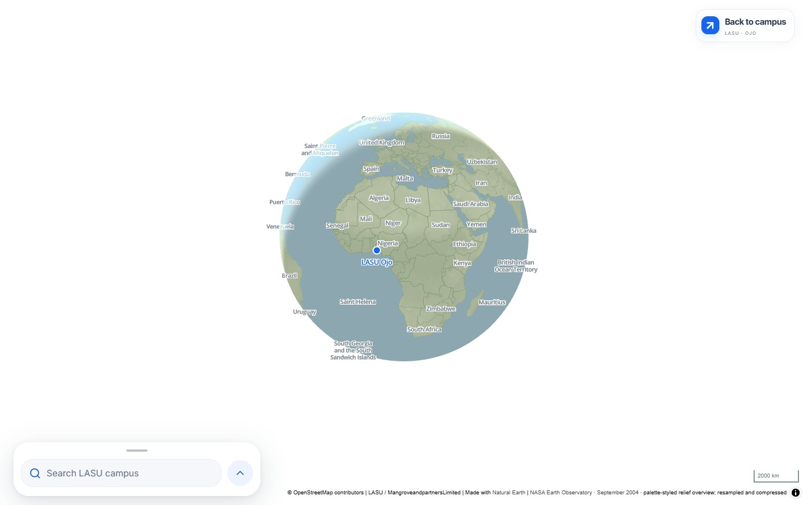
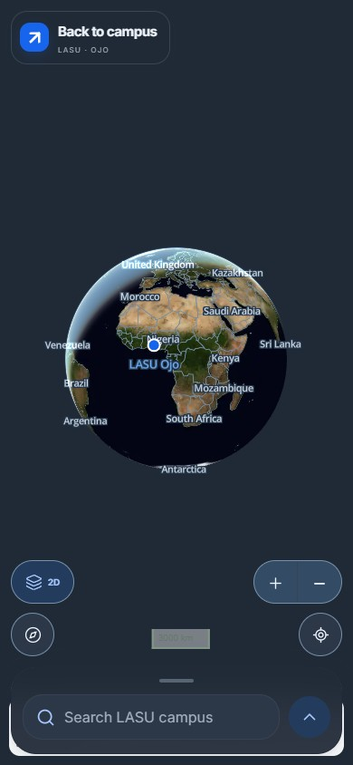
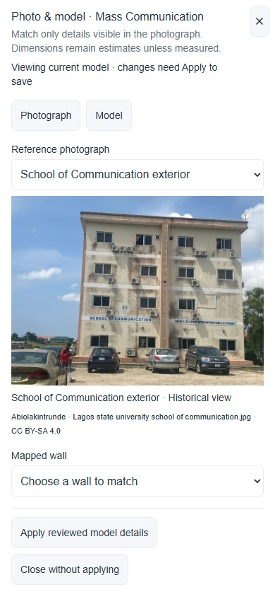
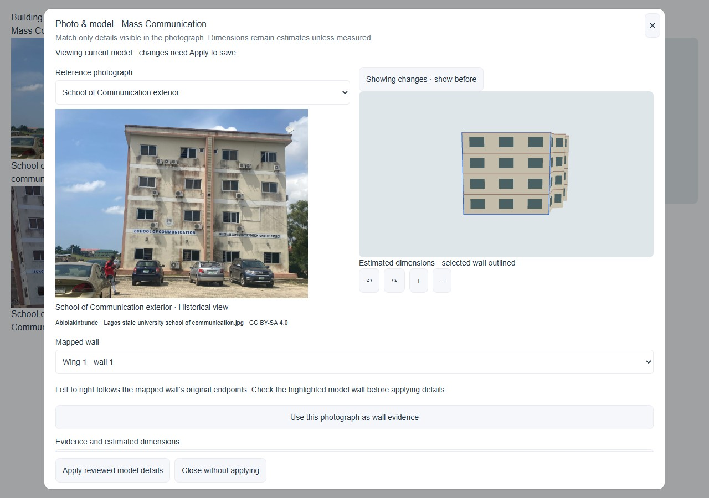
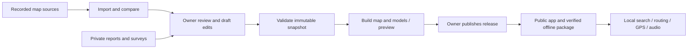

# TurnRight

**Find your way around LASU Ojo — online or offline.**

TurnRight is a campus walking and driving navigation PWA for Lagos State University, Ojo, with a private owner editor for maintaining paths, entrances, building appearances and reviewed releases. Search, routing, GPS processing and navigation audio run on the device.

[Open TurnRight](https://turnright.vercel.app/) · [Owner editor](https://turnright.vercel.app/admin) · [Deployment guide](docs/DEPLOYMENT.md) · [Report a software issue](https://github.com/mrglasswillbreak/TurnRight/issues)



> **Project status:** An independent, non-commercial personal project, not an official LASU service. Routes and modeled details combine recorded sources, reviewed corrections and explicitly illustrative estimates. Campus routes have **not been field-verified**. A mapped approach is not a confirmed building entrance, and missing steps information does not establish step-free access.

## Contents

- [Screenshots](#screenshots)
- [Recent changes](#recent-changes)
- [Features](#features)
- [Quick start](#quick-start)
- [Using the public map](#using-the-public-map)
- [Driving on campus](#driving-on-campus)
- [Entrance guides and photographs](#entrance-guides-and-photographs)
- [Appearance and 3D](#appearance-and-3d)
- [Owner editor](#owner-editor)
- [Building appearance and roofs](#building-appearance-and-roofs)
- [Review and publication](#review-and-publication)
- [Walking surveys](#walking-surveys)
- [Offline operation and recovery](#offline-operation-and-recovery)
- [Map data and coverage](#map-data-and-coverage)
- [Architecture](#architecture)
- [Configuration and hosting](#configuration-and-hosting)
- [Development and verification](#development-and-verification)
- [Repository structure](#repository-structure)
- [Troubleshooting](#troubleshooting)
- [Documentation](#documentation)
- [Contributing and licensing](#contributing-and-licensing)

## Screenshots

Captured **24 September 2026** from production builds using the verified public campus snapshot **`lasu-8577d5c85d2c`**. The globe captures show the real public application. Photo/model captures use the real workspace in an isolated fixture; no production drafts or private account information appear. Phone views are responsive browser simulations, not physical-device tests.

| Realistic globe · mobile Dark mode | Photo & model · mobile |
| --- | --- |
|  |  |

**Photo & model on desktop:** compare the published photograph with the model, choose a mapped wall and review architectural details. Dimensions and unseen elevations remain estimates.



The building inspector now places its **photo preview and Manage photos controls at the top**, directly below the building title. [All 19 building comparisons and evidence gaps](docs/PHOTO-MODEL-COVERAGE.md) · [Capture sources and reproduction](docs/assets/screenshots/README.md). Previous interface captures remain documented there.

## Recent changes

The 24 September visual update adds a **Photo & model** workspace, framed building openings, reviewed façade details and optional photographic textures. The reviewed 19-building batch is published as **`lasu-313d8a168635`**, covering all photographed buildings in the 395-building map, using 39 photographs and preserving owner roofs and colours. Dimensions and unseen sides remain estimates; uncertain wall/photo matches require review. No photographic wall textures are approved in this initial release. [Evidence, owner workflow and comparisons](docs/PHOTO-MODELS.md).

The offline globe now bundles the September 2004 **NASA Blue Marble** shaded-relief overview with Natural Earth coastlines, lakes, borders and labels, plus MapLibre atmosphere. It fades into the campus map as you zoom in. The dated imagery is an overview, not current street coverage. Globe and campus visual assets retain separate 8 MiB and 12 MiB limits. The guided editor met the measured input targets; software-GPU map movement remains slow and is documented in the [verification report](docs/PHOTO-MODEL-VERIFICATION.md).

The 23 September update adds [entrance guides and offline building galleries](docs/ARRIVAL-GUIDES.md), explicit entrance selection, recorded accessibility observations and private owner photo review. The [campus-wide photograph inventory](data/photos/README.md) accounts for every candidate in its documented source snapshots; only verified, reusable building matches are included.

The initial researched collection contained **21 photographs for 13 of 420 buildings**. After owner uploads and reviewed building consolidation, the 24 September published snapshot contains **39 photographs for 19 of 395 buildings**. Every approved release photograph is included in the campus download with its credits. Entrance and mapped-approach popups now use theme-aware text, backgrounds, pointers and close controls, including in Dark mode.

The photo editor now has a visual **Manage photos** workspace with multiple uploads, individual retries, guided source/author review, cover ordering, an offline-compatible public preview and private recovery. Migration 010 and schema-3 readers are deployed; new photographs still publish through owner release review.

Photo uploads continue while the editor session remains open, including after closing the dialog or changing buildings. The persistent upload indicator offers **Pause uploads**, which finishes the current file first. Galleries and private uploads use 20-item pages; owner-scoped IndexedDB recovery preserves unfinished details. The installed map opens after its campus data verifies, while **Checking downloaded files…** audits the remaining assets. See [performance measurements and verification](docs/PERFORMANCE.md).

The 17–18 September updates include:

- **Natural offline directions:** a built-in British female voice, complete turn sentences, mapped destination/road names, speed-aware turn timing, close-turn combinations and clearer GPS/rerouting messages. Preview it in Settings. [Voice maintenance and checks](docs/VOICE.md).

- **Offline globe:** the public map now zooms out to a full planet with land, oceans, country borders and names. A 5.30 MiB dated NASA/Natural Earth overview is saved with the app, works in both themes and returns smoothly to campus. The editor remains campus-focused.
- **More map space:** a compact bottom search bar, mobile controls arranged on both sides, and adjustable cards/dialogs. Desktop panels open at full height, then keep the size you choose while you use search. Explore, Saved, Offline, Settings and Editor stay visible as panel content scrolls; desktop map controls stay pinned too.
- **Visible app updates:** an update-ready notice on the public map, with an explicit install action that is disabled during navigation. Campus-package updates remain a separate Offline Maps operation.
- **Gentler editor selection:** selecting an object animates it into the exposed map. Long paths on phones zoom out by at most 0.75 levels and keep the tapped stretch, or the stretch nearest the current view, visible. Closing properties restores the earlier view.
- **Connected paths with exceptions:** drawn and surveyed paths can join actual same-level crossings automatically. Per-path crossing controls, bridge/tunnel levels and explicit joins let the owner decide where connections belong.
- **Drafts relative to publication:** pending changes and highlights compare with the latest published map, while published corrections remain stored for later source reconciliation.

These are application/editor changes. Public routing changes only after the owner reviews and publishes the corresponding campus map release.

## Features

| Area | Current behavior |
| --- | --- |
| Exploration | Bottom search dock, local place search, categories, aliases, saved/recent places, provenance and recorded street names. |
| Map controls and panels | Adjustable mobile/desktop cards and dialogs; full-height desktop opening; pinned navigation; view/compass controls on the left and zoom/location on the right. |
| World overview | Natural-colour September 2004 NASA imagery, shaded relief, atmosphere, Natural Earth coastlines/lakes/borders, offline labels and a return-to-campus action. |
| App updates | Visible update-ready notice, explicit installation, foreground/online checks and navigation safeguards. |
| Driving directions | Offline campus drive-and-walk journeys, vehicle permissions and one-way roads, turn restrictions, estimated ETA, parking selection, voice guidance, and a confirmed parking-to-walking handoff. Private roads and parking require separate owner driving review. |
| Walking directions | Worker-based A* routing, the shortest permitted walk and up to two sufficiently different alternatives when available. Recorded steps are shown; missing data stays unknown. |
| Navigation | Foreground GPS, natural offline British English voice, balanced turn timing, close-turn combinations, mapped names, remaining distance/ETA, route following, sustained-deviation rerouting and three-fix arrival confirmation. |
| Entrance guides | Best mapped entrance by default, optional explicit connected entrance, recorded approach/restriction/accessibility facts and a guide available during navigation and arrival. |
| Building photographs | Shared occupant galleries, entrance-specific photos and offline credits; a visual owner workspace handles multiple uploads, guided rights review, ordering and private recovery. All approved photos are downloaded. |
| Destination sharing | Copy a stable place link with an optional entrance ID or use native sharing; published aliases resolve old IDs and missing destinations offer a search fallback. |
| Appearance | Shared Device/Light/Dark settings in the public map and editor, a single opposite-action 2D/3D button, Enhanced by default and a remembered Simple option. |
| Enhanced buildings | Modeled walls, windows, trim, wings and roofs; original material colours in both themes, with automatic detail levels and simple fallback. |
| Owner editing | Autosave, grouped undo/redo, controlled automatic crossings and explicit joins, selection framing, publication-relative drafts, recoverable drawings/roof plans, guided repairs and conflicts. |
| Building editing | Inherited building/wing/wall styles, stable surface identities, facade controls, roof presets, custom ridge/valley plans and immediate worker previews. |
| Offline | Verified, resumable package downloads, explicit updates, integrity repair, prepared owner workspaces and immediate local recovery exports. |
| Data maintenance | Source comparison, reference/roof proposals, validation, release-impact and route checks, immutable preview/publish/rollback. |
| Reports and surveys | Private student reports with local offline drafts; owner-only walking surveys, entrance markers, touch review and recoverable private sync. |

Cycling, indoor positioning, current campus satellite imagery, background navigation, public user accounts and public user reviews are outside this release.

## Quick start

Use **Node.js 22.13+ within the 22.x line**, npm, Git and a WebGL-capable browser. Python 3.12+ is needed for importer scripts and their tests.

```sh
git clone https://github.com/mrglasswillbreak/TurnRight.git
cd TurnRight/web
npm ci
npm run dev
```

Open the URL printed by Vite, normally [localhost:5173](http://localhost:5173). The bundled seed supports public exploration and route previews without API keys. The production campus can have newer owner-published corrections and models than this development seed.

To test the production PWA locally:

```sh
npm run build
npm run preview
```

Open [127.0.0.1:4173](http://127.0.0.1:4173), choose **Offline → Download campus map** and wait for readiness. Development mode does not provide the production service-worker lifecycle. Vite does not serve Vercel `/api` functions; connected administration and report submission require the configured hosted application. Browser tests supply isolated API fixtures.

## Using the public map

The public map opens with a compact search bar at the bottom. Tap the search field or the arrow to open Explore, Saved, Offline and Settings. On desktop, panels and dialogs open at full height and can then be shortened with their top handle. Navigation and map controls stay pinned above the panel’s scrolling content. On mobile, view and compass controls sit on the left of the map, with zoom and location controls on the right. Drag the handle at the top of a card or dialog to change its height. Your chosen mobile heights are remembered on this device. With a keyboard, focus the handle and use Up/Down, Home or End. Collapse the card to see more of the map, including during a walk.

Zoom out with the minus button or a pinch/scroll gesture to reveal the globe. Drag to explore and use **Back to campus**, the **LASU Ojo** marker or a campus search result to return. The globe works with either 2D/3D preference; detailed buildings return at campus zoom. **Follow me** restores walking zoom after globe exploration without ending an active route. World geography is an overview only: place search, streets and walking directions remain limited to the downloaded campus.

When a new app version is ready, a notice appears over the public map with an **Install update** button. Updates are checked while the app is visible and when you return online. Installation waits until you finish navigation. You can also install from Settings.

1. Search for a building, faculty or service, or narrow the map with a category.
2. Open its details to check provenance, photographs, entrances and route coverage. Save, share or report the place.
3. Choose **Directions**, Walking or Driving + walking, and a current-location or manual origin. Review the destination entrance, any parking choice, alternatives and connection notices.
4. Start the available journey, allow location/audio and keep the application visible. Use mute, repeat, the instruction list and **Follow me** as needed. Driving requires a confirmed parking-to-walking handoff.

Voice directions use complete prerecorded sentences. Advance warnings adapt to recent walking speed (30–60 m); immediate turns need good location accuracy. Consecutive turns within 25 m are combined. Repeat describes the current state, including GPS loss or arrival. Muting, stopping and backgrounding cancel speech. New or renamed places without a recording keep their visible names and receive generic speech. **Settings → Preview voice directions** plays a sample outside navigation.

Poor or stale GPS pauses maneuver progression. Changing paths can trigger rerouting after sustained deviation with a sufficiently accurate fix; a nearby parallel path may remain inside the GPS tolerance and does not guarantee an immediate switch. The current rule needs eight seconds off-route, accuracy of 35 m or better, and at least 15 seconds between recalculations. Guidance ends at the mapped endpoint, which may be a nearby approach rather than an entrance. [Routing thresholds and limitations](docs/EDITOR.md).

Optional compass and motion assistance provides Travel-up, North-up and Phone-up orientation with GPS fallback. The purple cone is phone direction; the blue arrow is travel direction. Permissions are optional and can be retried from Settings. Motion hints are advisory: there is no step counting, dead reckoning or background navigation. Raw sensor readings remain in memory. [Sensor behavior and device checks](docs/MOTION.md).

## Driving on campus

Choose **Directions → Travel mode → Driving + walking**. Select a starting place or your current location, then use the suggested parking/drop-off point or choose another mapped point. Purple shows the driving leg; blue shows the walking leg. Total journey estimates combine both legs and do not include live traffic, parking search, or occupancy.

Keep the app visible. At the mapped vehicle endpoint, stop and park, then choose **Parked—start walking**. Driving reroutes retain the chosen parking point. The app never substitutes walking permission for vehicle access or draws an assumed connection across an unmapped gap.

The bundled map includes source-derived vehicle rules, but private campus roads and parking connections await owner driving review. An unavailable driving journey is expected until permitted roads, gates, parking and walking links are connected and published. Existing walking-only packages continue to work; update the campus package to obtain driving data. [Driving data, owner workflow and verification](docs/DRIVING.md).

## Entrance guides and photographs

Open a destination's **Building photographs** and **Entrances & arrival** sections. Galleries show distinct reviewed views, captions, historical labels, recorded capture dates and source-check dates. **Photo credits & license** contains the author, original source, reuse license and modification notices. Occupants share their building's photographs without downloading duplicate assets; a general building photograph does not identify every occupant's doorway.

**Destination entrance** defaults to **Best mapped entrance**. Where permitted, connected entrances exist, choose one explicitly. That choice survives alternatives, rerouting and driving-to-walking transitions. A closed, missing or disconnected selection requires another choice. Shared links can include `entrance=<stable-id>`; existing place-only links continue to work.

The map distinguishes connected entrances, unconfirmed connections and mapped approaches. **Mapped approach …; final entrance not verified** means the route ends on a mapped path near the destination. It does not confirm a doorway connection. Recorded steps, ramps, surfaces and measured doorway widths remain observations, with unknown details left unknown; no accessible-route guarantee is implied.

The building inspector shows its gallery preview and **Manage photos** button at the top. Owners edit arrival guides separately from this photo workspace. Add multiple files, review large previews, choose **I took this photo** or an external source, arrange the cover and gallery, and recover unfinished work in **Private uploads**. Reviewed photos attach to the map draft in an undoable batch; public-gallery preview and release publication remain separate. Original uploads and reviewer records remain private. Published derivatives are metadata-free WebP files, at most 1,600 pixels on the longest side and 250 KiB each. Moving an entrance flags its guide and photographs for review. Photos never grant access or create routing connections. [Guide, media review and offline behavior](docs/ARRIVAL-GUIDES.md) · [Collection coverage and candidate decisions](data/photos/README.md).

## Appearance and 3D

**Settings → Appearance** is available in both the public map and owner editor:

| Option | Behavior |
| --- | --- |
| **Device** — default | Follows the device's light/dark preference and reacts to system changes. |
| **Light** | Keeps the interface and map light. |
| **Dark** | Uses dark panels, blue-grey terrain and streets, green vegetation and blue water. |

Explicit choices persist across reopening and synchronize between tabs on the same origin. Storage failure retains the choice for the current session and shows a message. Changing the theme keeps the mounted map, camera, selection, drawing and roof draft.

Entrance and mapped-approach popup text, background, pointer and close button follow the active theme, including while a popup is open.

The map has **one view button**: **3D** switches into 3D; **2D** returns to 2D. There is no attached chevron. **Settings → 3D rendering** offers Enhanced and Simple; Enhanced is the default and an existing saved Simple choice is respected. Editor Settings also provides live **Tilt** in 3D and **Building opacity**.

Enhanced architecture retains its **original wall, window, roof and trim colours in both themes**, including older model packages and draft previews. Dark lighting adds neutral shading. Illustrative 2D footprints and Simple blocks use the slate palette. Material colour is separate from source evidence: a modeled detail is not necessarily a measured or photographed reconstruction.

Enhanced detail reduces at wider zooms and returns automatically on zooming in. Basic extrusions remain available where models are absent or unusable. Height evidence distinguishes measured/recorded heights, floor-based estimates and illustrative unknowns. [Rendering and dark styling](docs/DARK-MAP-STYLING.md).

## Owner editor

The [private editor](https://turnright.vercel.app/admin) requires the single allowlisted GitHub owner. Backend authorization and database policies protect drafts, reports, source proposals and releases.

- **Workspace:** select buildings, places, entrances or paths; edit properties, draw geometry, inspect mapping needs and test routes.
- **Sources:** compare imported records and their geometry, review reference-based appearance suggestions and inspect proposed roofs.
- **Settings:** change theme, 3D rendering, tilt and opacity without leaving unfinished work.
- **Reports and Releases:** review submitted issues and the release pipeline separately from live editing.

**Drafts** and map highlights show changes since the latest publication. Published corrections remain stored; editing them again creates a new pending change. Selecting an object animates it into view, and closing properties returns to the previous view. Mobile selection of a long path limits zoom-out to 0.75 levels; short paths and buildings still fit their complete geometry.

Drawn paths and surveys applied to the map draft participate in the editor’s routing checks when their walking access and connections are valid. Same-level intersections connect automatically unless disabled for a path. Use **Path connections → Connect crossings automatically**, **Crossing level**, or explicit endpoint/join controls to handle exceptions. Gaps, different levels, barriers, restrictions and closures are not bypassed. A reviewed campus publication makes accepted changes available to public navigation. [Connection controls](docs/EDITOR.md#control-automatic-connections).

Autosave preserves draft edits. A continuous field interaction is one undo step; blur, Enter, selection changes or another command finish the group. Undo restores related geometry, surface identities and styles together. Drawing gestures are protected against accidental tool changes, and unfinished work can be resumed after reopening.

Errors offer the failed operation's recovery, such as **Retry save**, **Retry export**, **Retry route**, **Retry 3D preview** or renewed sign-in. Save failures and other task errors remain separate. Reads have bounded timeouts; a prepared owner workspace can be offered after network failure even when the browser claims to be online.

Conflict review compares base, local and server values. Independent field/surface changes merge; conflicting values need an explicit choice. Geometry changes and dependent connections or surface assignments are reviewed together.

Guided repairs select the affected feature and open the relevant control. Proposed geometry is previewed before **Apply reviewed repair**. Opening **Duplicates** makes no edit: review survivors, removals and redirected entrances before applying one undoable batch. [Editor guide](docs/EDITOR.md) · [Reliability and conflict handling](docs/EDITOR-RELIABILITY.md).

## Building appearance and roofs

**Photo & model** adds a lazy-loaded, side-by-side photograph/model workspace with mobile view tabs, stable wall selection, framed windows, doors, columns, balconies, canopies, parapets and reviewed perspective-aligned textures. Apply saves one undoable edit. Footprint or source-photo changes flag affected assignments for review; photo captions do not rebuild models. The initial 19-building candidate adds supported opening proportions and evidence notes, with **zero automatically approved wall textures** until camera/wall correspondence is reviewed. [Owner workflow](docs/PHOTO-MODELS.md) · [Coverage](docs/PHOTO-MODEL-COVERAGE.md) · [Checks and performance](docs/PHOTO-MODEL-VERIFICATION.md).

Select a building to open **Appearance**, then choose the building, a wing or a wall through the inspector or model picking.

1. Set wall, roof, window and trim colours; window visibility/spacing; height or floors; supported roof form/pitch; and evidence notes.
2. Building defaults flow to wings and then walls. **Use inherited value** clears an individual override. Swatches show the resolved saved colours.
3. Use **Outline** for footprint editing. Stable part/ring/vertex/wall identities preserve styles through movement and reordering. Split walls inherit style; ambiguous joins or changed source geometry require reassignment or reset.
4. Use **Roof** for the selected wing. Draw ridge/valley constraints, move control points, enter elevations and inspect calculated surface slopes.
5. Review the result and choose **Apply roof** to commit one undoable change, or **Cancel roof** to restore the previous roof.

Roof plans store editable control points, constraints and boundary attachments, rather than generated triangles. Attached points follow footprint vertices; moving a wing moves its roof. The shared constrained triangulator preserves concave footprints and courtyards. Invalid constraints, incompatible elevations, degenerate surfaces and heights above the declared total block applying or publishing the affected roof.

Standard flat/hip/gable controls work on supported shapes. Window spacing accepts 0.5–20 m, with a 4 m default; supported standard pitch accepts 1–60° within the footprint and height limits. Custom roofs use point elevations. Unknown heights and approximate roof proposals remain explicitly illustrative.

Preview workers rebuild affected buildings after a short debounce, reject stale replies and retain the last valid preview on failure with **Retry 3D preview**. Selection does not hide enhanced models. Outline drawing, connection work and surveying suppress obstructing detail where needed. Settings and view changes preserve unfinished roof work.

Reference and roof batches require review; photographic support and inferred details are distinguished. They do not add unsupported paths, furniture or surveyed-height claims. [Building editor](docs/BUILDING-EDITOR.md) · [Roof plans](docs/BUILDING-ROOFS.md) · [Reference research](docs/BUILDING-REFERENCE-RESEARCH.md).

## Review and publication

**Saving a draft and deploying application code do not publish campus changes.**

1. Import source candidates with **Check now** or the scheduled source job. Incomplete imports retain the last successful source set.
2. Compare property rows and before/after geometry; raw records remain under Details. Review baseline reconciliation when approved sources differ from a published baseline.
3. Resolve blocking validation issues and inspect release impact: added/changed/deleted features, entrance and connectivity changes, and Clinic–Senate, Clinic–Law and Clinic–Library route results.
4. **Build review preview** flushes pending saves and creates an immutable release snapshot. The release worker independently validates it and regenerates the visual catalogue/sectors with the same building and roof rules as the editor.
5. Review the hosted preview, then use the owner's **Publish** action. Publication is recorded only after deployment/promotion succeeds. Keep the previous release for rollback.

Job status refreshes while its review panel is open. Publication and job submissions are checked before repetition; a failed action is not treated as published. Closures remain active until explicitly reopened and republished; an expected reopening date is only a review flag.

| Workflow | Purpose |
| --- | --- |
| `source-update.yml` | Daily/on-demand source import and comparison |
| `release.yml` | Reviewed preview, publication and rollback |
| `preview.yml` | Manual seed-based preview deployment |
| `bootstrap.yml` | Initial accepted source baseline without overwriting an existing baseline |

For campus enrichment, install `scripts/requirements-data.txt` in an isolated Python environment and run `python scripts/enrich_campus.py` from the repository root. It produces a review candidate, source receipts, coverage ledger and transportation comparison using OSM, permitted LASU ArcGIS data and bounded Overture extracts. Streets, restaurant/business details, multilingual aliases and addresses are searchable offline. See [enrichment and review](docs/ENRICHMENT.md). `node scripts/package.mjs` builds the seed package for development. Neither replaces the reviewed production release workflow.

## Walking surveys

On an owner phone session, choose **Survey** and prepare it online before a field visit. The workflow is **record → mark entrances → finish → adjust/connect → save survey → apply to map draft**.

Recording uses foreground GPS in north-up 2D. Pause/resume is explicit; backgrounding or reopening requires Resume. Stale fixes, implausible jumps and poor accuracy are excluded. Gaps remain separate sections. Entrance placement pauses for a deliberate building/place association.

Review supports trimming, splitting, vertex movement and explicit endpoint connections. Correcting an existing path retains geometry outside the selected section and preserves boundary junctions and metadata. Paths crossing at the same level connect automatically. Each path has **Connect crossings automatically** and **Crossing level** controls; bridges, tunnels, restrictions and missing gate spans remain separate where appropriate. See [connection controls](docs/EDITOR.md#control-automatic-connections).

Local recordings are owner-scoped and recoverable. Private sync preserves conflicting versions for review; raw sample tracks and timestamps are excluded from public packages. Field verification on physical Android and iPhone remains outstanding. [Survey guide and field record](docs/SURVEY.md).

## Offline operation and recovery

An initial online visit and a completed download are required. Installation and download are separate: use the browser's install/Add to Home Screen action, then download the campus package.

| Content | Storage / behavior |
| --- | --- |
| App shell, UI, fonts, map/model/routing workers, world overview and natural voice | Service-worker precache; world data and natural audio are included automatically |
| Campus geometry, routing, arrival guides, approved photographs and credits, glyphs, legacy fallback audio, visual catalogue and model sectors | Size/hash-verified CacheStorage assets with IndexedDB package records |
| Preferences, saved places, private editor/survey recovery and report drafts | Local browser storage, scoped where appropriate |

The natural voice pack is saved automatically with the **app**, independently of the campus download, with an 8 MiB total budget. Ordinary deployments reuse its checked-in recordings; no speech model runs on a phone. Existing campus-packaged recordings remain available as a fallback. Finish saving the app **and** downloading the campus map before disconnecting.

The world overview adds **about 5.30 MiB**, including 341 local 512-pixel raster tiles at zooms 0–4 and Natural Earth vectors. It uses the bundled label font. World assets are hash-verified before a new service worker activates; a failed installation keeps the working app. Wait for **Ready offline** before disconnecting; no external tiles or fonts are needed to explore the saved globe. A failed world-data load leaves the campus usable and offers **Retry world map**.

Downloads are resumable and activate atomically after integrity checks. Interrupted or corrupt updates retain the working package and can reuse valid assets. **Offline** shows the actual downloaded version, coverage and model readiness. A known newer map requires an explicit download; it waits to activate during navigation. The public **App update ready** notice and **Settings → Install update** activate a waiting application update with editing/navigation safeguards. App-update checks run once a minute while visible and online, and on returning to the app or reconnecting. Installing remains an explicit action; it is disabled during an active walk.

The campus download includes **every approved release photograph** and its required credits. Photo totals above 20 MiB produce a size warning, not silent omissions. Every required asset must verify before activation; integrity repair and immutable older assets support recovery and rollback. Older packages remain readable with absent guides and galleries omitted.

**Download local recovery** immediately exports the owner workspace without waiting for the server, including pending edits, unfinished geometry/roof work, undo history, save receipts and baseline information. Full server backup export is a separate online operation. Prepare an owner workspace online before relying on offline reopening.

Storage can be evicted or unavailable. Keep recovery exports for important work; do not clear site storage while unsynchronized work is pending. Offline reports remain drafts until explicitly submitted. Offline closures are only as current as the downloaded package.

## Map data and coverage

TurnRight combines OpenStreetMap and permitted LASU ArcGIS layers with reviewed owner corrections. Source IDs, access tags and provenance remain available. The world overview uses the fixed September 2004 NASA Blue Marble shaded-topography composite (about 2 km per original pixel at the equator) and public-domain Natural Earth v5.1.2 at 1:50m scale. It does not add worldwide roads, current campus imagery or routing coverage. Tiles are bundled locally. [Sources, dates, checksums and credits](data/world-sources.json).

The repository seed is **`lasu-b487503395f2`**. The reviewed public release verified on **24 September 2026** is **`lasu-313d8a168635`**, containing **395 buildings, 220 places and 39 photographs**, with **84 assets / 18,880,327 bytes**. It adds the 19-building photographic assessment to the previous `lasu-8577d5c85d2c` baseline; feature identities, footprints, photographs, routing graph and access permissions are unchanged. The [coverage report](docs/PHOTO-MODEL-COVERAGE.md) records comparisons against that previous baseline. The live/downloaded version can advance independently; the app's Offline screen is authoritative for the user's installed package.

Seed coverage is a reproducible baseline, not a claim about later owner releases:

| Seed metric | Value |
| --- | --- |
| Source place records, including duplicates | 219 |
| Places with a mapped approach | 206 |
| Approaches on the largest path component | 201 |
| Places without an approach | 13 |
| Confirmed connected entrances | 0 |
| Walking graph components | 5 |
| Campus field verification | Pending |

A mapped approach uses existing paths near the destination, without inventing the final connection. Reviewed student-access corrections permit specified internal roads, the Faculty of Law driveway and International Library gate; other restrictions, barriers, parking aisles and closures remain in force. Visual appearance changes do not modify routing.

The initial photograph inventory covered all 420 buildings in that source snapshot and accounts for all **7,976 records** discovered in its documented snapshots: **21 included, 167 duplicate, 7,725 rejected and 63 awaiting evidence or permission**. These are source-record counts, not a claim to have found every photograph online. Uncertain building matches, unlicensed material and declared synthetic imagery are excluded. [Reproducible inventory and coverage](data/photos/README.md).

The roof assessment covered 380 footprints and proposed 46 wing roofs across 44 buildings; most are illustrative, with photographic support for three building forms. This is a dated assessment, not a guarantee that every building has an accurate model. [Coverage and access](docs/CAMPUS-ACCESS.md) · [Machine-readable seed coverage](data/coverage-report.json) · [Roof coverage](docs/BUILDING-ROOF-COVERAGE.md).

## Architecture

| Layer | Technology / responsibility |
| --- | --- |
| UI | React 19, TypeScript, Vite 8, Tailwind CSS 4, shadcn/Base UI |
| Map and geometry | MapLibre GL JS 6; packaged GeoJSON, Terra Draw and explicit graph connections |
| Architecture rendering | Three.js in the shared WebGL context; sector loading, material caching, detail levels and fallback |
| Building generation | Shared worker/release mesh rules; Delaunator with Constrainautor for custom roofs |
| Routing | Dedicated worker, A* and bounded alternatives |
| Offline | Workbox, `vite-plugin-pwa`, IndexedDB and CacheStorage |
| Audio and sensors | Packaged Web Audio clips, optional local speech, foreground GPS and optional motion/orientation |
| Administration | Supabase Auth/PostgreSQL/PostGIS, RLS and single-owner API authorization |
| Hosting/jobs | Vercel application/API; GitHub Actions with Python and Node scripts |



Published navigation does not require the admin database to be available. Model appearance and optional recovery fields use existing JSON properties; source geometry and routing remain separate from display classifications. [Architecture details](docs/ARCHITECTURE.md).

## Configuration and hosting

Public seed exploration requires no credentials. Connected administration/reports need [web/.env.example](web/.env.example), Supabase GitHub OAuth, the owner allowlist, database migrations and workflow configuration.

Apply the migrations in order through **[010_private_photo_drafts.sql](supabase/migrations/010_private_photo_drafts.sql)**. Migration [007](supabase/migrations/007_source_field_reviews.sql) adds field-level source reviews; [008](supabase/migrations/008_private_building_media.sql) adds private building media storage and owner-only metadata; [009](supabase/migrations/009_bounded_baseline_comparison.sql) bounds source comparisons and writes only changed baseline rows while retaining authorization, stale-review checks and rollback records. Migration [010](supabase/migrations/010_private_photo_drafts.sql) adds private photo drafts, original filenames, target associations and guarded revisions while preserving immutable approvals. Author-uploaded photographs may omit a source website; releases containing them use package schema 3. Deploy compatible readers before publishing schema-3 content; schemas 1 and 2 remain readable. Follow the deployment guide's base setup and the production record.

| Variables | Scope |
| --- | --- |
| `VITE_SUPABASE_URL`, `VITE_SUPABASE_ANON_KEY` | Browser-visible authentication URL and public key |
| `SUPABASE_URL`, `SUPABASE_SERVICE_ROLE_KEY`, `ADMIN_USER_ID` | Server-only database access and owner identity |
| `GITHUB_REPOSITORY`, `GITHUB_WORKFLOW_TOKEN` | Server-side workflow dispatch |
| `REPORT_RATE_SALT` | Server-only report rate-limit buckets |
| `SOURCE_REDISTRIBUTION_APPROVED` | Build-time source-rights gate |
| `PUBLISHED_MAP_URL` | Stable HTTPS origin whose approved package ordinary app builds preserve |

Do not put privileged keys in `VITE_` variables or commit real environment files. Additional GitHub Actions deployment secrets are listed in [DEPLOYMENT.md](docs/DEPLOYMENT.md).

Vercel uses **`web` as the project root**, **Node 22**, **`npm run build`** and **`dist`** output, with repository files outside the root available. Main-branch code changes deploy the application. `PUBLISHED_MAP_URL` fetches and verifies the currently published package so a UI deployment cannot silently revert it to the seed; failure stops the build. Owner-reviewed releases use their immutable snapshot instead.

The project is configured on Vercel Hobby and Supabase Free. Hosting quotas or paused backend services can interrupt connected operations; already downloaded navigation remains local. See [configuration](docs/CONFIGURATION.md) and [production history](docs/PRODUCTION.md).

## Development and verification

Run from `web/`:

```sh
npm test
npm run lint
npm run build
npx playwright install chromium webkit
npm run test:browser
npm run test:survey-webkit
npm run test:survey-pwa
```

`lint` includes client/server TypeScript checks. The production build includes the PWA and existing visual budgets: **300 KB gzip for the lazy renderer**, **12 MB per model sector**, and **500 KB total for bundled world assets**, and **8 MiB for natural voice**. The build verifies world/voice precache inclusion and voice recording hashes. The WebKit and PWA scripts retain their historical survey names but also cover editor/building workflows. Run browser projects sequentially on machines using software WebGL.

Focused camera and panel regressions:

```sh
npx vitest run tests/editor-camera.test.ts tests/public-panel.test.ts tests/world-map.test.ts tests/globe-models.test.ts
```

For the current UI acceptance checks, use the in-app browser with a production preview: open and resize desktop panels, scroll their pinned controls, check mobile card heights, select a long editor path in 2D/3D, and install a locally staged service-worker update. For the globe, also check both themes, 2D/3D, world rotation, polar/date-line views, return-to-campus framing and resuming location following. Download first, stop the preview server, then reload and inspect country labels offline. A development server alone does not exercise PWA updates.

Importer/access tests run from the repository root:

```sh
python -m unittest discover -s scripts/tests -v
```

Coverage includes source normalization, appearance persistence/storage failures, grouped undo, save receipts, concurrent field/surface edits, geometry identity, constrained roofs, editor/release parity, drawing/roof recovery, worker failure/stale replies, package integrity and offline reopening. Browser tests use real map/rendering libraries with isolated authentication, API and hardware fixtures. Enhanced zoom cases inspect actual shader material colours and draw calls, including legacy meshes and repeated theme/zoom changes.

Historical local checks on **18 September 2026** (globe/editor browser checks below were completed on 17 September). Newer entrance, photo, driving and publication checks are recorded in [Production](docs/PRODUCTION.md) and [Entrance guides](docs/ARRIVAL-GUIDES.md).

| Check | Result |
| --- | --- |
| Camera/panel/globe regression tests | 21 / 21 passed |
| Full unit suite | 378 / 378 passed across the full regression and final voice-asset runs |
| Client and server TypeScript | Passed |
| Lint | Passed with seven existing warnings |
| Production app/service-worker build, renderer, world and voice budgets | Passed; world assets 254.8 KB and natural voice 5.84 MiB, both precached |
| Voice recordings | All 359 MP3s decoded; hash/transcript/name coverage passed; no missing published names |
| In-app browser | Mobile/desktop globe, light/dark themes, both building modes, projection transitions, date line/poles, campus return, simulated GPS recovery, editor framing, adjustable panels and offline reload checked |

The checks ran on the supported Node 22.23.2 runtime. Natural-voice browser checks cover desktop/mobile Settings playback, close turns, GPS recovery, rerouting, Repeat, mute, preview and simulated visibility changes. A fixed production preview also reloaded and played the natural voice with its server stopped. Physical-device listening and outdoor timing remain unverified; see [voice acceptance notes](docs/VOICE.md#verification-and-remaining-device-checks). Browser checks used the in-app browser, including an isolated camera/navigation-state fixture. The downloaded production preview reloaded and displayed globe geometry and labels with its server stopped. These checks do not establish a successful physical GPS walk or physical-device airplane-mode test.

Acceptance records separate automated/browser checks from unfinished physical work: Android/iPhone touch repairs, installation, airplane-mode reopening, outdoor GPS, campus walks, battery behavior and modest-phone performance. Do not interpret a software WebGL timing or emulated phone screenshot as a completed physical-device test.

## Repository structure

```text
TurnRight/
├── web/
│   ├── src/                 # Public UI, editor, map, buildings, routing and storage
│   │   ├── AppearanceSettings.tsx # Shared public/editor theme control
│   │   ├── campus-model-layer.ts # Enhanced rendering and model lifecycle
│   │   └── sw.ts            # Application service worker
│   ├── api/                 # Vercel admin and report endpoints
│   ├── server/              # Server-only validation and authorization
│   ├── tests/               # Unit, browser and offline regression coverage
│   ├── public/              # Development seed and packaged static assets
│   └── .env.example         # Configuration names without credentials
├── data/                    # Sources, visuals, reference/roof assessments and attribution
├── scripts/                 # Import, compare, validate, package and release jobs
├── supabase/migrations/     # Database schema, policies and reconciliation
├── .github/workflows/       # Source and release automation
└── docs/                    # Workflow guides, acceptance records and screenshots
```

## Troubleshooting

| Symptom | What to do |
| --- | --- |
| Models look like basic blocks | Check **Settings → 3D rendering → Enhanced**, then zoom closer. Inspect the model status or retry failed assets. Some footprints have no enhanced model. |
| Building colours look different in dark mode | Enhanced models retain saved colours with lighting/shadows; Simple blocks and 2D footprints use slate styling. Install a waiting app update if enhanced materials still appear slate. |
| Mapped-approach text is pale on a white popup in Dark mode | Install the available **app update** from the notice or Settings. Popup text and surfaces now follow the active theme; no campus-data update is required for this display fix. |
| Editor stays in the wrong theme | Use **Editor Settings → Appearance → Light/Dark**, or **Device** to resume automatic changes. |
| A roof preview is outdated | Use **Retry 3D preview** and inspect geometry/elevation errors. The last valid model and unfinished roof are retained. |
| A long selected path extends off-screen on a phone | This preserves local map detail by limiting zoom-out. Pan along the highlighted path or use the zoom-out control to see more. |
| Paths connect where they should stay separate | Turn off automatic crossings for that path or set the correct bridge/tunnel level. Use explicit joins for the connections you do want, then review and publish. |
| An app update is available | Finish navigation, then choose **Install update** from the map notice or Settings. Use Offline Maps separately for campus-data updates. |
| Draft changes are absent from the public map | Autosave stores a private draft. Review, validate, build a preview and publish through Releases; a code push alone does not publish it. |
| Publish/preview is unavailable | Resolve blocking validation or reconciliation issues, pending saves and conflicts. Inspect job errors and the release state; do not repeat an uncertain submission blindly. |
| Save/export/routing failed | Use the operation-specific retry. Renew an expired session if requested. **Download local recovery** remains independent of server export. |
| No walking connection to a destination | Review the actual missing path/entrance or disconnected component. Do not create assumed shortcuts or remove access restrictions globally. |
| Offline reopening fails | Use a production PWA, finish preparation/download, verify readiness and use integrity repair. Preserve unsynced recovery before changing storage. |
| Location or compass is unavailable | Use HTTPS, allow the relevant permissions and keep the app visible. Manual origins and GPS-only operation remain available. |
| Survey has gaps or paused | Review accuracy and interruptions, then Resume explicitly. Rewalk missing sections; gaps are not automatically connected. |
| Local admin/report API fails | Vite does not host Vercel functions. Use a configured hosted environment and verify OAuth, variables and owner authorization. |

## Documentation

| Guide | Topics |
| --- | --- |
| [Editor](docs/EDITOR.md) / [Reliability](docs/EDITOR-RELIABILITY.md) | Drawing, connections, recovery, conflict and operation-specific errors |
| [Entrance guides](docs/ARRIVAL-GUIDES.md) / [Photograph collection](data/photos/README.md) | Entrance selection, accessibility observations, private media review, reusable image coverage and offline galleries |
| [Driving](docs/DRIVING.md) / [Campus enrichment](docs/ENRICHMENT.md) | Independent vehicle permissions, drive-and-walk journeys, imports, source evidence and review |
| [Building editor](docs/BUILDING-EDITOR.md) | Wing/wall inheritance, identity, controls and preview lifecycle |
| [Roof plans](docs/BUILDING-ROOFS.md) / [Roof coverage](docs/BUILDING-ROOF-COVERAGE.md) | Constraints, validation, approximate proposals and evidence |
| [Building references](docs/BUILDING-REFERENCE-RESEARCH.md) / [Appearance coverage](docs/BUILDING-APPEARANCE-COVERAGE.md) | Reference sources, uncertainty and facade assessments |
| [Dark map](docs/DARK-MAP-STYLING.md) / [UI readability](docs/DARK-MODE-READABILITY.md) | Palette, original enhanced materials, labels, controls and contrast |
| [Surveys](docs/SURVEY.md) / [Motion](docs/MOTION.md) | Recording, private evidence, permissions and field checks |
| [Architecture](docs/ARCHITECTURE.md) / [Miniature campus](docs/MINIATURE-CAMPUS.md) | Data boundaries, routing, storage and model packages |
| [Deployment](docs/DEPLOYMENT.md) / [Configuration](docs/CONFIGURATION.md) / [Production](docs/PRODUCTION.md) | Service setup and operational history |
| [Acceptance](docs/ACCEPTANCE.md) | Automated evidence and outstanding physical checks |
| [Campus access](docs/CAMPUS-ACCESS.md) / [Connection review](docs/CONNECTION-REVIEW.md) | Approved walking corrections and remaining gaps |
| [Offline voice](docs/VOICE.md) | Timing, recording provenance, regeneration, name coverage and device checks |
| [Attribution](data/ATTRIBUTION.md) / [Overture audit](docs/OVERTURE-COMPARISON.md) | Provenance, permissions and source comparisons |

## Contributing and licensing

Use GitHub issues for reproducible software defects or feature proposals; include browser/device, app/package version, steps and expected behavior. Use in-app reports for campus places and paths. Keep changes focused, run relevant checks and include screenshots for UI changes. Map contributions need identity, provenance, redistribution permission and evidence for connections/access. Mark unsurveyed details explicitly. Never commit credentials, private reports or raw owner recordings.

- **OpenStreetMap:** © OpenStreetMap contributors, ODbL 1.0. The package includes OSM-derived data. [Attribution and license](https://www.openstreetmap.org/copyright).
- **LASU ArcGIS:** MangroveandpartnersLimited. The owner recorded offline redistribution permission on 8 September 2026; the public item supplied no explicit redistribution license. That confirmation is recorded in [ATTRIBUTION.md](data/ATTRIBUTION.md), not a general grant for unrelated uses.
- **Fonts/audio:** Inter uses the SIL Open Font License; Open Sans map glyphs use Apache 2.0. Natural navigation recordings use locally generated Kokoro v1.0 `bf_emma` (Apache 2.0 model); original Windows recordings remain a fallback. Provenance and regeneration details are in the attribution record.
- **Reference images:** Linked evidence and supplied visual inspiration do not establish redistribution rights or surveyed building accuracy. The README contains application screenshots, not copied reference photography.
- **Published photographs:** The current researched collection uses CC BY-SA 4.0 images with verified building matches. Each gallery retains its source, author, license and derivative notices online and offline. Original authors retain copyright; see the [collection report](data/photos/README.md).

No standalone license has been selected for TurnRight's own source code. Do not assume an MIT or Apache license; dependencies and datasets retain their respective terms. No Google Maps content or remotely hosted rendered map tiles are bundled. The offline globe includes the dated NASA composite under its recorded reuse conditions; this is not current campus satellite coverage.
