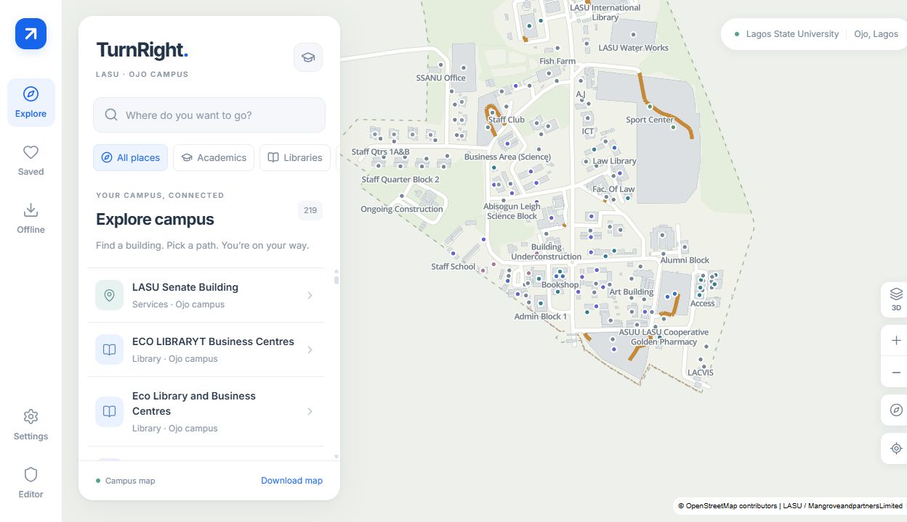
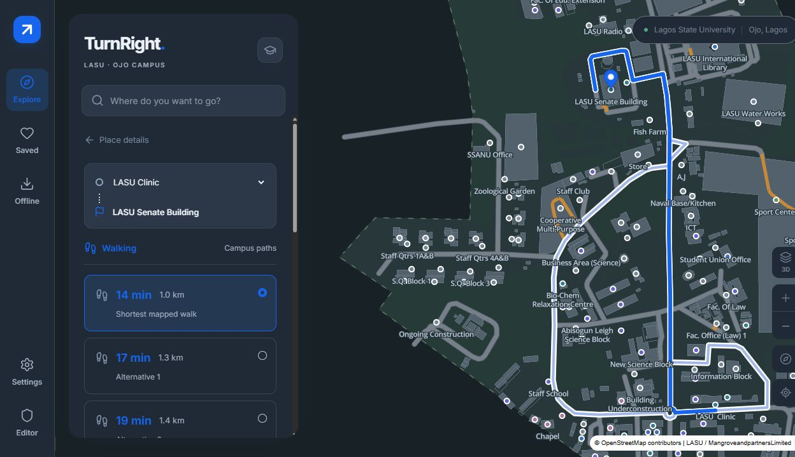
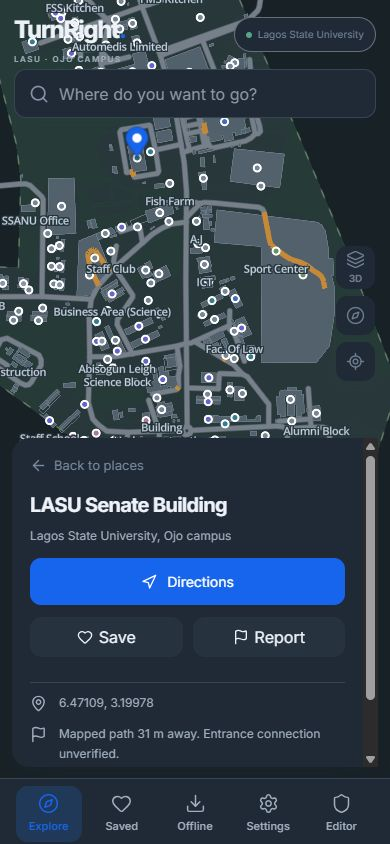
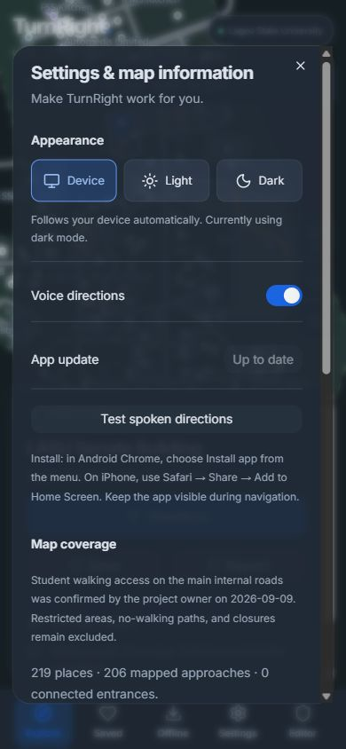
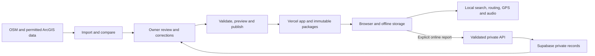

# TurnRight

**Find your way around LASU Ojo — online or offline.**

TurnRight is a campus walking-navigation PWA for Lagos State University, Ojo. Explore places, compare mapped walking routes, and follow spoken directions using your device's GPS and a downloaded campus map. Search, routing, location processing, and navigation audio run on the device.

[Open TurnRight](https://turnright.vercel.app/) · [Owner editor](https://turnright.vercel.app/admin) · [Deployment guide](docs/DEPLOYMENT.md) · [Report a software issue](https://github.com/mrglasswillbreak/TurnRight/issues)



> **Project status:** Public personal-project release. The map is derived from published sources and reviewed access corrections; campus routes have **not been field-verified**. Some destinations have only a nearby mapped approach, and confirmed entrance connections are still missing. TurnRight is an independent, non-commercial project, not an official LASU service.

## Contents

- [Screenshots](#screenshots)
- [Features](#features)
- [Quick start](#quick-start)
- [Using TurnRight](#using-turnright)
- [Offline operation and updates](#offline-operation-and-updates)
- [Technology and architecture](#technology-and-architecture)
- [Map data and coverage](#map-data-and-coverage)
- [Administration and publication](#administration-and-publication)
- [Record paths by walking](#record-paths-by-walking)
- [Configuration and hosting](#configuration-and-hosting)
- [Development and verification](#development-and-verification)
- [Repository structure](#repository-structure)
- [Troubleshooting](#troubleshooting)
- [Documentation](#documentation)
- [Contributing](#contributing)
- [Attribution and licensing](#attribution-and-licensing)

## Screenshots

**Desktop route preview in Dark mode:** a manually selected Clinic-to-Senate walk with two alternatives.



| Mobile place details | Device appearance settings |
| --- | --- |
|  |  |

Real browser captures from 9 September 2026. Mobile views use a responsive viewport; they do not represent completed physical-device or campus tests. [Capture details](docs/assets/screenshots/README.md).

## Features

| Area | Implemented behavior |
| --- | --- |
| Campus exploration | Local search, categories, source-supported aliases, saved places, recent selections, readable labels, and place provenance. |
| Walking directions | A* routing in a dedicated worker; shortest permitted walk and up to two sufficiently different alternatives when available. |
| Navigation | Foreground GPS tracking, next maneuver, remaining distance, ETA, instruction list, recentering, map following, north-up orientation, sustained-deviation rerouting, and arrival detection. |
| Compass and motion | Optional phone-direction cone and advisory movement status for navigation and walking surveys; Travel-up, North-up and Phone-up navigation with GPS-only fallback. **Awaiting device verification.** [Sensor guide](docs/MOTION.md). |
| Spoken guidance | 19 packaged English maneuver/distance clips, mute, repeat, and optional device-local speech for place names. |
| Appearance | Device light/dark preference by default, live system changes, persistent Light/Dark overrides, and an accessible three-option selector. |
| Map display | 3D by default with a remembered 2D/3D toggle, full-campus framing and selectable building surfaces. Recorded heights take precedence over floor-derived estimates; muted 6 m blocks illustrate unknown heights without changing source data. |
| Offline maps | Verified resumable downloads, content-hash reuse, atomic activation, version/coverage information, storage checks, and explicit updates. |
| Student reports | Place or pin reports with a category and description; private server submission, spam controls, and device-local offline drafts. |
| Owner editor | Map-centered 2D/3D workspace, protected mouse/touch drawing sessions, snapped junctions, entrance routing, duplicate review, worker validation, undo/redo, automatic draft saving and offline recovery. [Editor guide](docs/EDITOR.md). |
| Walking surveys | Owner-only phone recording, entrance markers, touch geometry review, partial path replacement, recoverable offline sessions and private survey sync. **Awaiting physical field verification.** [Survey guide](docs/SURVEY.md). |
| Data maintenance | Daily/on-demand source imports, change review separate from corrections, immutable releases, preview/publish/rollback, and backup export. |

Driving, cycling, indoor positioning, satellite imagery, background navigation, public user accounts, and reviews are outside this release.

## Quick start

### Requirements

- **Node.js 22.13 or later within the 22.x line**, matching the project's supported engine.
- npm and Git.
- A browser with WebGL for the map. Use HTTPS or localhost for service workers and device location.
- Python 3.12+ if you will run source imports or Python tests.

### Start development

```sh
git clone https://github.com/mrglasswillbreak/TurnRight.git
cd TurnRight/web
npm ci
npm run dev
```

Open the URL printed by Vite, normally [localhost:5173](http://localhost:5173). The included campus package works immediately for public exploration and route previews. **No API keys are required for that local experience.**

### Test the production PWA locally

From `web/`:

```sh
npm run build
npm run preview
```

Open [127.0.0.1:4173](http://127.0.0.1:4173), select **Offline → Download campus map**, and wait for **Ready offline**. Use this production build to test service-worker caching and offline reopening; the development server does not provide the production offline lifecycle.

Vite's local servers do not serve the Vercel `/api` functions. Use a configured Vercel preview for connected administration and report submission. For physical-phone GPS/PWA checks, use the HTTPS deployment; an ordinary LAN HTTP address is not equivalent to localhost's secure-context exception.

## Using TurnRight

1. **Explore:** search for a building, faculty, service, or other campus place; use categories to narrow the results.
2. **Check the place:** review its source and walking coverage. Save it locally or report a missing path, entrance, or incorrect detail.
3. **Preview a route:** select Directions, then choose your current location or a manual starting place. Compare the available walking alternatives and entrance notices.
4. **Start walking:** grant location access and allow audio through the Start walking action. Keep the app visible. Use mute/repeat, recenter, or the instruction list as needed.

Poor or stale location fixes pause maneuver progression. Rerouting requires sustained deviation to reduce false wrong turns from GPS jitter. Navigation ends at the mapped endpoint; an approach endpoint is not a surveyed building entrance.

### Compass and motion assistance

The first **Start walking** or **Record new path** tap requests optional compass and motion permission where the browser requires it. Orientation and motion permissions are independent. Declining does not prevent GPS navigation or surveying, and remembered denials are retried only through **Enable/Retry sensors**. **Turn off sensors** remembers your choice on this device. Controls are in public **Settings**, the active walk, and **Survey → Compass & motion controls**.

**Travel-up** remains the default and uses GPS direction of travel. **North-up** fixes north at the top. **Phone-up** uses approximate phone direction, falls back to usable GPS travel direction, then holds the map bearing with an explanation. Touching or dragging the map suspends following; **Follow me** restores the selected mode. The purple cone indicates phone direction; the blue arrow indicates GPS travel direction. Neither creates a location when GPS is unavailable.

Survey recording starts north-up in 2D. Sensor readings stop on pause, finish, sign-out, exit and backgrounding; a backgrounded survey requires explicit **Resume**. Entrance placement and review never move the camera in response to sensors. Navigation can reacquire sensors when its active session returns to the foreground.

Motion hints (**Likely still**, **Motion detected**, **Uncertain**) are advisory. GPS remains authoritative for position, route progress and survey geometry. Only assistance/orientation preferences are saved; sensor readings stay in memory and never enter surveys, backups or network payloads. No step counting or dead reckoning is performed. Physical Android/iPhone and installed-app checks remain pending: see [sensor behavior and field record](docs/MOTION.md).

The compass/motion update was deployed to [production](https://turnright.vercel.app/) on **12 September 2026**, following automated and authenticated preview verification (release commit `37c8cbe`). Existing installations can use **Settings → Install update** after the new version is detected. The campus package remains `lasu-4e4c8008b38b`, schema 1; this application rollout did not publish campus data.

### Appearance

Open **Settings → Appearance**:

| Option | Behavior |
| --- | --- |
| **Device** — default | Follows the browser's `prefers-color-scheme` setting and reacts when the device changes between Light and Dark. |
| **Light** | Keeps the interface and map light until you choose another option. |
| **Dark** | Keeps the interface and map dark until you choose another option. |

The choice survives reopening and works offline. Existing explicit light/dark choices are retained during migration. Choosing Device resumes automatic detection. The application applies appearance before React renders, updates browser theme colors, and recolors the map without recreating it or resetting the current view. Preference changes also synchronize between open tabs on the same origin. If storage is unavailable, the current session still works and a failed save is reported.

### Install on a phone

- **Android Chrome:** open the HTTPS app and use the browser's Install app option when available.
- **iPhone Safari:** open the HTTPS app, choose Share, then Add to Home Screen.

Installation and map download are separate steps. Install the app, complete its offline download, and verify Ready offline before relying on it without a connection. Physical-device installation and live GPS acceptance checks remain listed in [ACCEPTANCE.md](docs/ACCEPTANCE.md).

## Offline operation and updates

An initial online visit and completed download are required. TurnRight stores two complementary parts:

| Stored content | Mechanism | Measured size, 9 September 2026 |
| --- | --- | --- |
| Application shell, styles, icons, interface fonts, map/routing workers | Workbox service-worker precache | Approximately **2.46 MiB**, uncompressed build assets |
| Campus geometry, search fields, routing graph, closures, map glyphs, audio manifest and recordings | CacheStorage assets with IndexedDB package records | **3.01 MiB** — 3,159,499 bytes across 22 assets |

The checked-in campus package is `lasu-4e4c8008b38b`. Transfer size and browser storage usage differ with compression and browser overhead. No external tile service or satellite imagery is needed.

- **Download safely:** required files are size/hash verified before the active package changes. Interrupted or corrupt updates retain the working version; valid existing files can be reused.
- **Choose updates:** opening or reconnecting checks release metadata. A known newer map is displayed for review and download; it is not silently installed.
- **Keep a walk stable:** a downloaded update waits until active navigation ends. Application updates that require reloading are also delayed during a walk.
- **Know the limits:** offline devices only know closures contained in their downloaded package. Check its date and any newer-release notice before a walk.
- **Recover storage:** the app requests persistent storage where supported, detects missing/evicted assets, and offers retry or deletion controls. Browser storage permission is not a guarantee against eviction.
- **Keep reports as drafts:** reports saved offline remain local until you explicitly submit them online. Reconnecting does not submit them automatically.

## Technology and architecture

| Layer | Technology | Responsibility |
| --- | --- | --- |
| Interface | React 19, TypeScript, Vite 8, Tailwind CSS 4, shadcn/Base UI | Responsive application, accessible controls and dialogs |
| Map | MapLibre GL JS 6, locally packaged GeoJSON vector layers | Campus geometry, labels, routes and optional extrusions |
| Routing | Dedicated Web Worker, A* and bounded alternative generation | Local graph search without blocking the interface |
| Offline storage | Workbox, `vite-plugin-pwa`, IndexedDB, CacheStorage | App shell, verified packages, local preferences and drafts |
| Navigation audio | Web Audio and optional local Web Speech voices | Packaged instructions without an online speech service |
| Visual editor | Terra Draw with the MapLibre adapter | Geometry drawing, vertex editing and explicit connections |
| Hosting/API | Vercel Hobby | Public application, immutable packages and small server endpoints |
| Administration | Supabase Auth, PostgreSQL/PostGIS, row-level security | Owner identity, approved sources, private corrections, reports and releases |
| Data jobs | GitHub Actions, Python and Node.js scripts | Imports, comparison, validation, package builds and deployment |



Published navigation does not depend on Supabase being available. Navigation GPS processing stays on the device. Owner surveys keep recoverable recordings locally and upload evidence privately when saved; public campus packages contain reviewed geometry and coarse provenance, never raw survey tracks or sample timestamps. Report submissions send the selected pin/place and entered description. Appearance is persisted in IndexedDB with a small localStorage mirror so the first paint can use the saved setting. See [ARCHITECTURE.md](docs/ARCHITECTURE.md) for thresholds, schema boundaries, storage transactions and authorization details.

## Map data and coverage

The map combines **OpenStreetMap** with the **LASU ArcGIS campus layers**. Original source IDs and access tags are retained alongside administrator corrections. A source modification date is not a field-survey date. An [Overture comparison](docs/OVERTURE-COMPARISON.md) did not identify useful additional campus walking geometry in the audited release.

Current checked-in coverage for `lasu-4e4c8008b38b`:

| Metric | Count / status |
| --- | --- |
| Source place records, including duplicates awaiting review | 219 |
| Places with a mapped approach | 206 |
| Approaches on the largest connected path component | 201 |
| Places without a mapped approach | 13 |
| Confirmed connected entrances | **0** |
| Walking graph components | 5 |
| Directed segments excluded for building/barrier conflicts | 166 |
| Existing internal roads enabled by the owner's student-access confirmation | 63 |
| Individually confirmed private gates enabled for student walking | 1 |
| Campus field verification | **Pending** |

A **mapped approach** ends on an existing source path near a place. It does not draw an assumed final connection through a fence, building, or unmapped area. A destination can have an approach yet remain disconnected from the chosen origin.

The student-access correction applies to 62 reviewed ordinary internal roads, the individually confirmed Faculty of Law driveway, and the International Library gate. Other private driveways and gates, parking aisles, explicit no-walking restrictions, barriers, and closures remain excluded; it does not grant unrestricted public campus access. See [CAMPUS-ACCESS.md](docs/CAMPUS-ACCESS.md), the [connection review](docs/CONNECTION-REVIEW.md), and the [machine-readable coverage report](data/coverage-report.json).

Law and the International Library now connect to the main network through existing OSM paths. Priority survey work includes their final building entrances, the five approaches still on smaller disconnected sections, conflicting source geometry, and duplicate place records. These are software-checked approaches; campus walks remain unverified. Map publication is separate from a code push; see the [review and rollout record](docs/CONNECTION-REVIEW.md).

## Administration and publication

The [owner editor](https://turnright.vercel.app/admin) requires the single allowlisted GitHub account. Both database policies and backend endpoints enforce access. Anonymous visitors cannot read drafts, reports, or administrative records, and submitted reports cannot change routes.

The workflow is **review → validate → preview → publish**:

1. Import source candidates daily or through **Check now**. Failed/incomplete imports retain the last successful dataset; candidates do not overwrite approved data.
2. Review additions, removals, geometry changes, and conflicts. Administrator corrections remain separate from imported source records.
3. Select a building, place its entrances, draw their approaches and connect to highlighted path segments in 2D or 3D. Drafts save automatically; route tests choose the shortest permitted entrance. Review unresolved items in **Needs mapping**. See the [editor guide](docs/EDITOR.md) for connections, recovery and controls.
4. Validate an approved revision and create an immutable package/deployment preview.
5. Review the preview and publish it. Success is recorded only after deployment and production promotion succeed. Retain the preceding release for rollback and export approved data/correction history for recovery.

Closures remain active until explicitly reopened and republished. An expected reopening date creates an overdue-review flag; it never reopens a route automatically.

| Workflow | Trigger / purpose |
| --- | --- |
| `source-update.yml` | Daily at 02:17 UTC or on demand; imports and queues source changes |
| `release.yml` | Reviewed release preview, publication and rollback |
| `preview.yml` | Manual seed-based preview deployment |
| `bootstrap.yml` | One-time accepted source baseline; refuses to overwrite an existing baseline |

For a local source refresh, run from the repository root:

```sh
python scripts/import_campus.py --download --output data/candidates
```

This writes candidates; it does not publish them. `node scripts/package.mjs` builds the checked-in seed package for development. Production map changes use the reviewed release workflow. See the architecture and deployment guides before changing the data pipeline.

## Record paths by walking

Open the [owner editor](https://turnright.vercel.app/admin) on Android Chrome or iPhone Safari, including an installed web app, and choose **Survey**. The workflow is **record → mark entrances → finish → adjust and connect → save map draft**. The feature is labelled **Awaiting field verification** until physical walks pass on both platforms.

1. Choose **Prepare for offline survey** while signed in and online. Wait for the readiness confirmation before starting an offline visit.
2. Choose **Record new path**, grant location access, and walk with TurnRight visible. Recording starts in north-up 2D; panning suspends following and **Follow me** restores it. **Pause/Resume** controls recording explicitly.
3. Choose **Mark entrance here** to pause and review a recent usable fix. Position the footprint under the crosshair, select its building/place, and confirm the entrance name and walking access. Resume for the next section.
4. Choose **Finish** to compare the original trace with proposed geometry. Trim, split, remove sections, move/insert/delete vertices, and undo/redo on the phone. Use **Place here** and highlighted targets to connect endpoints deliberately; a crossing alone does not create a junction.
5. **Save survey** preserves private evidence and queues an upload if offline. **Apply to map draft** creates editable path/entrance corrections after review and connection checks. Close Survey to test routes. Neither action publishes campus data.

**Correct existing path** replaces a selected section between two boundary vertices. Geometry outside the section, fixed junctions, access/direction metadata and closure coverage are retained. Changed targets require another review. **Saved surveys** opens local recovery and private versions for later phone or desktop editing; conflicting versions remain available for explicit resolution.

Reported accuracy is good through 8 metres and usable through 15 metres; this is a device estimate, not surveyed precision. Stale fixes, implausible jumps and poor accuracy are excluded. Signal gaps become separate sections and are never silently bridged. Locking the screen, switching apps or reopening pauses recording until **Resume**. Wake lock is requested where available, but background recording is outside this release.

Recovery uses owner-scoped IndexedDB with incremental sample writes. Storage failures pause recording; signing out locks cached surveys. Sync requires the same owner to authenticate online. The editor's **Install update** notice requires paused recording and saved recovery/draft work before reloading. See [SURVEY.md](docs/SURVEY.md) for controls, acceptance thresholds, architecture, conflicts and the physical-device test record.

## Configuration and hosting

Public local exploration needs no credentials. For connected administration and reports, start with [web/.env.example](web/.env.example) and follow [DEPLOYMENT.md](docs/DEPLOYMENT.md), including the Supabase migrations, GitHub OAuth callback, administrator allowlist, workflow secrets and redirect URLs.

Apply migrations in order through [004_private_surveys.sql](supabase/migrations/004_private_surveys.sql) before deploying the survey API/editor. Migration 004 adds owner-readable private survey metadata, immutable recording revisions and bounded chunks; mutations are restricted to the authenticated admin API's service role. Normal editor-state responses do not fetch recordings. Campus package schema version remains 1.

| Variables | Scope / purpose |
| --- | --- |
| `VITE_SUPABASE_URL`, `VITE_SUPABASE_ANON_KEY` | Browser-visible Supabase URL/public key for authentication; security depends on RLS and endpoint checks |
| `SUPABASE_URL`, `SUPABASE_SERVICE_ROLE_KEY`, `ADMIN_USER_ID` | Server-only database access and administrator identity |
| `GITHUB_REPOSITORY`, `GITHUB_WORKFLOW_TOKEN` | Server-side workflow dispatch configuration |
| `REPORT_RATE_SALT` | Server-only salt for report rate-limit buckets |
| `SOURCE_REDISTRIBUTION_APPROVED` | Build-time rights gate; set only when source redistribution is authorized |
| `PUBLISHED_MAP_URL` | Build-time stable HTTPS origin used to preserve the currently published map during ordinary app builds |

Never put privileged keys in a `VITE_` variable or commit real environment files. The setup guide lists the additional GitHub Actions deployment secrets separately. Keep credentials in the hosting providers' secret stores.

Current Vercel settings use **`web` as the root directory**, **Node 22**, `npm run build`, and `dist` output, with repository files outside the root available to the build. Git changes on `main` drive application deployments. Documentation-only changes may be skipped by Vercel's monorepo detection. The project's configuration and publication history are recorded in [CONFIGURATION.md](docs/CONFIGURATION.md) and [PRODUCTION.md](docs/PRODUCTION.md).

`PUBLISHED_MAP_URL` is configured for code deployments so a new UI build does not revert approved map data to the seed. It fetches and verifies published assets and fails safely if they cannot be obtained. Updating seed files alone is not a replacement for an editor-reviewed production map release.

This project uses free plans without paid overages. Vercel Hobby is limited to personal, non-commercial use; quota exhaustion can interrupt service. Supabase Free may pause inactive projects. Published/downloaded navigation remains independent of the administrative database. Check the current [Vercel Hobby terms](https://vercel.com/docs/plans/hobby) and [Supabase Free plan](https://supabase.com/pricing) before changing the project's use or hosting configuration.

## Development and verification

Run frontend checks from `web/`:

```sh
npm test
npm run lint
npm run build
npx playwright install chromium webkit
npm run test:browser
npm run test:survey-webkit
npm run test:survey-pwa
```

Run importer/access-policy tests from the repository root:

```sh
python -m unittest discover -s scripts/tests -v
```

| Command, from `web/` | Purpose |
| --- | --- |
| `npm run dev` | Vite development server |
| `npm test` | Vitest regression suite |
| `npm run test:browser` | Real MapLibre/Terra Draw editor, survey and motion-assistance scenarios in Chromium |
| `npm run test:survey-webkit` | Phone survey and public motion-assistance scenarios in WebKit with touch/mobile support |
| `npm run test:survey-pwa` | Isolated production build: offline preparation/startup, recording recovery and reconnecting private sync |
| `npm run lint` | TypeScript frontend/API checks and Oxlint |
| `npm run build` | Preserve/package data, type-check, compile server imports, build application and service worker |
| `npm run preview` | Serve the production build locally |
| `npm run package` | Regenerate the campus package from the checked-in seed |
| `npm run format -- <path>` | Format selected files with Oxfmt; keep formatting changes focused |

**Verification recorded on 12 September 2026, using Node 22:** 135 Vitest tests and seven Python tests pass. Twelve Chromium browser scenarios, five WebKit phone scenarios and the production-PWA offline/recovery scenario pass. Production build and API compilation pass. Lint has no errors, with seven existing explicit-any warnings. Coverage includes entrance routing, directed paths and closures, stable editor junctions, noisy/stale GPS, recording interruptions, partial replacement, undo/redo, owner-scoped recovery, storage failures, atomic private uploads, retries/conflicts, cross-device archive recovery and exclusion of raw survey evidence from public packages. Motion tests cover angle/tilt normalization, independent permissions, sparse readings, lifecycle cleanup, rate limits, GPS invariance, camera control and preference-only persistence. Browser tests use real MapLibre/Terra Draw with GPS, sensor, authentication and API fixtures only in tests.

Migration 004 is applied. Authenticated preview checks verified offline preparation and private save/reopen, and live database checks verified incomplete-upload rejection, idempotent retries, duplicate-chunk prevention and retained concurrent versions inside a rolled-back transaction. These are software checks: physical Android/iPhone walks, accuracy near buildings, battery use and device interruption/offline behavior remain pending in the [survey field record](docs/SURVEY.md#physical-field-record--pending).

Appearance checks include device changes, explicit overrides, migration, reopening, cross-tab synchronization, delayed storage hydration, storage failures, and startup-script behavior. Browser checks cover persisted Light mode, returning to Device/Dark, an open route reacting to a change in another tab, and the 390 × 844 settings layout. Automated system-change events do not replace physical OS/device checks.

Earlier offline browser checks exercised cold reopening with the origin server stopped, search, worker routing, alternatives, and recorded audio. Physical Android/iPhone installation, airplane-mode navigation, live GPS, modest-phone performance, representative campus walks, and deliberate wrong turns remain acceptance work. [ACCEPTANCE.md](docs/ACCEPTANCE.md) separates completed evidence from outstanding checks.

## Repository structure

```text
TurnRight/
├── web/
│   ├── src/                 # UI, map, routing, GPS, audio, editor and storage
│   │   ├── appearance.ts    # Device preference, overrides and persistence
│   │   ├── useAppearance.ts # React integration for the appearance store
│   │   └── sw.ts            # Application service worker
│   ├── api/                 # Vercel admin and report endpoints
│   ├── server/              # Server-only validation and authorization
│   ├── tests/               # Regression tests
│   ├── public/              # Packaged map/assets served with the app
│   └── .env.example         # Configuration template without credentials
├── data/                    # Seed, access corrections, attribution and coverage
├── scripts/                 # Import, compare, validate, package and release jobs
├── supabase/migrations/     # Database schema, policies and API grants
├── .github/workflows/       # Source and release automation
└── docs/                    # Setup, architecture, acceptance and screenshots
```

## Troubleshooting

| Symptom | What to check |
| --- | --- |
| “A walking connection for this place has not been mapped” | The destination lacks a supported connection, or its component is disconnected from the origin. Report the actual missing path/entrance and review an explicit editor connection. Do not remove restrictions globally or draw an assumed shortcut. |
| App does not follow the device's appearance | Select **Settings → Appearance → Device**. An explicit Light/Dark choice intentionally overrides the device. Install a waiting app update if the three-option selector is missing. |
| Map will not reopen offline | Use a production PWA build, complete the download, and confirm Ready offline. Check eviction/storage errors and use the repair/download controls. |
| Location is unavailable or inaccurate | Use HTTPS, grant the site's location permission, keep the app visible, and move outdoors. A manual origin still supports route previews. |
| No spoken place name | Names need an available local English voice. Packaged maneuver clips work independently; check mute and device volume, then use Test spoken directions. |
| Local `/admin` or report submission fails | Vite does not host the Vercel API. Use a configured hosted preview and check environment variables, session and administrator allowlist. |
| Import/build/publish fails | Inspect the editor's job/release error and the GitHub/Vercel logs. Resolve the failed source, credentials, validation, or quota issue; do not mark a failed deployment published. |
| Git push succeeds but the approved map is unchanged | App deployments preserve the published package. Review, validate and publish map changes through the release workflow. |
| Survey is missing from the editor | Install a waiting update from public map **Settings → Install update**, then reopen `/admin`. Subsequent updates also appear inside the editor. |
| A survey paused or contains gaps | Keep the app visible, check GPS accuracy, and choose **Resume** after backgrounding or reopening. Rewalk the missing section or draw and review an explicit connection. |
| Survey upload is queued or conflicted | Reconnect as the same owner. Use **Saved surveys** to review retained versions; do not clear browser storage while recovery work is pending. |

## Documentation

| Guide | Contents |
| --- | --- |
| [Architecture](docs/ARCHITECTURE.md) | Device flow, storage, routing thresholds, data model and security boundaries |
| [Deployment](docs/DEPLOYMENT.md) | Reproducible Vercel, Supabase, GitHub OAuth and workflow setup |
| [Acceptance](docs/ACCEPTANCE.md) | Automated/browser evidence, physical-device checklist and field-survey log |
| [Editor](docs/EDITOR.md) | 2D/3D mapping, entrances, connections, draft recovery and review |
| [Walking surveys](docs/SURVEY.md) | Phone recording/review, private sync, migration 004 and pending physical-device checks |
| [Compass and motion](docs/MOTION.md) | Sensor permissions, heading/motion quality, orientation controls, privacy and pending device checks |
| [Configuration record](docs/CONFIGURATION.md) | Configured services and operational setup record |
| [Production record](docs/PRODUCTION.md) | Publication history, deployment and package verification |
| [Campus access](docs/CAMPUS-ACCESS.md) | Reviewed student walking correction and remaining path gaps |
| [Overture comparison](docs/OVERTURE-COMPARISON.md) | Additional-data audit and access findings |
| [Source attribution](data/ATTRIBUTION.md) | Map, font and audio provenance and redistribution status |
| [Coverage report](data/coverage-report.json) | Machine-readable baseline coverage metrics |

## Contributing

Use [GitHub issues](https://github.com/mrglasswillbreak/TurnRight/issues) for reproducible software defects and feature proposals. Include the app/package version, browser/device, steps, and expected versus actual behavior. Use the in-app report flow for a specific campus place or path so it reaches the private review queue.

Keep pull requests focused, run checks appropriate to the change, and include screenshots for interface changes. Map contributions need stable feature IDs where available, provenance, redistribution permission, and evidence for paths/access/entrances. Preserve existing corrections and explicitly mark unsurveyed geometry. Do not submit credentials or private report contents to the public repository.

## Attribution and licensing

- **OpenStreetMap:** © OpenStreetMap contributors, ODbL 1.0. The downloadable campus JSON contains the OSM-derived database. [OSM attribution and license](https://www.openstreetmap.org/copyright).
- **LASU ArcGIS layers:** MangroveandpartnersLimited. The TurnRight owner confirmed offline redistribution permission on 8 September 2026; the public ArcGIS item itself supplied no explicit redistribution license. The confirmation is recorded in [ATTRIBUTION.md](data/ATTRIBUTION.md) and is not a general license grant for unrelated uses.
- **Fonts:** Inter under the SIL Open Font License; Open Sans map glyphs under Apache 2.0. Navigation recordings were generated locally; source and regeneration details are recorded in the attribution file.

No standalone source-code license has been selected in this repository. Do not assume an MIT or Apache license for TurnRight's own code; third-party components and datasets retain their respective terms. No Google Maps content, satellite imagery, or externally hosted rendered map tiles are bundled.
