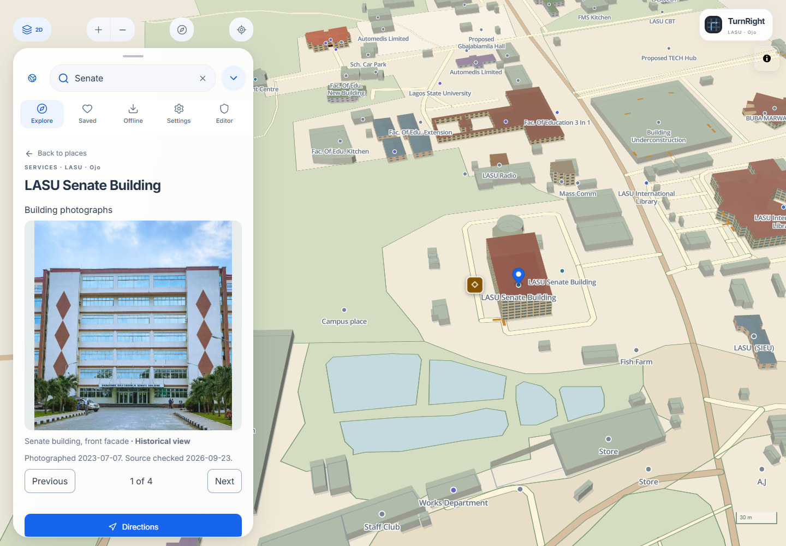
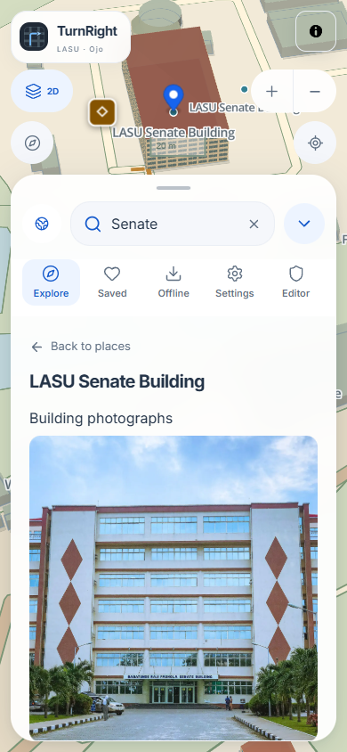
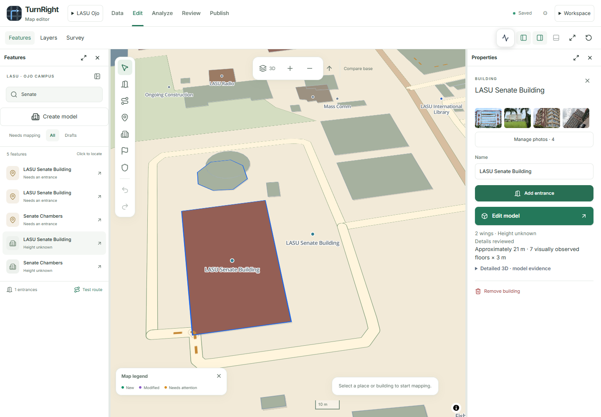
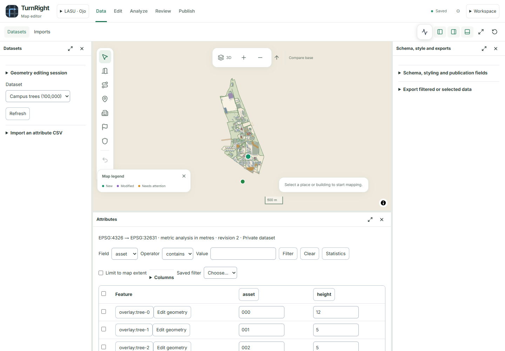
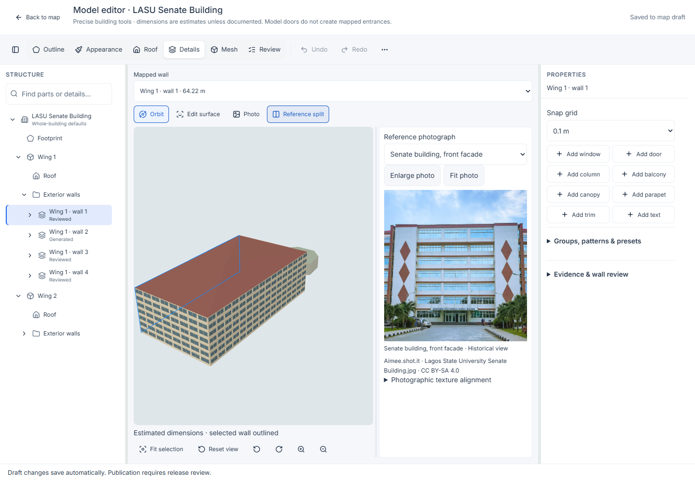
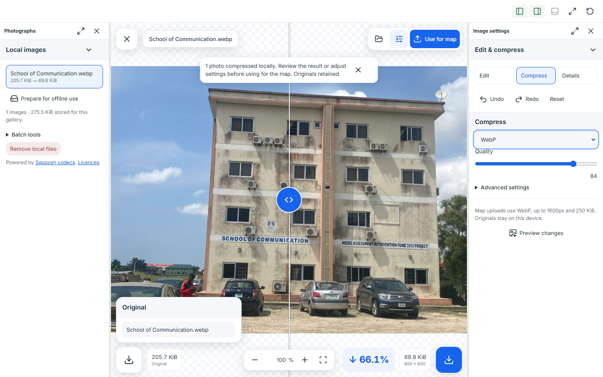
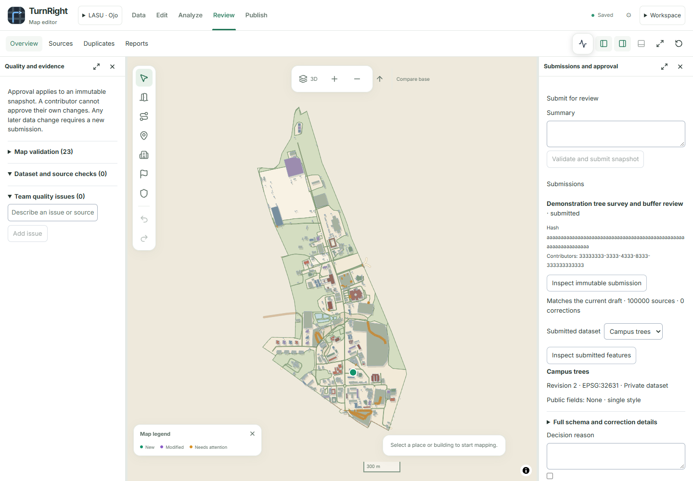
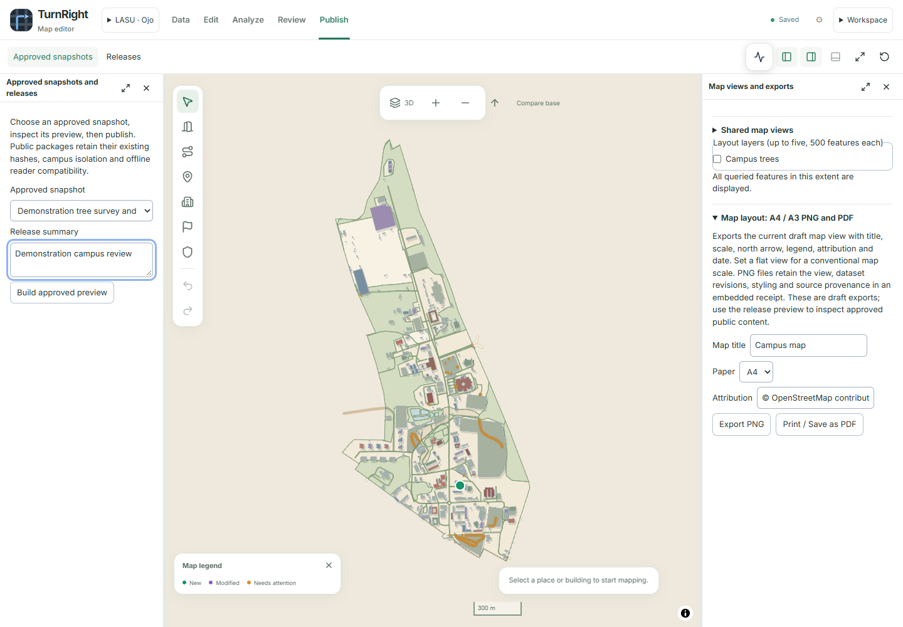

<picture>
  <source media="(prefers-color-scheme: dark)" srcset="docs/assets/brand/wordmark-reversed.svg">
  
</picture>

# Campus maps, made together

TurnRight brings campus mapping, building authoring, and public navigation into one application. Small teams can import spatial data, edit a shared draft, investigate quality issues, obtain independent approval, and publish maps that visitors can download for offline use.

[Explore the map](https://turnright.vercel.app/) · [Team workspace](https://turnright.vercel.app/admin) · [Documentation](docs/README.md) · [Contributing](CONTRIBUTING.md)

> TurnRight is an independent project, not an official university service. Routes have not been field-verified; mapped approaches and building models do not establish entrance access or accessibility.

## See TurnRight in action

### Explore a campus

Search destinations, inspect buildings and photographs, and plan walking or driving routes. LASU Ojo and UNILAG Akoka have independent published packages and offline downloads.

| Desktop map | Phone view |
| --- | --- |
|  |  |

### Map and maintain

Five workspaces follow the team workflow: **Data → Edit → Analyze → Review → Publish**. Resizable panes keep the map, feature explorer, properties, and attribute table in predictable places. The workspace remembers your layout; focus mode and compact mobile sheets make room for the task at hand.

| Map editing | Structured data |
| --- | --- |
|  |  |

### Model buildings and prepare photographs

Work with footprints, roofs, façades, surface text, curves, and meshes. Compare models with photographic references. Crop, adjust, redact, resize, and compress photographs locally before attaching them to campus work.

| Building authoring | Photo comparison |
| --- | --- |
|  |  |

### Review and publish deliberately

Resolve map-linked issues, submit immutable content, and obtain approval from someone who did not contribute to it. Publish an approved preview or submit historical content for renewed review.

| Independent review | Publication |
| --- | --- |
|  |  |

[More layouts and workflows](docs/SCREENSHOTS.md) · [Capture provenance](docs/assets/screenshots/README.md)

Screenshots illustrate the local application with published campus assets and isolated demonstration accounts/API responses. Phone views are browser simulations. Demonstration counts and edits are not production inventories or performance measurements; published deployment status is recorded separately in [Production](docs/PRODUCTION.md).

## What you can do

- **Manage spatial data:** import common GIS formats, configure typed attributes, filter and page datasets, retain source provenance, and export GeoJSON, CSV, or GeoPackage.
- **Edit and analyze:** author geometry with undo and recovery; run buffers, overlays, joins, measurements, and other bounded spatial operations.
- **Coordinate a team:** use campus-scoped roles, assignments, evidence, validation, independent approval, and an audit trail.
- **Publish useful maps:** style layers, preview approved releases, export A4/A3 maps, and distribute separately verified campus packages.
- **Navigate on site:** find places, plan walking/driving journeys, use foreground GPS and spoken guidance, and reopen downloaded campuses offline.

Server queries, team synchronization, analysis, and publication need a connection. Prepared personal editing and image recovery have separate offline support. There is no cross-campus routing, indoor navigation, or verified step-free guarantee. See [supported workflows and limits](docs/GIS-PLATFORM.md).

## Run locally

Prerequisite: **Node 22.23.3**, pinned in `.node-version` and `.nvmrc`.

```sh
cd web
npm ci
npm run dev
```

The public map runs without credentials. Vite does not emulate the private Vercel APIs. Team authentication, imports, database queries, analysis, and publication require the [deployment configuration](docs/DEPLOYMENT.md). Keep service credentials out of `VITE_*` variables and Git.

Typical checks, from `web/`:

```sh
npm test -- --maxWorkers=2
npm run lint
npm run check:configured-build
npm run test:browser
```

See [Contributing](CONTRIBUTING.md) for focused browser checks, offline verification, native GIS requirements, and documentation maintenance.

## Find your guide

| I want to… | Start here |
| --- | --- |
| Understand the complete team workflow | [Campus GIS platform](docs/GIS-PLATFORM.md) |
| Learn the editor, panes, and shortcuts | [Editor guide](docs/EDITOR.md) |
| Import campus data | [Campuses and imports](docs/CAMPUS-IMPORTS.md) |
| Build and review a model | [Unified model editor](docs/UNIFIED-MODEL-EDITOR.md) |
| Edit and compress photographs | [Photo editing](docs/PHOTO-EDITING.md) |
| Understand the code and data flow | [Architecture](docs/ARCHITECTURE.md) |
| Configure and operate a deployment | [Deployment](docs/DEPLOYMENT.md) and [Configuration](docs/CONFIGURATION.md) |
| Check measured limits and verification | [Performance](docs/PERFORMANCE.md), [Acceptance](docs/ACCEPTANCE.md), [Production](docs/PRODUCTION.md) |

## Architecture at a glance

React and TypeScript power the PWA; MapLibre provides the shared campus map and Three.js supports building authoring. Supabase/PostGIS stores scoped team data and review records. Vercel serves the app/API, while isolated workers and GitHub Actions handle processing and release gates.

Public packages and private drafts are distinct. Application deployments preserve published campus content; data becomes public through the reviewed publication workflow. Arbitrary dataset attributes remain private until explicitly selected for publication.

| Directory | Purpose |
| --- | --- |
| `web/src` | Public app and editor workspaces |
| `web/api`, `web/server` | Authentication, data, processing, review, publication |
| `web/tests` | Unit, database, browser, and offline checks |
| `scripts` | Import, processing, packaging, and verification tooling |
| `supabase/migrations` | Additive database migrations |
| `data`, `docs` | Attributed sources, guides, and dated evidence |

## Contributing and attribution

Start with [Contributing](CONTRIBUTING.md). Changes should preserve campus identities, provenance, private attributes, recovery, independent review, and existing resource budgets.

Software licensing terms have not been declared in a root licence file. Data, photographs, codecs, and other assets have their own terms: consult [data attribution](data/ATTRIBUTION.md), [photo records](data/photos/README.md), and in-app credits. OpenStreetMap-derived data retains ODbL attribution; authorization to publish a source does not automatically grant broader reuse rights. [Brand assets and usage](docs/BRAND.md).
