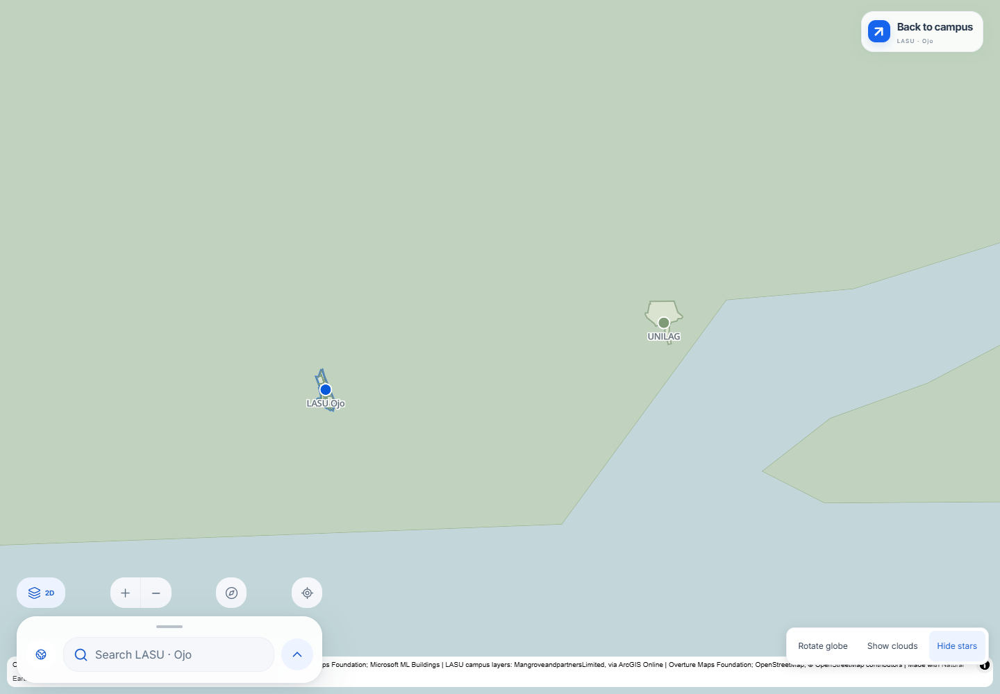
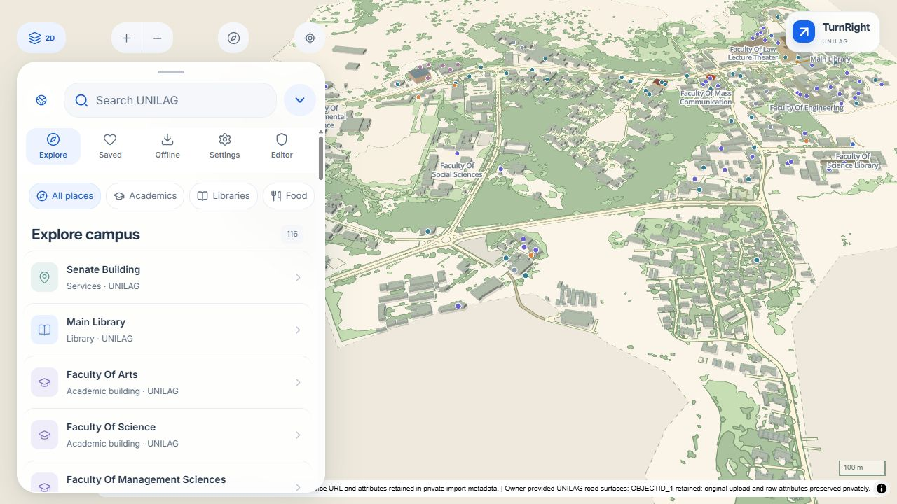
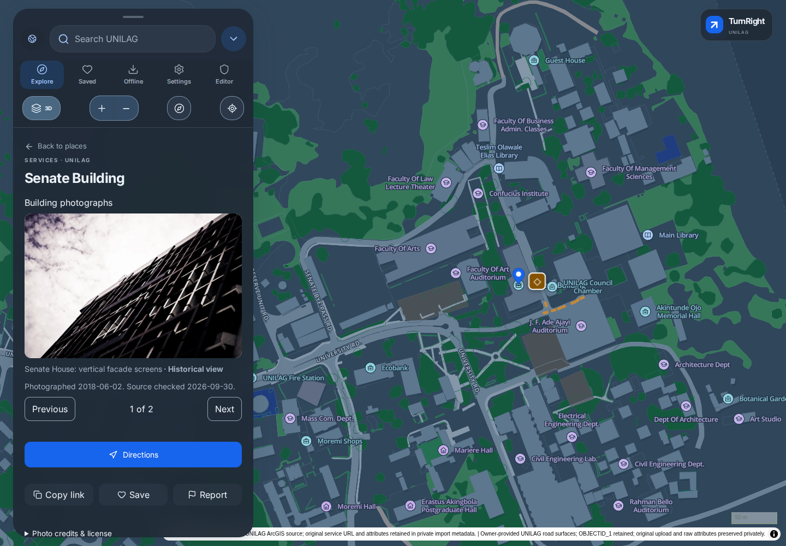
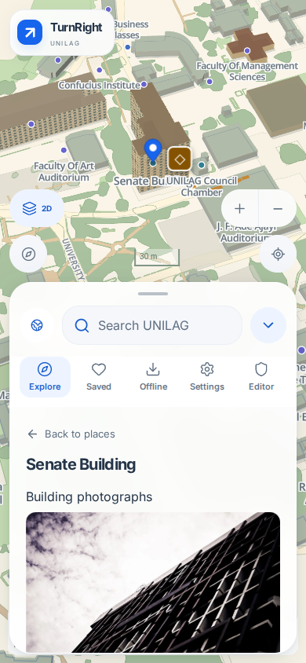
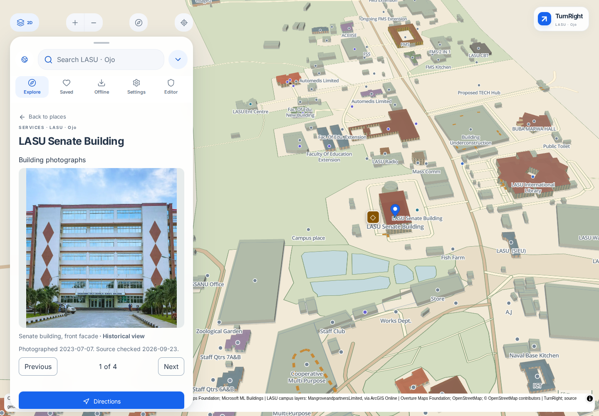
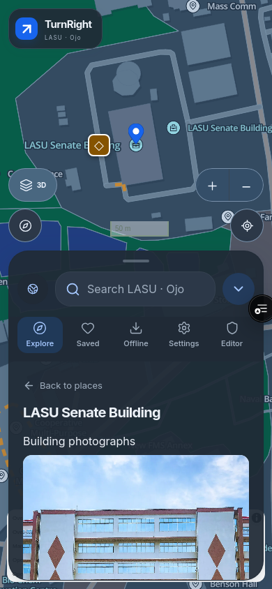
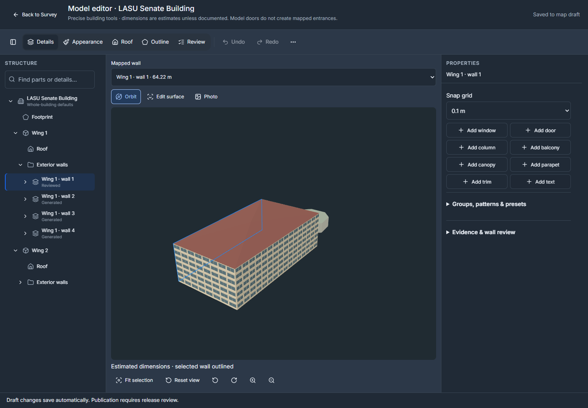

# TurnRight

Explore **LASU Ojo and UNILAG Akoka**, search campus places, and navigate with independently downloadable offline maps.

[Open map](https://turnright.vercel.app/) · [Open LASU](https://turnright.vercel.app/?campus=lasu) · [Open UNILAG](https://turnright.vercel.app/?campus=unilag) · [Owner workspace](https://turnright.vercel.app/admin) · [Documentation](docs/README.md)

TurnRight combines a public navigation PWA, a private GIS workspace and a building model editor. Search, route calculation, GPS processing and spoken guidance run on the device. Each campus has its own sources, corrections, photographs, models and reviewed releases. A plain visit reopens the last successfully used campus on this device. Explicit campus links take priority; first visits and older destination links default to LASU.

> An independent personal project, not an official university service. Campus routes have not been field-verified. A mapped approach is not a confirmed entrance. Unknown heights remain labelled illustrative estimates; visual detail does not establish walking, driving or accessibility permission.

## Campus status

LASU has 82 labelled illustrative road surfaces and distinct landscape classes. UNILAG has 179 surveyed road-width records, detailed vegetation, credited photographs and evidence-backed architectural treatments. The editor provides a campus layer explorer, independently selectable routing paths and road surfaces, and reviewed geometry operations. [Layer workflow](docs/CAMPUS-LAYERS.md) · [LASU coverage](docs/LASU-LAYERS.md) · [UNILAG evidence](docs/UNILAG-DETAIL.md) · [Released versions and verification](docs/PRODUCTION.md).

| Published map content | LASU Ojo | UNILAG Akoka |
| --- | ---: | ---: |
| Building footprints | 393 | 723 |
| Destinations | 220 | 116 |
| Photographs | 44 | 16 |
| Road surfaces | 82 illustrative | 179 surveyed |

Both upgrades preserve existing destination identities, routing graphs, permissions, photographs, authored models and unrelated private drafts. LASU accounts for all 95 source roads: 82 generated surfaces, 12 with no usable area after exclusions and one held geometry conflict. The 179 road polygons comprise 80 paved roads, 24 unpaved roads and 75 sidewalks. The documented self-intersection in source feature 96 is repaired with a retained diagnostic receipt. Senate floor totals and several residence-hall assignments remain explicitly disputed.

## Screenshots

The dated campus captures show real packages. Editor examples use isolated owner/API fixtures; phone images are browser simulations. Capture provenance identifies each release and distinguishes historical examples. [Capture provenance](docs/assets/screenshots/README.md).



| UNILAG · light, 3D | UNILAG · dark, 2D |
| --- | --- |
|  |  |

| UNILAG · mobile | LASU · campus detail |
| --- | --- |
|  |  |

| LASU · mobile dark 2D | Road and landscape workflow |
| --- | --- |
|  | [82 labelled road estimates, 30 classified landscape polygons, source decisions and remaining gaps](docs/LASU-LAYERS.md). [Layer editing and reviewed regeneration](docs/CAMPUS-LAYERS.md). |

| Private GIS workspace | Building authoring |
| --- | --- |
|  |  |

## Features

- **Campus navigation:** searchable names, aliases, categories and streets; walking and driving routes; destination/entrance guides; mapped restrictions, closures, parking and walking handoffs; foreground GPS and offline spoken instructions.
- **Consistent maps:** light, dark and system themes; 2D and 3D; shared building colours, place icons and labels; separate trees, hedges, shrubs, greenspaces, water, sports areas, parking and subtle parcels. Polygon road surfaces cover matching centreline display segments while leaving uncovered segments visible.
- **Independent campuses:** clickable published boundary silhouettes, distant pins and a searchable non-modal globe chooser. Switching flies directly to the target on the same map, remembers the last successful campus and supports browser Back/Forward. Saved places, recents, report drafts and verified offline packages stay campus-scoped. Active directions require confirmation before switching. [Globe and offline guide](docs/CAMPUS-GLOBE.md).
- **Vector imports:** file batches, public ArcGIS and complete OSM extracts; format/projection detection, editable field mappings, aliases/coded values, repair receipts, per-layer sampling and styled previews over the current campus.
- **Layer management:** Layers / Features explorer, folders, search by source identity, virtualized attribute table, map-linked multi-selection, bulk edits, styling rules, locking, isolation, archive/restore, duplication and mapped-property exports. Editing visibility, release inclusion and published visibility are separate.
- **Road and geometry editing:** original routing paths remain selectable beneath road surfaces. Road class, material, width and evidence persist through saves and release. Land/overlays support 20,000 vertices with progressive handles, holes, multipart edits, reviewed split/merge and linked-surface regeneration; undo restores whole operations.
- **Owner editing:** places, paths, buildings, barriers, land and overlays share transactional autosave, revision guards, undo/redo, interruption recovery and release review.
- **Building detail:** footprint-bound architectural evidence, roof plans, wall materials, windows, surface text, curves, components, meshes and reference-photo split views. GLB/glTF/OBJ/STL exchange uses the separate model workspace.
- **Photographs:** credited galleries, automatic compression, offline image editing, crop/rotate/exposure controls, ordered galleries, recovery and model references. Photo dates and historical views remain visible.
- **Reviewed publication:** immutable campus snapshots, validated models and hashed assets, preview before publication, preserved other-campus packages, and a campus-specific restore workflow.

## Quick start

Use **Node 22.13+ in the 22.x line**.

```sh
cd web
npm ci
npm run dev
```

The local public map needs no credentials. Vite does not emulate Vercel's private APIs. Owner login, import jobs, submitted reports and publication require [the deployment setup](docs/DEPLOYMENT.md). Keep service credentials out of `VITE_*` variables and Git.

```sh
npm test
npm run lint
npm run build
npm run check:configured-build
```

The configured build exercises the real authentication/dependency boundary using placeholder public configuration; it is a verification build, not a deployable account configuration.

## Using the public map

1. Open a campus directly or use **Choose a campus** beside search. Select a published silhouette, pin, label or list entry; overlapping campuses offer a chooser. The globe remains interactive while search is open.
2. Search a destination or street. Open its details to inspect photographs, model evidence and arrival information.
3. Choose directions and an origin. Select walking or driving where the campus supports it, then review restrictions and the final approach before starting.
4. Use the controls above the main panel for 2D/3D, zoom, north-up and location/follow. Desktop has one floating row; mobile retains two rows. Theme and navigation preferences remain in settings. GPS guidance runs while the app is foregrounded.
5. Open **Offline** and download that campus. Wait for completion before disconnecting. Removing one campus download retains other campuses and shared assets.

Links use `?campus=unilag` and can include existing place/building identifiers. Opening `/` restores the last successfully loaded public campus from device storage. First visits use LASU. Existing destination/building links without a campus parameter retain their LASU interpretation. Explicit links always win; unsuccessful loads and editor visits do not change the remembered choice. Browser storage restrictions can prevent remembering it. Search and route calculation work with the downloaded package; online source imports and owner publication require a connection.

Switching keeps the current campus usable while **Opening [campus]…** loads and validates the target. Success updates the URL and campus together, clears the old search/route preview and flies to the new boundary in the chosen 2D/3D view. Gestures interrupt the flight; reduced motion skips animation. Failure offers Retry without changing the current map. Download each campus needed offline: silhouettes remain discoverable, but an undownloaded offline target cannot open. [Complete switching and offline behavior](docs/CAMPUS-GLOBE.md).

## Supported map imports

The [shared capability registry](scripts/map_import/capabilities.json) drives upload controls, API checks and worker dispatch. Conversion stays in the pinned server-side GIS worker.

| Input | Requirements and supported content |
| --- | --- |
| GeoJSON / ArcGIS JSON | `.geojson`, `.json`, including `.geojson.json`; features, collections, bare geometry, multipart and GeometryCollections |
| TopoJSON | `.topojson` or detected JSON topology |
| GeoJSON sequences / NDJSON | `.geojsonl`, `.geojsons`, `.jsonl`, `.ndjson`; one feature per record |
| Shapefile | ZIP or matching `.shp`, `.shx`, `.dbf`; include `.prj` or select the source CRS |
| GeoPackage | `.gpkg`; select vector layers |
| KML / KMZ | Local vector content; external network links are rejected |
| GPX | Waypoints, tracks and routes; tracks confer no access permission |
| CSV | Coordinate columns or WKT geometry; map fields and CRS |
| OSM | Complete XML/PBF extracts, or boundary-based Overpass source |
| FlatGeobuf | `.fgb` |
| File Geodatabase | ZIP containing a complete `.gdb` directory |
| GML | `.gml`, with local schema companions where needed |
| MapInfo | Grouped TAB companions or MIF/MID, directly or in a ZIP |
| GeoParquet | `.parquet` / `.geoparquet` with GeoParquet metadata and WKB geometry |
| Georeferenced DXF | `.dxf` coordinates already tied to a known CRS; select that CRS |
| Mixed vector ZIP | Multiple supported datasets, with companion files kept together |
| Public ArcGIS | Web Maps, embedded collections and queryable FeatureServer/MapServer layers |

Raster imagery, scanned-map alignment, tile archives, proprietary DWG conversion and private ArcGIS authentication are deferred. Importing a CAD drawing does not automatically georeference a local engineering coordinate system. [Full guide, limits and fixtures](docs/CAMPUS-IMPORTS.md).

## Import and edit a campus

Open **Editor → Campuses**, select the target campus and choose **Import data**. Original uploads stay private. Inspect the layers, confirm the source projection, choose a role and stable identifier, then build the preview. Unknown points, lines and polygons can use the **overlay** role. Use **road-surface** for roads represented by polygons; it adds no routing connections.

The importer retains meaningful names, categories, road/surface/width fields, land use, vegetation, heights and floors. Width/height units can be metres or feet. GeometryCollections receive stable component suffixes. Null geometry, invalid coordinates, duplicate identities, incomplete exports and ambiguous repairs are explicit errors or review diagnostics.

Routine winding, repairable ring closure and consecutive duplicate fixes are automatic. Polygon repair is accepted only when valid, nonempty, component-preserving and within 1% projected area change. Original geometry hashes and before/after diagnostics remain in the private review record.

Repeat imports default to **add/update selected layers**. Removing missing records requires explicit complete-layer or complete-source replacement. Select the accepted layer identity when a filename/layer name changes to reuse its mappings. Owner corrections and authored models survive source refreshes. Preview sampling spreads across each layer; validation covers the full dataset.

Queue a valid preview, review the proposed changes, then build a campus release preview. Existing drafts and public packages remain separate. A changed baseline or public catalogue invalidates a stale release. [Editor guide](docs/EDITOR.md) · [Import guide](docs/CAMPUS-IMPORTS.md) · [Publication](docs/DEPLOYMENT.md).

## Manage campus layers

Open **Editor → Layers**. Choose a layer to set the drawing target, then use **Features** to find records by name, application ID or source ID. UNILAG’s 179 road surfaces are available here independently of **Needs mapping**. Overlapping map selections show a chooser; hidden or locked layers do not intercept clicks.

Layer settings control folders, order within cartographic bands, labels, classification styles and release settings. Bulk edits and geometry operations preview their affected records before one undoable application. Source width changes mark generated surfaces stale; **Preview linked road surfaces → Apply** regenerates them after review. Manually reshaped surfaces require an explicit replacement choice. Surveyed polygons never reshape just because their width property changes.

[Full layer guide](docs/CAMPUS-LAYERS.md) · [Editor](docs/EDITOR.md) · [LASU coverage and estimates](docs/LASU-LAYERS.md).

## Building models and photographs

Open a building in the owner editor to manage references, appearance and its model. Native authoring covers roofs, wall surfaces, openings, surface text, curves and object/component meshes. Undo history and authored models remain private until reviewed publication. Imported standard model files retain supported static geometry and appearance; native editing history is not a standard model-file feature.

Photographs retain author, licence, source URL, capture date where known and derivative notices. The UNILAG review assessed 115 candidates and accepted 16 images for 11 buildings. Ten footprint-bound architecture references feed the existing model pipeline; the pre-existing Engineering model remains authoritative. Four buildings gain source/photo-supported floor estimates. Unknown metre heights, rear elevations and materials remain labelled gaps.

[Model authoring](docs/MODEL-AUTHORING.md) · [Unified editor](docs/UNIFIED-MODEL-EDITOR.md) · [Photo editing](docs/PHOTO-EDITING.md) · [Arrival photos](docs/ARRIVAL-GUIDES.md) · [UNILAG evidence](docs/UNILAG-DETAIL.md).

## Offline operation and recovery

Campus packages include map/routing data, models, credited photos, glyphs and audio with verified hashes. Offline downloads are scoped by campus. Application updates preserve the active navigation package. Editor recovery is scoped to owner and campus; pending saves, drawings, roof edits and survey recordings require resolution before switching.

Interrupted file uploads can resume by selecting the same files. Import jobs expose progress, cancellation and retry; cancellation invalidates their run token. Daily source checks prepare review proposals and cannot publish automatically. [Offline and field verification](docs/ACCEPTANCE.md) · [Survey guide](docs/SURVEY.md).

## Architecture

React/TypeScript and MapLibre render the application. Web workers handle routing, road-display clipping, image work, model files and validation; optional authoring surfaces load on demand. Vercel serves the PWA and owner APIs, Supabase stores private campus records/assets, and GitHub Actions runs isolated GIS conversion and reviewed releases.

The GIS worker pins GDAL 3.11.4 by image digest, Shapely 2.1.2, Pyproj 3.7.2, PyArrow 19.0.1 and Pyosmium 4.1.1. It runs with no network, a read-only root, bounded scratch space and explicit driver selection. Public packages contain mapped application properties rather than arbitrary source attributes.

Resource limits remain 50 MiB uploaded per batch, 250 MiB expanded archives, 100,000 normalized features, 100 layers and 20 minutes per import job. Gzip budgets remain 425 KiB for public startup, 185 KiB additional owner startup, 12 KiB for the photo workspace and 300 KiB for the lazy 3D renderer/editor. [Architecture](docs/ARCHITECTURE.md) · [Performance](docs/PERFORMANCE.md).

## Configuration and hosting

Apply migrations in order through **021_reviewed_release_snapshot.sql** before enabling their dependent writers. Existing production migrations are recorded in [Production](docs/PRODUCTION.md); do not rerun initialized schema migrations.

Set up the owner allowlist, GitHub OAuth, private storage and repository/Vercel secrets using [Deployment](docs/DEPLOYMENT.md) and [Configuration](docs/CONFIGURATION.md). `PUBLISHED_MAP_URL` makes application builds preserve current campus packages. Worker workflows run from `main`, so release the shared registry/API/worker changes together. Restore one campus through a fresh release preview, preserving other campuses' current packages.

## Development and verification

Unit tests cover source identities, geometry/classification, overlays, routing, private drafts, packages, photos and model publication. PostgreSQL-compatible migration tests exercise transactional land/overlay saves and history. GIS integration fixtures cover every advertised format inside the pinned Linux runtime, including projections, grouped files, incomplete sources and recovery.

```sh
cd web
npx playwright test campus-imports.spec.ts
npx playwright test --config playwright.webkit.config.ts campus-imports.spec.ts
npm run test:survey-pwa
```

The [verification record](docs/PRODUCTION.md) distinguishes full regression runs, focused follow-ups, real-campus checks and remaining physical-device/field checks. Windows runs without GDAL skip the Linux integration fixtures; those skips do not establish format support.

## Repository structure

| Path | Purpose |
| --- | --- |
| `web/src`, `web/api`, `web/server` | Public app, owner editor, APIs and validation |
| `web/tests` | Unit, database, browser and offline workflows |
| `scripts/map_import` | Shared format registry and pinned GIS conversion |
| `scripts/tests` | Import, source-completeness and UNILAG geometry acceptance |
| `supabase/migrations` | Additive schema/RPC upgrades |
| `data/campus-layer-enrichment` | LASU generated surfaces, candidate ledger, repair receipts and UNILAG parcel corrections |
| `data/unilag-enrichment` | Mapped release patch, candidate dispositions and credited photo inventory |
| `data/building-evidence.json`, `data/photos` | Architecture references and licensed photo derivatives |
| `docs` | Current guides, evidence, screenshots and dated verification |

Raw downloads and private source/draft snapshots are excluded from Git and public deployments.

## Limitations and troubleshooting

- **Unknown projection:** select the actual source CRS. Changing a label to WGS84 does not convert local drawing coordinates.
- **Incomplete export:** retrieve all source records; the importer rejects truncated ArcGIS responses and incomplete OSM dependencies.
- **Preview disabled:** resolve its stated errors or rebuild after changing mappings. Inspect automatic repair receipts before queueing.
- **Changed source filename:** select the existing accepted layer identity. Do not infer identity from a repeated label or nearby location.
- **Missing route:** no new access is inferred from a road polygon, photograph or model. Check reviewed paths, entrance connections and restrictions.
- **3D unavailable:** use the 2D map. Mesh editing requires WebGL; full physical-device coverage remains a separate acceptance task.
- **Stale release:** create a fresh preview after source/draft/catalogue changes. Do not promote an old whole-site deployment to roll back one campus.

No cross-campus routing, indoor room navigation or verified step-free campus guarantee is provided. Research does not fill unknown values merely to equal another campus's counts.

## Documentation and licensing

[Documentation index](docs/README.md) links current usage, deployment and engineering guides. [UNILAG coverage](docs/UNILAG-DETAIL.md) records included candidates, source conflicts and remaining evidence gaps. Historical research reports retain their original dates and counts.

Map data and photographs have separate terms: [source attribution](data/ATTRIBUTION.md), [photo catalogue](data/photos/README.md), and the per-asset author/licence records. OpenStreetMap-derived data retains ODbL attribution. Owner-authorised ArcGIS publication does not imply a broader public reuse licence. Contributions should preserve campus identities, source provenance, private draft isolation and existing resource budgets.
