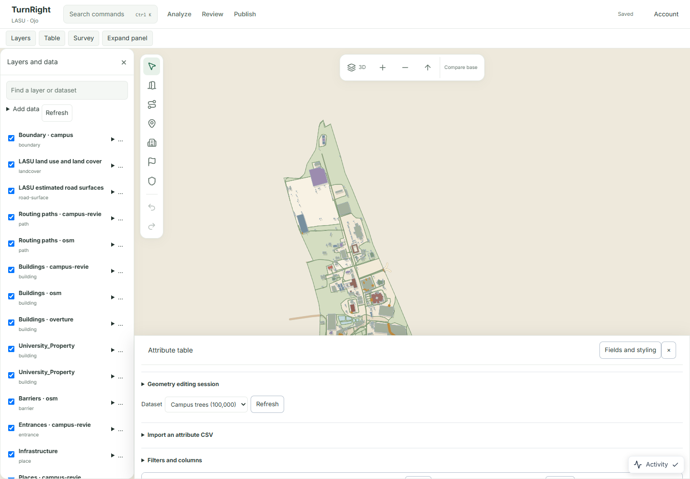
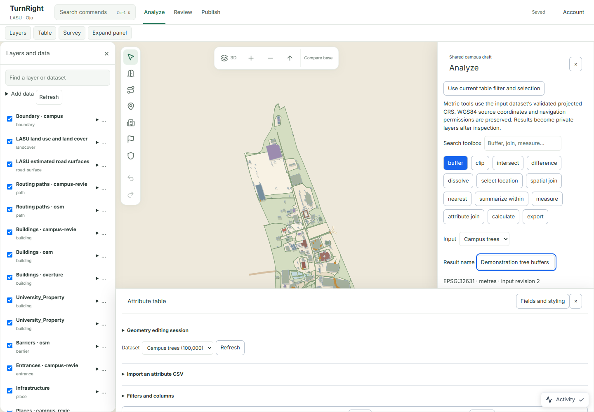
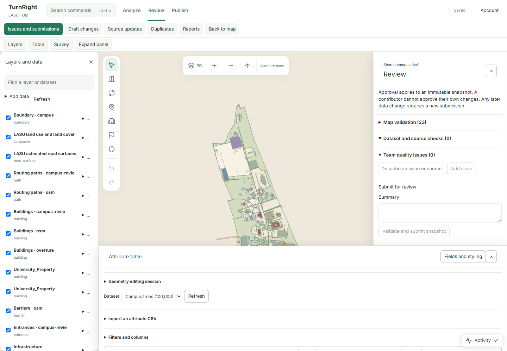
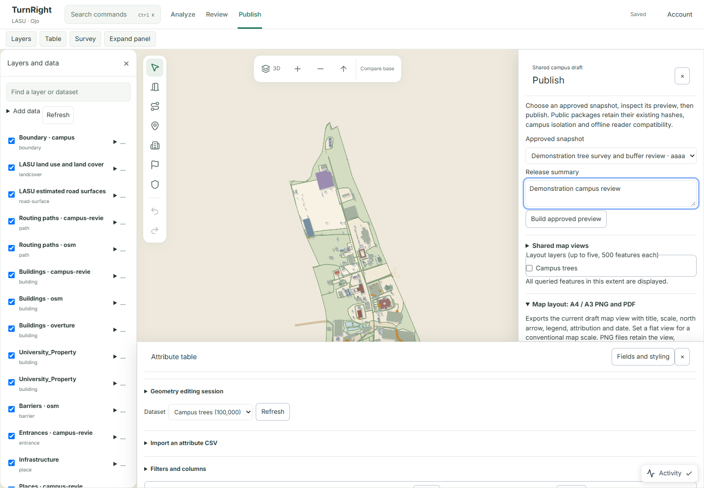
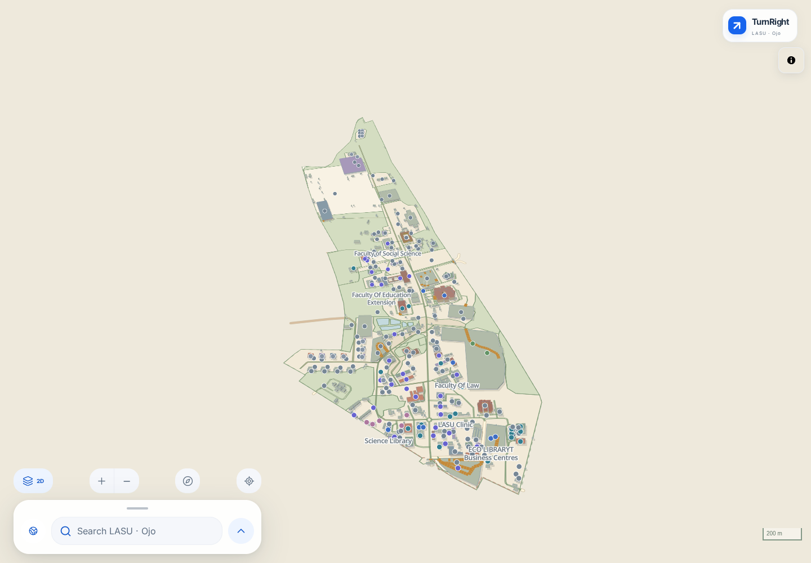
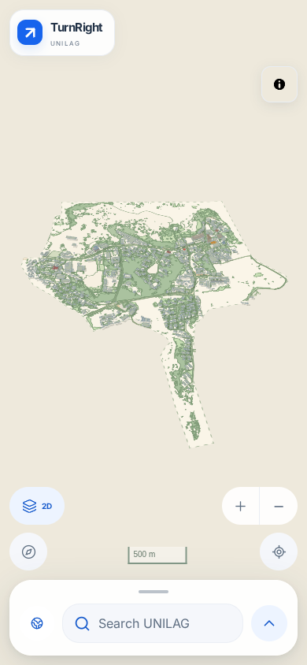

# TurnRight

**A campus GIS platform for small teams — from source data to reviewed, published maps.**

Import spatial data and asset tables, edit geometry and attributes, run analysis, resolve quality issues, obtain independent approval, and publish a campus that visitors can reopen offline. TurnRight combines one map-centered private editor with public walking/driving navigation, photographs, field evidence and building authoring.

[Open map](https://turnright.vercel.app/) · [LASU](https://turnright.vercel.app/?campus=lasu) · [UNILAG](https://turnright.vercel.app/?campus=unilag) · [Team workspace](https://turnright.vercel.app/admin) · [Documentation](docs/README.md) · [Deployment status](docs/PRODUCTION.md)

> An independent project, not an official university service. Campus routes have not been field-verified. A mapped approach is not a confirmed entrance; visual detail does not establish access permission. Unknown measurements and accessibility conditions remain explicit.

## One connected workflow

**Import → edit → analyze → validate → submit → independently approve → preview → publish → offline**

| Shared editor area | What teams can do |
| --- | --- |
| **Catalogue and table** | Browse indexed, revision-consistent pages; configure typed fields, aliases, units and domains; filter/sort, inspect statistics, import CSV tables, select public fields and export data. |
| **Map and properties** | Edit geometry with topology-aware tools, shared selection, undo/redo, optimistic concurrency and personal recovery. Preserve separate source records and corrections. |
| **Analyze** | Run buffer, clip, intersect, difference, dissolve, spatial/attribute joins, nearest, summarize-within, measurement and restricted calculations. Inspect staged results before applying a new private layer. |
| **Review** | Triage map-linked issues, assign work, retain comments/evidence, inspect immutable submissions and approve an exact content hash independently of its contributors. |
| **Publish** | Preview and release approved snapshots, restore one campus through renewed review, retain other campuses, and export A4/A3 maps. |

[Unified editor navigation](docs/UNIFIED-EDITOR.md) · [Complete workflow, roles and operating limits](docs/GIS-PLATFORM.md) · [Editing](docs/EDITOR.md) · [Imports](docs/CAMPUS-IMPORTS.md)

Administrator, editor, reviewer and publisher roles compose per campus. The original owner becomes an administrator and can record a reasoned, audited review override. Personal recovery and unfinished uploads remain user-scoped. Ready assets attached to campus work can be reused by authorized teammates.

The workspace targets **100,000 features** with bounded server queries and editing sessions. That is a dataset target, not a claim that every mobile device can render 100,000 features interactively. Public navigation and offline packages have their own smaller limits.

## Current editor screenshots

Unaltered captures of the production-built application use a verified published LASU basemap and isolated demonstration team/API responses. The 100,000-row catalogue count illustrates paging controls; it is not a live inventory or a performance measurement. [Capture provenance and reproduction](docs/assets/screenshots/README.md#unified-editor--5-october-2026).

| Repeatable analysis | Independent review |
| --- | --- |
|  |  |

## Capabilities

- **Structured datasets:** stable campus/layer/feature identities; text, number, boolean and date fields; required values and coded domains; immutable source attributes plus correction overlays; saved filters and map views.
- **Spatial analysis:** indexed PostGIS queries and isolated GDAL/GEOS/PROJ jobs. Runs retain inputs, revisions, parameters, CRS, engine, actor, progress and diagnostics. Cancel, retry or rerun settings; stale inputs prevent application.
- **Cartography and exchange:** categorical/graduated styles, proportional point symbols, labels and legends; selected/filtered GeoJSON, CSV and GeoPackage with provenance receipts; A4/A3 PNG and browser-print PDF. Released maps retain exact package identity and date.
- **Quality and governance:** geometry, connectivity, duplicate, attribute, evidence and source-conflict checks; assignments, comments and dispositions; independent approval bound to content; append-only audit and guarded publication.
- **Geometry and roads:** holes, multipart editing, split/merge and linked-width regeneration. Routing paths remain selectable beneath road polygons. Visual-only geometry never grants walking or driving access.
- **Models and photographs:** footprint-bound building evidence, roofs, façades, windows, surface text, curves and meshes; GLB/glTF/OBJ/STL exchange; credited galleries, local image editing, compression and interruption recovery.
- **Public navigation:** searchable places/streets, walking and driving routes, entrances, restrictions, closures, parking handoffs, foreground GPS and offline spoken guidance. Search, routing and GPS processing run on the device.
- **Independent campuses:** one persistent map, clickable campus silhouettes, remembered campus selection, scoped saved places/reports and separately verified offline downloads.

Arbitrary attributes remain private until explicitly selected for publication. Analysis outputs begin as private layers and never silently replace source geometry or change routing permissions.

## Public campuses

LASU Ojo and UNILAG Akoka are independently published. Application deployments preserve their existing packages; team edits become public only through the reviewed release workflow.

| Published content | LASU Ojo | UNILAG Akoka |
| --- | ---: | ---: |
| Building footprints | 393 | 723 |
| Destinations | 220 | 116 |
| Photographs | 44 | 16 |
| Road surfaces | 82 illustrative | 179 surveyed |

[Current release receipts](docs/PRODUCTION.md) · [LASU coverage](docs/LASU-LAYERS.md) · [UNILAG evidence and unresolved conflicts](docs/UNILAG-DETAIL.md)

| Public desktop map | Public phone view |
| --- | --- |
|  |  |

These unaltered public captures are from **5 October 2026**. [Live verification](docs/assets/gis-platform-production-2026-10-05.json) checked all 180 assets, 32 browser/campus/theme/view combinations and offline reopening in Chromium and WebKit. Phone images are browser simulations, not physical-device verification. [Capture provenance and historical galleries](docs/assets/screenshots/README.md) remain available.

## Get started

Use **Node 22.23.3**, pinned in .node-version and .nvmrc.

~~~sh
cd web
npm ci
npm run dev
~~~

The local public map needs no credentials. Vite does not emulate the private Vercel APIs. Team login, source imports, database queries, analysis and publication need the [deployment configuration](docs/DEPLOYMENT.md). Never put service credentials in VITE_* variables or Git.

~~~sh
npm test -- --maxWorkers=2
npm run lint
npm run check:configured-build
npx playwright test tests/browser/gis-workflow.spec.ts
npx playwright test --config playwright.webkit.config.ts tests/browser/gis-workflow.spec.ts
npx playwright test --config playwright.pwa.config.ts
~~~

The configured build uses placeholder public authentication settings to test real dependency boundaries; it is not an account configuration. Native database/engine checks run in [GIS acceptance CI](.github/workflows/gis-acceptance.yml); importer drivers use a separate pinned Linux image. [Reproduction and evidence](docs/GIS-PLATFORM.md#reproducible-development-and-acceptance).

## Work with campus data

1. Sign in to **Team workspace**. An administrator assigns existing Supabase Auth users to campus roles in **Campus menu → Campus memberships**.
2. Use **Layers and data → Add data** to import spatial files or public OSM/ArcGIS sources. Inspect CRS, stable identities, field mappings and repair diagnostics before accepting proposals into the shared draft.
3. Use the **attribute table** for typed attributes and non-spatial asset CSVs. Join tables in **Analyze**, then inspect and apply the result as a private dataset.
4. Select a feature for **Edit geometry**. Finish the bounded editing session with **Save and end geometry session**; other team edits use explicit conflict handling.
5. Style results and explicitly choose public fields. Resolve blocking issues in **Review**, submit a snapshot, and obtain approval from a non-contributor.
6. A publisher previews and publishes that exact approved content. Export data or a map, then download the published campus in the public **Offline** panel.

Original source attributes remain separate from corrections. Reimports preserve stable identities, accepted mapping choices and authored references. A source refresh invalidates processing results based on older revisions. Subsequent content changes invalidate approval.

## Supported imports and exports

| Input | Support |
| --- | --- |
| GeoJSON, ArcGIS JSON, TopoJSON, GeoJSON sequences/NDJSON | Feature collections, multipart geometry and GeometryCollections |
| Shapefile, GeoPackage, FlatGeobuf, File Geodatabase | Complete companion files/layer directories; select vector layers |
| KML/KMZ, GPX, GML, MapInfo TAB/MIF | Local vector content and required companions; external KML links rejected |
| GeoParquet, georeferenced DXF | Geographic metadata/known CRS required; local CAD coordinates are not automatically georeferenced |
| Spatial CSV | Coordinate columns or WKT and explicit CRS |
| Asset CSV | Non-spatial typed tables for attribute joins |
| OSM XML/PBF and public ArcGIS services/Web Maps | Complete dependencies/records; no private ArcGIS authentication |
| Mixed vector ZIP | Supported datasets with companions retained together |

Export selected/filtered datasets as **GeoJSON, CSV or GeoPackage**. Receipts retain CRS, source provenance and input revisions. Metric operations use the campus's validated WGS84 UTM analysis CRS and metres; stored coordinates remain WGS84. [Detailed format and repair rules](docs/CAMPUS-IMPORTS.md).

## Architecture and boundaries

React/TypeScript and MapLibre share one map. Supabase/PostGIS stores campus memberships, authoritative sources/corrections, typed datasets, a rebuildable spatial index, jobs and immutable reviews. Vercel serves the PWA and typed compatibility API; GitHub Actions runs isolated processing and release gates. Specialist tasks load on demand inside the shared shell.

| Boundary | Current limit |
| --- | --- |
| Spatial workspace dataset target | 100,000 features |
| Interactive query/edit batch | Up to 500 features; the attribute table displays 100 rows per page |
| Query response | 2 MB |
| Asset CSV | 2.5 MB, 100,000 rows, 100 fields |
| Processing input/output | 100,000 features and 50 MiB each |
| Public navigation package | 20,000 map features and 25 MB |
| Draft map layout | Five layers, up to 500 visible features each; incomplete extents are rejected |
| Public/editor startup budgets | 425 KiB public; 185 KiB additional editor, gzip |
| Lazy GIS workspace budget | 20 KiB incremental gzip each |

The importer separately limits uploaded batches to 50 MiB, expanded archives to 250 MiB and jobs to 100 layers/20 minutes. Worker containers disable network access, drop capabilities and bound scratch space, CPU, memory and execution time. [Architecture](docs/ARCHITECTURE.md) · [Performance](docs/PERFORMANCE.md).

## Deployment and verification

Apply additive migrations **001–037** in order for a fresh installation, or only missing migrations for an existing database. Release the matching application, API and worker workflows together. The owner bootstrap remains in admin_users; ongoing access is campus membership based. PUBLISHED_MAP_URL preserves current public packages during code deployments.

Pull requests run unit/database, type, lint, configured-build, browser, offline and native GIS checks. Reviewed content releases also require the comprehensive gates. [Deployment procedure](docs/DEPLOYMENT.md) · [Configuration](docs/CONFIGURATION.md) · [Acceptance](docs/ACCEPTANCE.md) · [Actual deployment receipts](docs/PRODUCTION.md).

The preceding GIS platform release's [complete release gates](docs/assets/gis-platform-release-gates-2026-10-05.json) passed **714 tests across 99 files**, both TypeScript projects, lint and unchanged build budgets; 187 Chromium cases, 87 WebKit cases, 15 additional WebKit photo cases and 10 offline cases. Native PostGIS/isolated GIS/importer checks also passed, including 100,000-feature paging and database backup restoration. [Production](docs/PRODUCTION.md) separately records live service, migration and deployment evidence; fixture success does not establish the remaining multi-user/device/field acceptance.

## Repository structure

| Path | Responsibility |
| --- | --- |
| web/src | Public app, geometry/model editors and lazy GIS workspaces |
| web/api, web/server | Authentication/capabilities, dataset queries, jobs, reviews and publication |
| web/tests | Unit, PostGIS migration, browser and offline coverage |
| scripts/map_import | Shared import registry, inspection and isolated conversion |
| scripts/gis, scripts/gis-worker.mjs | Analysis/export engine, worker lifecycle and native database acceptance |
| supabase/migrations | Additive schema, RLS and transactional RPC upgrades |
| data | Attributed source preparation, surveyed/reviewed evidence and public assets |
| docs | Workflow guides, deployment receipts, limits and screenshot provenance |

Raw uploads, private snapshots, credentials and local recovery are excluded from Git and public deployments.

## Scope and next releases

This release focuses on the complete small-team campus workflow. It does not claim desktop ArcGIS/QGIS parity or OGC conformance. Enterprise SSO, editing branches, arbitrary user code, raster/georeferencing, external WMS/WMTS, OGC API Features, workflow scheduling, advanced atlases and indoor/terrain analysis are follow-on work. Broader projected CRS support, vector PDF and an invitation-mail service are also outside the current implementation.

Offline public navigation and prepared personal editing/recovery remain supported; server queries, shared-team synchronization, analysis and publication require a connection. Physical Android/iPhone, GPS and campus field checks remain separate acceptance work. There is no cross-campus routing or verified step-free guarantee.

## Documentation and data rights

[Documentation index](docs/README.md) links the current guides. Historical research and deployment records retain their original dates, counts and limits. [Attribution](data/ATTRIBUTION.md), [photo records](data/photos/README.md) and in-app credits document separate data/asset terms. OpenStreetMap-derived data retains ODbL attribution. Owner-authorized ArcGIS publication does not imply a broader public reuse licence.

Contributions should preserve campus identities, provenance, private attributes, independent review, recovery and existing resource budgets.
