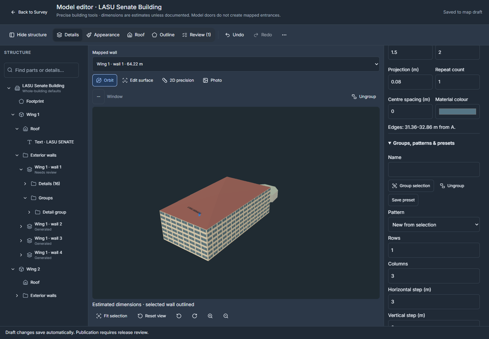
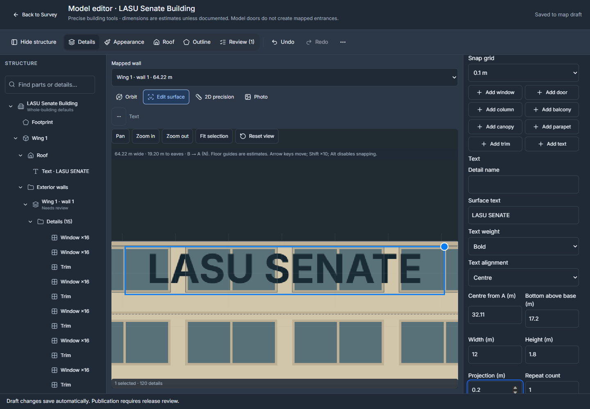

# Building appearance and model editing

The current owner workflow is the [unified Edit model workspace](UNIFIED-MODEL-EDITOR.md). Open **Edit model** from a selected building; choose Appearance, Roof or Outline inside the dedicated workspace. **Details** and **Review** share the same building draft and history. The former long façade form and its one-shot Apply action are superseded.

On mobile, the canvas fills the workspace and controls open in one focused sheet. Use the labelled mode selector, **Choose wall**, and **Orbit / Edit surface / 2D precision / Photo** views. Tap selects; Move or Resize explicitly enables geometry editing. Pinch navigation cancels an unfinished edit. The sheet has Expand/Collapse/Done controls, safe-area spacing and focused-input scrolling. Desktop has a collapsible tree, a central viewport and a properties panel.

The selected detail's **⋯** button and right-click menu hold Duplicate, Copy, Paste/copy-to, Delete, Lock and Hide. **More → Selection actions** provides access from mobile sheets. Ctrl/Cmd+D duplicates; Ctrl/Cmd+C/V copies and opens a placement preview; Ctrl/Cmd+A selects the wall's details. Shift+F10 opens the menu. These shortcuts do not replace normal editing inside text inputs.

Touch and hold a visible detail in **3D** to open the same actions. Moving your finger or touching with a second finger cancels the hold. **×** beside Undo/Redo exits the workspace; **Done** only closes its current tool panel. Short landscape screens place tools beside the canvas, with independent scrolling.

The workspace opens in Orbit. Selecting a tree row or mesh shares selection with properties without moving the camera. **Edit surface** uses an orthographic view of the actual wall, roof or footprint; returning to Orbit restores the previous position. Precision views reuse the same commands and provide a WebGL fallback. The nested tree supports disclosure, search, keyboard navigation and same-wall detail multiselection. Group/pattern children reference existing records; floor counts remain properties.

## Select and place

Use the searchable hierarchy, mapped-wall list, face-on canvas or selectable 3D preview. Walls show their mapped length and review state; dimensions are measured from the labelled endpoint and model base. Numeric fields use metres at the editing boundary while saved façade coordinates remain compatible with existing renderers.

Move and resize on the canvas, enter dimensions, or nudge with arrow keys. The grid offers 0.01, 0.1 and 1 metre increments; Shift multiplies a nudge by ten and Alt bypasses snapping. Multi-selection supports alignment, equal gaps and mirroring. Groups, editable patterns, instance detachment, duplicate, copy-to-wall/building and independent named presets reuse the same command history. Copied layouts receive fresh identities and show a placement preview. Out-of-bounds details require explicit repair.

Generated windows and trim can be previewed and converted into editable details. Add buttons insert the requested detail immediately while preserving that generated layout in one undoable action. Blocked additions remain recoverable; repair the reported issue and use **Save unfinished wall**. Whole-building height and floor-count controls are available inside Appearance. Custom windows, doors, columns, balconies, canopies, parapets and trim do not create entrances or routing connections. Photographs are optional for explicitly illustrative designs. Observed details require matching photographic evidence; documented dimensions need measurement provenance.

**Ungroup** appears in selected-item actions when any selected detail belongs to a group. **Detach instance** makes one repeated occurrence independent. Both actions preserve the remaining details and support undo.

**Add text** creates wall lettering; **Add roof text** creates wing lettering. Edit wording, size, colour, weight, alignment and placement. Roof labels follow the actual roof planes and must remain outside courtyard openings. Text uses the existing draft/release flow.

## Appearance and geometry

Building defaults flow to wings and then walls. **Use inherited value** removes an override. Window spacing defaults to 4 m and supports 0.5–20 m. Unknown heights remain illustrative; a model is not a survey. Standard hip/gable roofs require a convex four-sided wing without a courtyard and a pitch that fits the height. Complex wings use the existing custom-roof triangulation.

**Appearance → Building height** opens whole-building controls inside Appearance. Floor count uses an explicit 3 m-per-floor estimate. A missing count remains recoverable input until completed. Height changes adjust inherited custom roofs proportionally by default, including eaves and roof-point elevations; the checkbox can retain recorded elevations instead. Wing overrides remain explicit. Existing mismatches offer **Fit inherited custom roofs to current building height**. Height and roof changes share one undo action and flag affected wall assignments; physical detail dimensions and roof plan coordinates are preserved.

Roof mode stores geographic control points, elevations, ridge/valley constraints and footprint attachments. Outline mode edits the existing mapped vertices rather than a second footprint. Courtyards remain open. Completed valid roof actions save automatically; an invalid intermediate plan remains local for repair. **Done editing roof** closes the roof controls. Outline and height changes can invalidate associated details or textures. Physical dimensions are preserved for explicit placement review; removed assignments stay recoverable through rematching.

## Draft, review and recovery

Each completed numeric edit or pointer gesture is one undoable command. The shared editor retains 100 actions, operation identities, owner-scoped IndexedDB recovery and optimistic conflicts. Selection, cameras, panel resizing and visibility/locking are editing state, not public model changes. Closing preserves unfinished fields and roof work. Storage failure is reported; it must not be treated as a successful local save.

Review is targeted: **Mark this wall reviewed** only reviews that wall. Copies and affected geometry require review. Source-photo replacement invalidates relevant evidence; captions and ordering do not establish a new wall match. Publication independently validates the immutable snapshot and assets through the normal preview/publish/rollback workflow.

To abandon one building's saved changes, use **Restore published building** in its inspector when a matching published correction is available. Inspect the proposed repair and choose **Apply reviewed repair**. Other draft corrections remain intact; Undo restores the previous building draft. This does not publish or roll back the whole campus.

## Rendering and compatibility

Enhanced rendering remains the default, with Simple 3D and automatic performance fallback. Public/editor theme preferences are shared; building colours remain recognizable in both themes. The model workspace preserves its camera during selection and completed detail edits. Lightweight drag previews do not regenerate the full mesh on every pointer move.

Meshes batch repeated geometry by material while carrying detail and repeated-instance picking identities. One model build runs at a time and only the newest pending revision is retained. Closing releases preview workers and GPU resources; failed builds retain the draft and offer **Retry model preview**. Architectural details have a separate revision from legacy geometry; selection and façade evidence notes do not request a rebuild.

The visual allocation remains **12 MiB for campus geometry/textures**, **8 MiB for globe assets**, and **64 MiB resident building textures**. Prepared offline installations include the lazy workspace. Public package schemas 1–3 and the database schema are unchanged. Private names, groups, patterns and presets use versioned draft JSON and are omitted from downloads. Older clients receive an update message before they can drop this metadata.

## Verification

Before building a release preview, the Releases panel lists pending model reviews by building and wall. **Review model** opens the affected assignment. Height-only changes need a placement review, while moved or reassigned walls also need a confirmed wall match. **Mark this wall reviewed** affects one wall and supports undo; it does not approve the rest of the building. See [release review steps](UNIFIED-MODEL-EDITOR.md#publication).

[Current implementation and performance evidence](MODEL-EDITOR-VERIFICATION.md) replaces the old build-count and Apply/Cancel acceptance instructions. The earlier [roof coverage](BUILDING-ROOF-COVERAGE.md) and [photographic coverage](PHOTO-MODEL-COVERAGE.md) remain dated evidence inventories, not claims about newly surveyed geometry.

Physical Android/iPhone touch, real keyboards and outdoor/offline campus checks remain distinct from browser simulations. Application deployment does not publish architectural draft changes.
