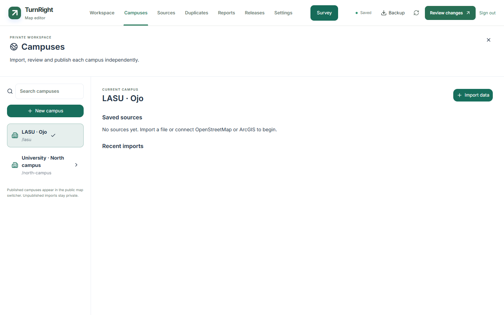
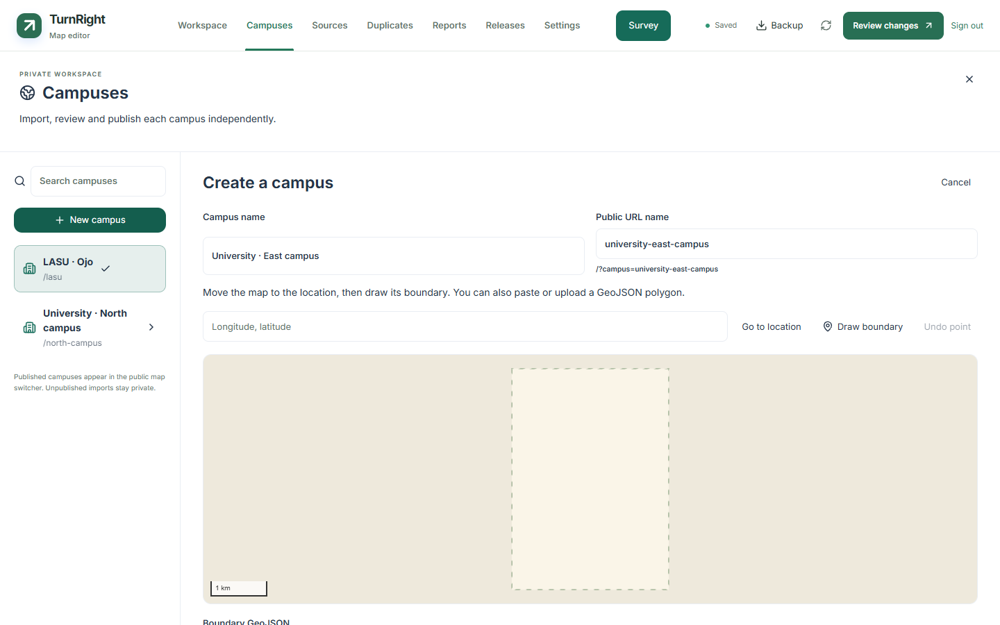
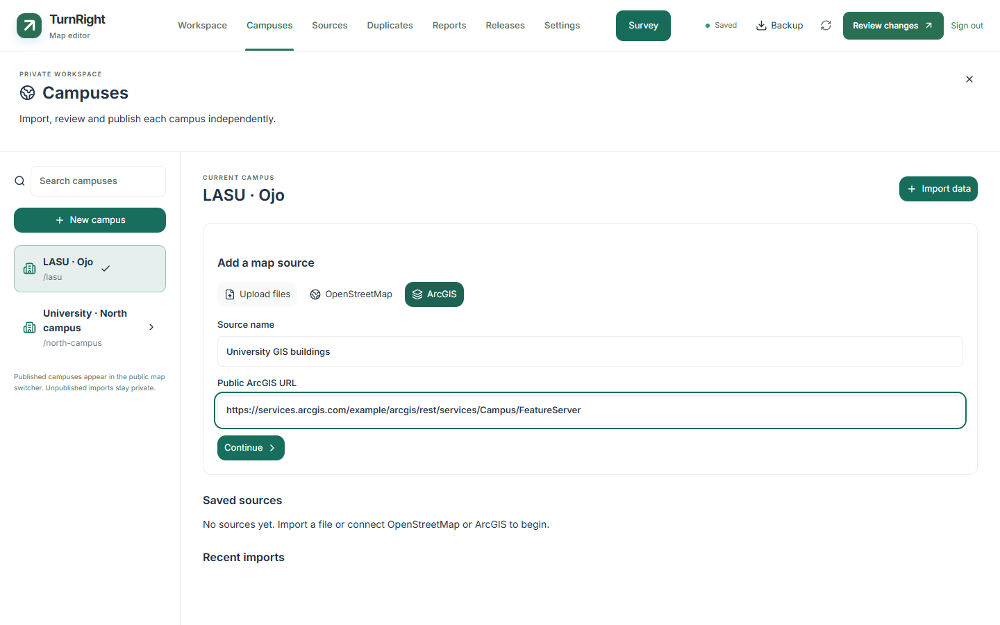
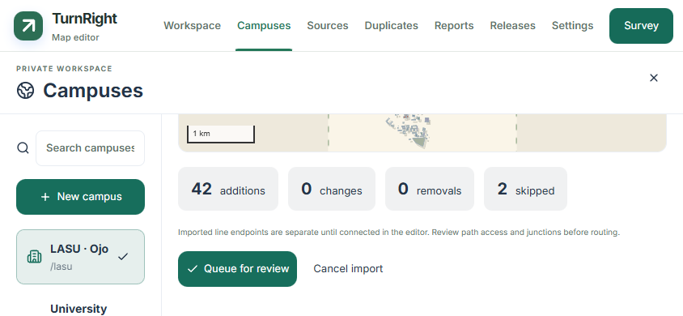
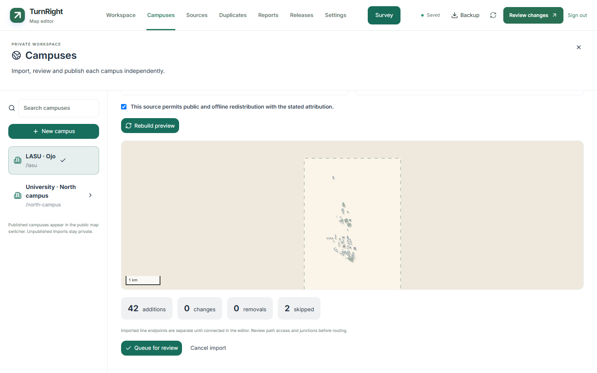
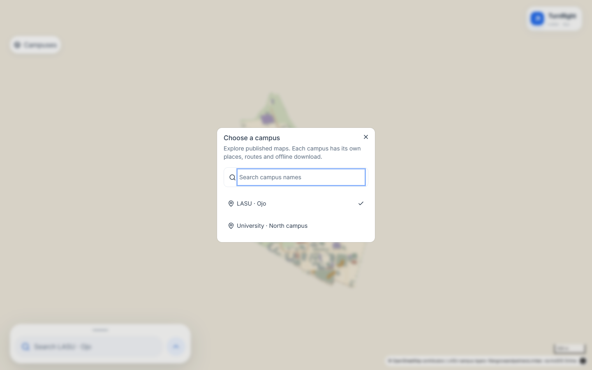
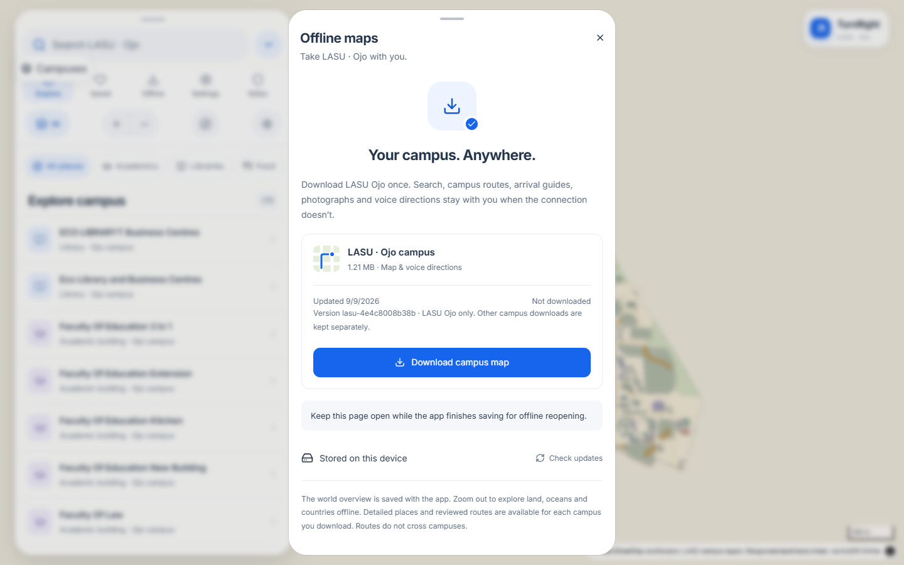

# Campuses and editable map imports

TurnRight keeps separate campus maps under the existing owner account. LASU is the default; links without a campus parameter retain their original meaning. Imported geography is private until the owner reviews the proposed changes and publishes a campus release.

**Rollout status:** the compatible readers are live. The Campuses controls and
writing API are implemented but await migrations 013–015 before production
enablement. [Production evidence](PRODUCTION.md) records the current deployment.



## Create a campus

Open **Editor → Campuses → New campus**. Enter a name and a unique public URL name. Move to the location using longitude, latitude, then draw a closed boundary. Alternatively upload or paste a WGS84 GeoJSON polygon. A collection containing several polygons exposes a boundary selector and previews the selected geometry before creation.

Campus identity is permanent; the public slug identifies links such as `/?campus=north-campus`. Creating a campus does not publish it. The new workspace begins with a boundary and no invented buildings, destinations or routes. Campus creation fields and import mappings are recovered on this device under the owner and campus identity.



## Connect sources

Choose **Import data** inside the target campus. Several sources can contribute layers to one campus. Existing sources retain their configuration for replacement files and manual checks.

| Input | Supported content and requirements |
| --- | --- |
| GeoJSON | Features and feature collections; polygon holes and multipart geometry retained |
| Shapefile ZIP | Matching `.shp`, `.shx`, `.dbf`; include `.prj` or select an EPSG projection |
| GeoPackage | Select individual vector layers; raster contents are excluded |
| KML / KMZ | Vector placemarks, lines and polygons; network links and external XML entities rejected |
| GPX | Waypoints, tracks and routes; tracks do not establish walking permission |
| CSV | Header row, explicitly mapped coordinate columns and projection |
| OSM XML / PBF | Complete campus-sized extracts, including referenced nodes and relation members |
| OpenStreetMap | Boundary-based Overpass query; complete extract required |
| ArcGIS | Public Web Maps, embedded feature collections, FeatureServer and queryable MapServer layers |

Imagery, scanned maps, PDF alignment, File Geodatabases, private ArcGIS authentication and routes between campuses are outside this release. Model GLB/glTF/OBJ/STL imports remain in the separate [model workspace](MODEL-AUTHORING.md).



Upload files directly to private storage; the application server issues a short-lived signed URL rather than receiving the file body. Select the same files to retry an interrupted upload. A different file with an already reserved name needs a replacement import. **Inspect layers** starts a background job; leaving the screen does not discard it. Reopen it in **Recent imports**. Cancel invalidates the run token, so a late worker cannot apply its result.

## Map fields and check placement

Choose an import role for each layer: building, path, place, entrance, barrier, land cover, boundary or skip. Suggested mappings are editable. Names, categories, heights, floors and access fields map to the existing editor model. ArcGIS aliases and coded-value labels appear in the selectors. Height units can be metres or feet; floor counts remain properties.

Choose a stable identifier for file reimports. OSM node/way/relation IDs are retained automatically. Without a stable identifier, subsequent files create replacement proposals; names and nearby coordinates are not treated as identity. Original files, attributes, source URLs, snapshots and hashes stay in private import storage.

Supported coordinate systems are converted to WGS84 through GDAL/PROJ. The layer
summary shows the detected source projection; leave the override empty to retain
it. A missing projection must be selected before a candidate is valid. CSV
requires both coordinate columns and its source projection. Verify the map
preview against the campus boundary; an apparently valid number is not proof of
the right projection. Detection and WGS84 output use separate fields so reopening
the mapping step cannot reinterpret projected metres as degrees.


**Build preview** reports additions, changes, removals, skipped features, invalid geometry, overlap candidates and disconnected walking networks. Long forms scroll inside the workspace. Mapping choices survive tab changes, resizing and rotation. The preview is bounded for responsiveness; counts cover the full processed dataset.



## Review, then publish

Use **Queue for review**, then **Open source review**. An import produces proposals; it does not accept source changes, replace owner corrections, or publish anything. Source changes use existing whole-record and field review. Overlaps require an explicit duplicate decision. An incomplete ArcGIS response or OSM extract cannot generate removals. Large removal batches stop for investigation.

Authored model assignments on matching building identities survive refreshes. Owner corrections remain separate from the source layer. Geometry changes can still require wall, roof, connection or duplicate review before publication.

OSM paths retain their node topology and access restrictions. Generic line endpoints remain separate until connected explicitly. GPX tracks and lines default to restricted access. Crossing bridges and tunnels are not connected because their lines happen to intersect. Imported entrance pins need a building/place assignment and an explicit approach connection. LASU-specific access decisions do not carry into another campus.



A campus with buildings and places can publish without routes. The public map then explains that directions are unavailable. Review permitted paths and their connections before promising navigation.

In **Releases**, prepare and inspect a preview, then publish. The preview freezes the campus snapshot and the current public catalogue revision. A changed catalogue makes that preview stale. The serialized release workflow preserves every other campus and verifies all referenced immutable assets. **Prepare restore preview** reuses a campus's historical package in a new deployment alongside the other campuses' current packages; it never promotes an old whole-site deployment.

## Public switching and offline maps

The public **Campuses** button searches published campuses only. Globe markers open the same catalogue entries. Campus links compose with place and building links; **Editor** keeps the selected campus and building through the existing OAuth callback. Switching while directions are active asks to stop the current route. The owner workspace also protects unfinished drawings, roof drafts, recording and pending saves.



Download or remove each campus from its own Offline panel. Saved places, recents, report drafts, active package pointers and editor recovery are scoped to campus. Deleting one download retains shared assets and every other campus package. The world overview is shared by the application.



## Refresh policy and attribution

Sources default to **Manual**. File sources refresh through **Replace file**. Online sources offer **Check source**; optional daily checks prepare review proposals using the saved field mappings. The original LASU source schedule stays at 02:17 UTC; opted-in campus sources run at 03:47 UTC. A scheduled proposal still requires review and publication.

Overpass snapshots are reused for 15 minutes per source. Requests have bounded retries and backoff. Configure `OVERPASS_URL` for another endpoint. Daily OSM checks remain unavailable unless `OVERPASS_SCHEDULE_ALLOWED=true` is set both in the server environment and GitHub repository variables for an endpoint that permits scheduled use. Map visitors never download source data.

Record the source attribution, licence and redistribution permission before publication. Public availability is not itself permission to redistribute ArcGIS content. OSM attribution and ODbL information remain in public data and offline packages. The map renders each campus's source attribution rather than hard-coded LASU credits. See [source attribution](../data/ATTRIBUTION.md), [OpenStreetMap copyright](https://www.openstreetmap.org/copyright), [Overpass usage](https://dev.overpass-api.de/overpass-doc/en/preface/commons.html) and [ArcGIS querying](https://developers.arcgis.com/rest/services-reference/enterprise/query-feature-service-layer/).

## Implementation and limits

The default limits are 50 MiB per upload batch, 250 MiB expanded archives, 100,000 normalized features, 100 layers and 20 minutes of job processing. Public package, model, photo and startup budgets remain independent. Split overly complex datasets into sources when they exceed a processing or public-package limit.

`scripts/import_map.py` runs conversion in a network-disabled, read-only Docker container. The GDAL 3.11.4 image is pinned by digest and supplies PROJ; Pyosmium 4.1.1 and Shapely 2.1.2 are pinned. Supported drivers are explicitly allowed. ZIP traversal/symlinks, external KML entities and arbitrary native-parser network access are blocked. Online adapters use HTTPS, reject private DNS answers, pin the resolved address and recheck redirects. ArcGIS object-ID batches must match both the requested IDs and feature counts before comparison.

`campuses`, `campus_sources`, `campus_imports` and `campus_import_assets` hold private identity, configuration and jobs. Migrations 013–015 add campus scoping to source records, edits, reviews, reports, surveys, media, model assets and releases. Legacy requests and backfilled records remain LASU-only. The server resolves public slugs and passes an explicit campus context to REST and transactional RPCs; private storage grants are not exposed to anonymous or authenticated browser clients.

The public `/packages/campuses.json` catalogue is versioned separately from immutable manifests. `/packages/latest.json` remains LASU's compatibility entry point. New manifests carry campus identity; LASU's existing feature IDs and public model fingerprints are unchanged. See [architecture](ARCHITECTURE.md) and [rollout](DEPLOYMENT.md).

## Verification

Use the `campus-*` unit tests, database migration/isolation tests and `tests/browser/campus-imports.spec.ts`. GIS fixtures run in `.github/workflows/map-import-tests.yml`, including the same network-disabled container used in production. Local Python runs skip GDAL integration if that runtime is absent; skipped cases are not acceptance evidence. The Linux run must pass before enabling imports.

```sh
cd web
npm test
npm run lint
npx playwright test campus-imports.spec.ts
npx playwright test --config playwright.webkit.config.ts campus-imports.spec.ts
npm run build
npm run check:configured-build
```

Screenshots are unaltered local application captures with isolated owner/source responses, illustrative campus names and a checked-in LASU geographic fixture. They demonstrate controls, not a second published production campus. Physical-device keyboards and native browser zoom remain separate manual checks. See [screenshot provenance](assets/screenshots/README.md) and [production evidence](PRODUCTION.md).
