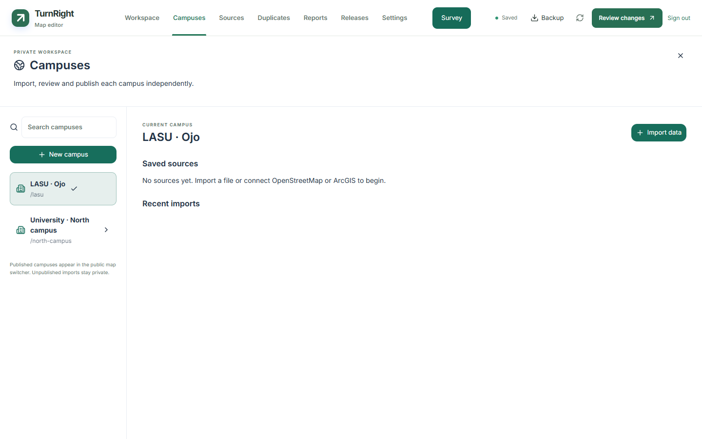
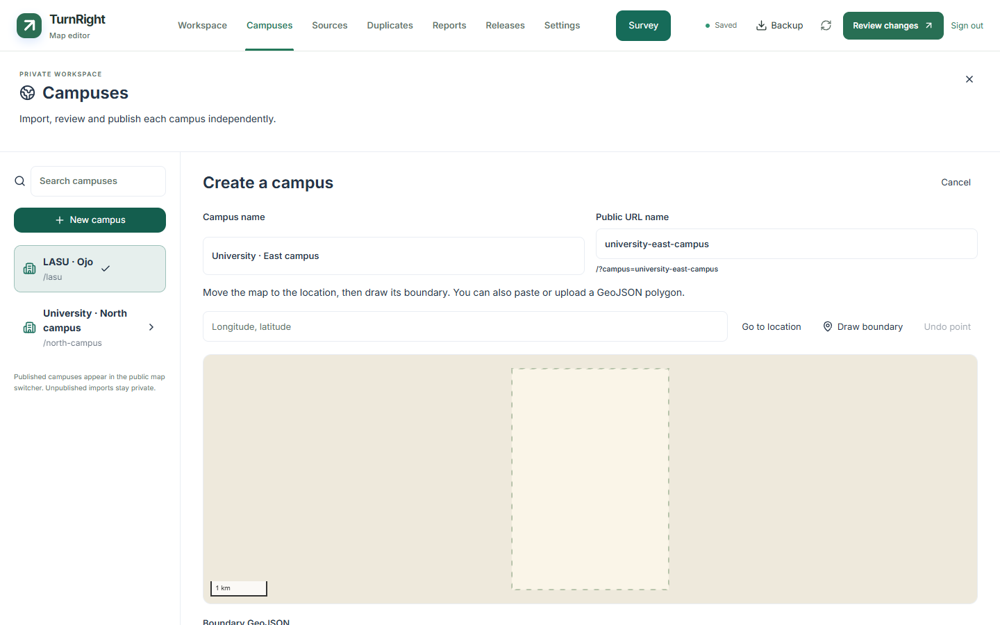
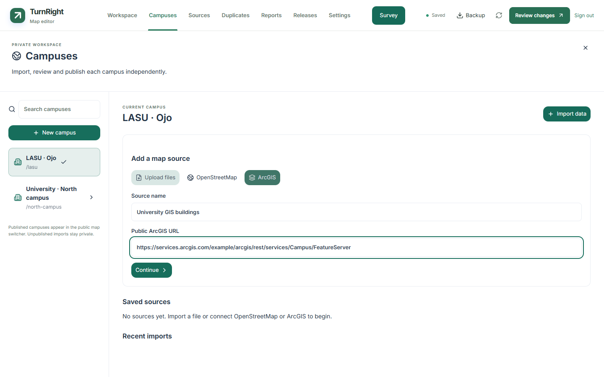
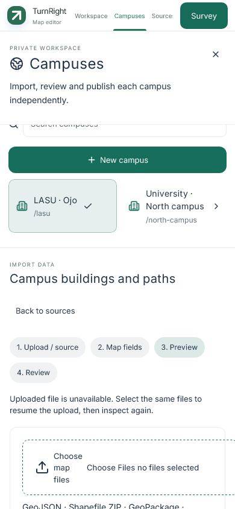
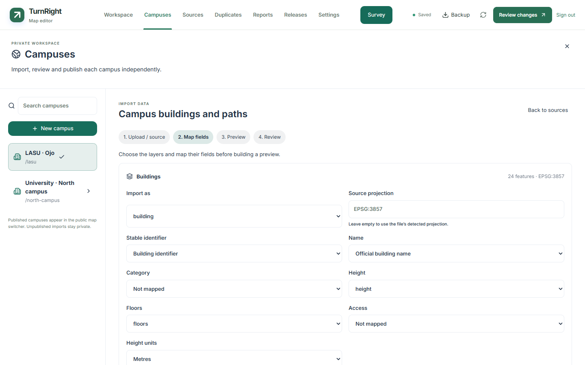
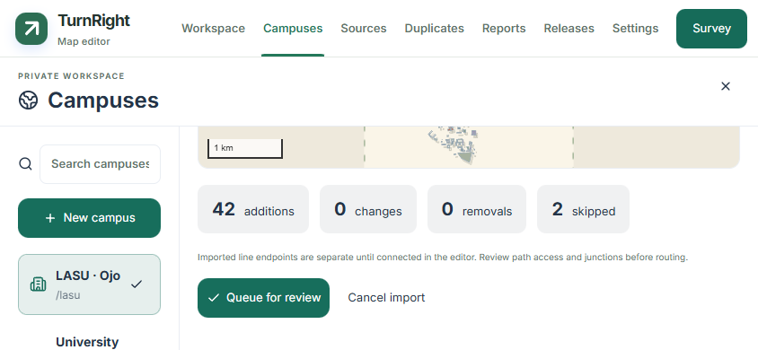
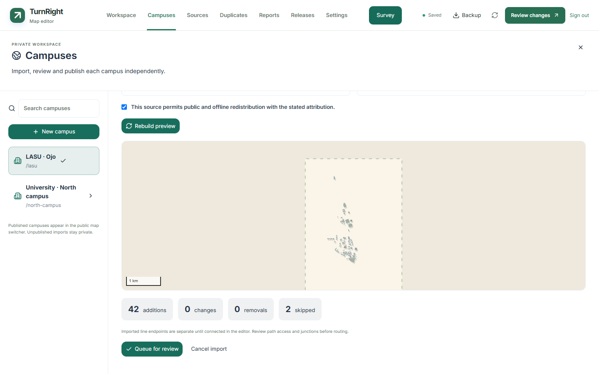
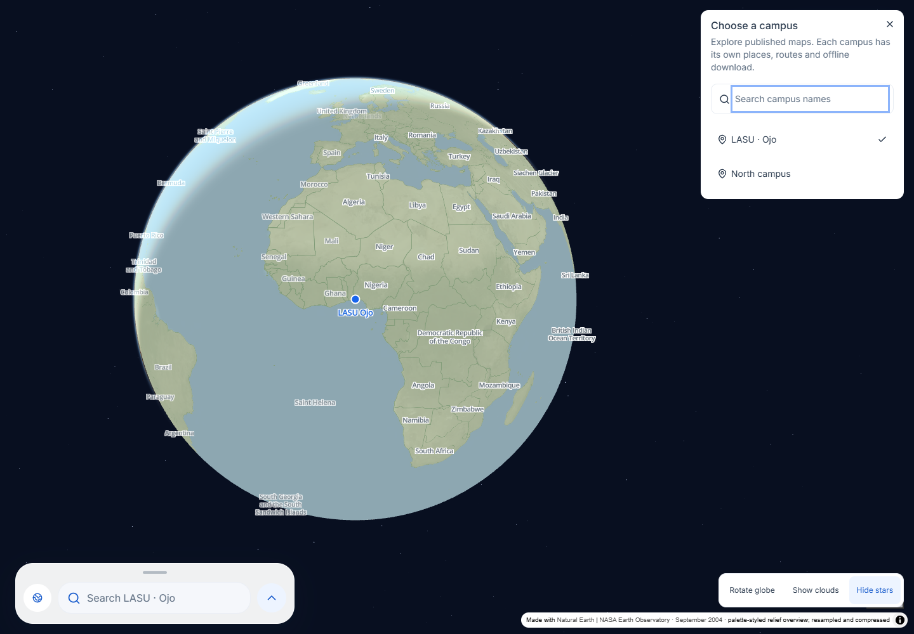
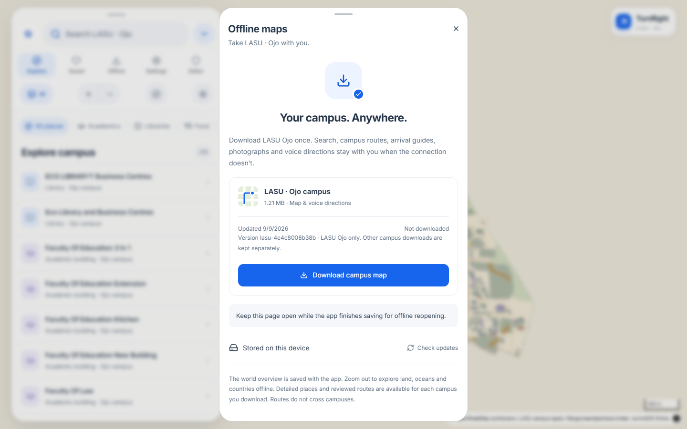
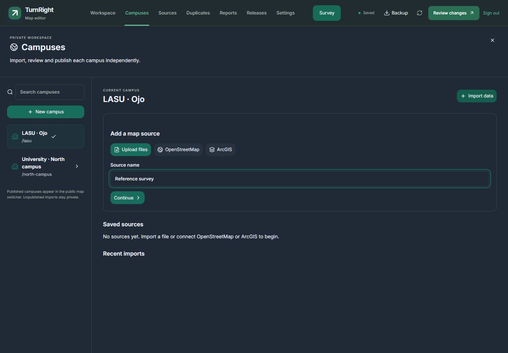

# Campuses and editable map imports

The pending [campus layer workflow](CAMPUS-LAYERS.md) connects accepted imports to stable campus layer identities. Accepted layer hashes survive filename changes; membership uses `mapLayerId`, distinct from the numeric road grade field. Pending import jobs stay in source review. Parcel-layer labels such as street addresses no longer classify a parcel as a road surface. Migration 020 has been applied; the corresponding editor deployment is still pending.

TurnRight keeps separate campus maps under the existing owner account. LASU is the default; links without a campus parameter retain their original meaning. Imported geography is private until the owner reviews the proposed changes and publishes a campus release.

**Rollout status:** migrations 013–019, the Campuses controls and the writing API
are live. Code deployments preserve published campus packages; publishing an
explicitly reviewed release remains a separate operation.
[Production evidence](PRODUCTION.md) records the deployment and checks.

**UNILAG detail upgrade (30 September):** 723 buildings, 116 destinations, 16 credited photographs and 179 road surfaces. The existing graph and access decisions are retained. The main library approach and other recorded field-verification gaps remain unresolved. [Coverage and source conflicts](UNILAG-DETAIL.md) · [Actual release receipts](PRODUCTION.md).



## Create a campus

Open **Editor → Campuses → New campus**. Enter a name and a unique public URL name. Move to the location using longitude, latitude, then draw a closed boundary. Alternatively upload or paste a WGS84 GeoJSON polygon. A collection containing several polygons exposes a boundary selector and previews the selected geometry before creation.

Campus identity is permanent; the public slug identifies links such as `/?campus=north-campus`. Creating a campus does not publish it. The new workspace begins with a boundary and no invented buildings, destinations or routes. Campus creation fields and import mappings are recovered on this device under the owner and campus identity.



## Connect sources

For UNILAG Akoka, the [download and source-comparison guide](UNILAG-DOWNLOADS.md) produces separate ArcGIS/OSM files with a 500 m access-road buffer, completeness checks and illustrated manual instructions. Downloading that package does not create or publish a campus.

Choose **Import data** inside the target campus. Several sources can contribute layers to one campus. Existing sources retain their configuration for replacement files and manual checks.

| Input | Requirements and supported content |
| --- | --- |
| GeoJSON / ArcGIS JSON | `.geojson`, `.json`, including `.geojson.json`; features, collections, bare geometry, multipart and GeometryCollections |
| TopoJSON | `.topojson` or detected JSON topology |
| GeoJSON sequences / NDJSON | `.geojsonl`, `.geojsons`, `.jsonl`, `.ndjson`; one feature per record |
| Shapefile | ZIP or matching `.shp`, `.shx`, `.dbf`; include `.prj` or select the source CRS |
| GeoPackage | `.gpkg`; select vector layers |
| KML / KMZ | Local vector content; external network links are rejected |
| GPX | Waypoints, tracks and routes; tracks confer no access permission |
| CSV | Coordinate columns or WKT geometry; map fields and CRS |
| OSM | Complete XML/PBF extracts, or boundary-based Overpass source |
| FlatGeobuf | `.fgb` |
| File Geodatabase | ZIP containing a complete `.gdb` directory |
| GML | `.gml`, with local schema companions where needed |
| MapInfo | Grouped TAB companions or MIF/MID, directly or in a ZIP |
| GeoParquet | `.parquet` / `.geoparquet` with GeoParquet metadata and WKB geometry |
| Georeferenced DXF | `.dxf` coordinates already tied to a known CRS; select that CRS |
| Mixed vector ZIP | Multiple supported datasets, with companion files kept together |
| Public ArcGIS | Web Maps, embedded collections and queryable FeatureServer/MapServer layers |

Raster imagery, scanned-map alignment, tile archives, proprietary DWG conversion and private ArcGIS authentication are deferred. Importing a CAD drawing does not automatically georeference a local engineering coordinate system. [GDAL driver documentation](https://gdal.org/en/stable/drivers/vector/index.html).




Upload files directly to private storage; the application server issues a short-lived signed URL rather than receiving the file body. Select the same files to retry an interrupted upload. A different file with an already reserved name needs a replacement import. **Inspect layers** starts a background job; leaving the screen does not discard it. Reopen it in **Recent imports**. Cancel invalidates the run token, so a late worker cannot apply its result.

Failed jobs also expose **Choose map files**. Re-select the original files to resume their reserved uploads, then inspect again; a retry creates a new run token and clears an unusable candidate. An ArcGIS layer's `/query?...` export link is accepted: inspection resolves the underlying layer and reports that it is using the campus bounds rather than the link's query filters or export settings.

GeoJSON exports containing `exceededTransferLimit` (including inside collection `properties`) are incomplete and are rejected with a download-all-records explanation. Use the source layer URL for complete ID batching, or download all batches yourself. `.geojson.json` filenames are supported. Road-width polygons use the road-surface role; routing paths require line geometry. Identifier suggestions prefer fields verified unique across the inspected layer, so a repeated legacy `Id` does not take precedence over a unique `OBJECTID` or `OBJECTID_1`.



### September 27 inspection repair

Failed production jobs reported `PermissionError: /work/request.json` before parsing. Matching the container's UID/GID to the runner fixes access to the private 0700 directory while retaining network/capability restrictions. The [Linux regression run](https://github.com/mrglasswillbreak/TurnRight/actions/runs/36296175970) verifies the real worker command/mount and every supported driver. Missing-upload errors now explain how to reselect the same files; resumable uploads invalidate stale run tokens and candidates.

Large ArcGIS snapshots also exposed a JSON-driver ambiguity: when feature records precede the schema, GDAL's header probe can select GeoJSON and fail before reading the later ArcGIS geometry type. Inspection now identifies the dialect from the parsed document and explicitly selects the [GDAL ESRIJSON driver](https://gdal.org/en/stable/drivers/vector/esrijson.html). The regression fixture puts a long feature record before the schema. The existing production UNILAG ArcGIS job then [completed inspection successfully](https://github.com/mrglasswillbreak/TurnRight/actions/runs/36296250634), exposing 14 layers for private field mapping, including 633 buildings and the complete 2,425-feature Greenland layer. No review candidates or public map changes were applied by this verification.

The five complete user-supplied files also [passed a production file inspection](https://github.com/mrglasswillbreak/TurnRight/actions/runs/36296393964): 633 building footprints, 157 road lines, 179 road-width polygons, 426 parcels and nine greenspaces, totaling 1,404 features. The private source **UNILAG supplied vectors — inspection** remains at Map fields. Parcel uses `OBJECTID_1`, road-width polygons are suggested as land cover, and walking access remains restricted until reviewed. The original batch containing truncated Greenland remains recoverable with its explicit completeness error. Inspection success does not certify geometry validity, redistribution rights or publication readiness.

The six supplied UNILAG examples were also checked locally without changing their contents. Greenland contains 1,000 valid polygons but explicitly reports truncation, so it needs a complete export. Parcel contains 426 features and requires its unique `OBJECTID_1` (the older `OBJECTID` repeats). Greenspace has nine features; Roads has 157 lines; Building_footprint has 633 polygons. Road width contains 179 polygons, one geometrically invalid, to resolve in preview/review. These checks do not establish source completeness for files without a source count or grant redistribution rights.

## Map fields and check placement

Choose an import role for each layer: building, path, place, entrance, barrier, land cover, road-surface, overlay, boundary or skip. Suggested mappings are editable. Names, categories, heights, floors, road class, surface, width, land use, vegetation and access fields map to the existing editor model. Unknown point, line and polygon datasets can remain generic overlays with editable labels, colour, opacity, visibility and order. ArcGIS aliases and coded-value labels appear in the selectors. Height and width units can be metres or feet; floor counts remain properties.

Choose a stable identifier for file reimports. OSM node/way/relation IDs are retained automatically. Without a stable identifier, content-derived identities can change when content changes; names and nearby coordinates are not treated as identity. Select an accepted layer identity after a filename/layer rename to reuse its mappings. Duplicate layer names are disambiguated by dataset context. Original files, attributes, source URLs, snapshots and hashes stay in private import storage.

Supported coordinate systems are converted to WGS84 through GDAL/PROJ. The layer
summary shows the detected source projection; leave the override empty to retain
it. A missing projection must be selected before a candidate is valid. CSV
requires both coordinate columns and its source projection. Verify the map
preview against the campus boundary; an apparently valid number is not proof of
the right projection. Detection and WGS84 output use separate fields so reopening
the mapping step cannot reinterpret projected metres as degrees.



**Build preview** reports additions, changes, removals, skipped features, invalid geometry, overlap candidates and disconnected walking networks. Long forms scroll inside the workspace. Mapping choices survive tab changes, resizing and rotation. The preview allocates coverage to each layer and spreads samples across its complete feature list. An explicit per-layer shown/total indicator identifies sampling; validation covers every feature. GeometryCollections split into stable editable component identities. Null geometries, duplicate identifiers and coordinate problems are reported.

Routine winding, closable rings and consecutive duplicate vertices are normalized automatically. A polygon repair is accepted only if it is valid, nonempty, retains all components, and changes area by no more than 1% in a local equal-area projection. Dimension-changing/collapsed geometry or larger changes require review. Original uploads and geometry hashes stay private. The preview shows repair actions and area diagnostics; complete receipts remain in the private candidate even when its visible report is capped. [Why repair output types need checking](https://shapely.readthedocs.io/en/stable/reference/shapely.make_valid.html).



## Review, then publish

A completed preview enables **Queue for review** when its validation has no
blocking errors and its field mappings still match the preview. Database JSON
key ordering does not count as a mapping change. If the button is disabled, the
message beside it explains whether an operation is still running, preview
details are unavailable, validation needs repair, or settings have changed.
Use **Rebuild preview** after changing a mapping, attribution or permission;
reverting the change restores the existing preview without another build.
Reopening a completed import retains recoverable mapping edits and the same
checks. A successful background job alone does not bypass validation.

Large validated batches use a bulk transaction (migration 016) with a bounded 60-second database allowance (migration 017). The server waits up to 75 seconds for this queue RPC; other database requests retain their usual limit. If a queue attempt fails, its transaction rolls back and the validated preview remains recoverable. Reopen the import before retrying to distinguish a completed queue from a failed request.

Repeat imports default to adding/updating selected layers. Choose **Replace selected layers** or **Replace the complete source** explicitly before missing records can be proposed for removal; verify source completeness first.

Use **Queue for review**, then **Open source review**. An import produces proposals; it does not accept source changes, replace owner corrections, or publish anything. Source changes use existing whole-record and field review. Overlaps require an explicit duplicate decision. An incomplete ArcGIS response or OSM extract cannot generate removals. Large removal batches stop for investigation.

Authored model assignments on matching building identities survive refreshes. Owner corrections remain separate from the source layer. Geometry changes can still require wall, roof, connection or duplicate review before publication.

OSM paths retain their node topology and access restrictions. Generic line endpoints remain separate until connected explicitly. GPX tracks and lines default to restricted access. Crossing bridges and tunnels are not connected because their lines happen to intersect. Imported entrance pins need a building/place assignment and an explicit approach connection. LASU-specific access decisions do not carry into another campus.



A campus with buildings and places can publish without routes. The public map then explains that directions are unavailable. Review permitted paths and their connections before promising navigation.

In **Releases**, prepare and inspect a preview, then publish. The preview freezes the campus snapshot and the current public catalogue revision. A changed catalogue makes that preview stale. The serialized release workflow preserves every other campus and verifies all referenced immutable assets. **Prepare restore preview** reuses a campus's historical package in a new deployment alongside the other campuses' current packages; it never promotes an old whole-site deployment.

## Public switching and offline maps

The public globe button beside search (**Choose a campus**) opens the globe and searchable published-campus chooser together. It stays reachable with the card collapsed or expanded. Closing the chooser leaves the globe visible; choosing the current campus returns to its map. Active directions retain their camera and following when search opens, and switching campuses still requires confirmation. Globe markers open the same catalogue entries. Campus links compose with place and building links; **Editor** keeps the selected campus and building through the existing OAuth callback. The owner workspace also protects unfinished drawings, roof drafts, recording and pending saves.



Download or remove each campus from its own Offline panel. Saved places, recents, report drafts, active package pointers and editor recovery are scoped to campus. Deleting one download retains shared assets and every other campus package. The world overview is shared by the application.



## Refresh policy and attribution

Sources default to **Manual**. File sources refresh through **Replace file**. Online sources offer **Check source**; optional daily checks prepare review proposals using the saved field mappings. The original LASU source schedule stays at 02:17 UTC; opted-in campus sources run at 03:47 UTC. A scheduled proposal still requires review and publication.

Overpass snapshots are reused for 15 minutes per source. Requests have bounded retries and backoff. Configure `OVERPASS_URL` for another endpoint. Daily OSM checks remain unavailable unless `OVERPASS_SCHEDULE_ALLOWED=true` is set both in the server environment and GitHub repository variables for an endpoint that permits scheduled use. Map visitors never download source data.

Record the source attribution, licence and redistribution permission before publication. Public availability is not itself permission to redistribute ArcGIS content. OSM attribution and ODbL information remain in public data and offline packages. The map renders each campus's source attribution rather than hard-coded LASU credits. See [source attribution](../data/ATTRIBUTION.md), [OpenStreetMap copyright](https://www.openstreetmap.org/copyright), [Overpass usage](https://dev.overpass-api.de/overpass-doc/en/preface/commons.html) and [ArcGIS querying](https://developers.arcgis.com/rest/services-reference/enterprise/query-feature-service-layer/).

## Implementation and limits

The default limits are 50 MiB per upload batch, 250 MiB expanded archives, 100,000 normalized features, 100 layers and 20 minutes of job processing. Public package, model, photo and startup budgets remain independent. Split overly complex datasets into sources when they exceed a processing or public-package limit.

`scripts/import_map.py` runs conversion in a network-disabled, read-only Docker container. The GDAL 3.11.4 image is pinned by digest and supplies PROJ; Pyosmium 4.1.1, Shapely 2.1.2, Pyproj 3.7.2 and PyArrow 19.0.1 are pinned. GeoParquet WKB/metadata conversion runs inside this worker; it adds no browser parser. Supported drivers are explicitly allowed. ZIP traversal/symlinks, external KML entities and arbitrary native-parser network access are blocked. Online adapters use HTTPS, reject private DNS answers, pin the resolved address and recheck redirects. ArcGIS object-ID batches must match both the requested IDs and feature counts before comparison.

`campuses`, `campus_sources`, `campus_imports` and `campus_import_assets` hold private identity, configuration and jobs. Migrations 013–015 add campus scoping to source records, edits, reviews, reports, surveys, media, model assets and releases. Legacy requests and backfilled records remain LASU-only. The server resolves public slugs and passes an explicit campus context to REST and transactional RPCs; private storage grants are not exposed to anonymous or authenticated browser clients.

The public `/packages/campuses.json` catalogue is versioned separately from immutable manifests. `/packages/latest.json` remains LASU's compatibility entry point. New manifests carry campus identity; LASU's existing feature IDs and public model fingerprints are unchanged. See [architecture](ARCHITECTURE.md) and [rollout](DEPLOYMENT.md).

## Process visibility

Open **Activity** while inspecting or building a preview. It shows upload/file counts, verified ArcGIS retrieval batches, conversion and final job stages. The job remains visible in the campus workspace too. Status refreshes while online; cancellation still invalidates the run token so stale processing cannot apply results. [Progress monitor](PROGRESS-MONITOR.md).

## Verification

Use the `campus-*` unit tests, database migration/isolation tests and `tests/browser/campus-imports.spec.ts`. GIS fixtures run in `.github/workflows/map-import-tests.yml`, including the same network-disabled container used in production. Local Python runs skip GDAL integration if that runtime is absent; skipped cases are not acceptance evidence. The Linux run must pass before enabling imports.

```sh
cd web
npm test
npm run lint
npx playwright test campus-imports.spec.ts
npx playwright test --config playwright.webkit.config.ts campus-imports.spec.ts
npm run build
npm run check:configured-build
```

Run the complete GIS suite on Linux with Docker from the repository root, or use the **GIS import regression tests** GitHub workflow:

```sh
docker build -t turnright-gis-import -f scripts/map_import/Dockerfile scripts/map_import
docker run --rm --network none --cap-drop ALL --security-opt no-new-privileges --read-only --tmpfs /tmp:rw,size=512m -v "$PWD/scripts:/app:ro" --entrypoint python3 turnright-gis-import -m unittest discover -s /app/tests -p 'test_map_import*.py' -v
```

The app's dark/light/system preference also applies to the import header, forms and validation. Source fields retain entered values through a theme change. On narrow screens, the directory and form stack and scroll inside the workspace.



Screenshots are unaltered local application captures with isolated owner/source responses, illustrative campus names and a checked-in LASU geographic fixture. They demonstrate controls, not a second published production campus. Physical-device keyboards and native browser zoom remain separate manual checks. See [screenshot provenance](assets/screenshots/README.md) and [production evidence](PRODUCTION.md).
## September 27 UNILAG import outcome

This dated initial-import record is superseded by the [September 30 detail upgrade](UNILAG-DETAIL.md); its exclusions describe that earlier stage.

The requested building footprints, Roads, Parcel, Greenspace and complete Greenland layers were applied to the private UNILAG workspace from its existing ArcGIS source. The queue contained 10,175 additions and one attribution-metadata change; acceptance used the existing campus-scoped review operation. The private baseline now contains 3,646 geographic features, 2,281 routing nodes, 4,248 directed edges and one campus metadata record. Generic road access remains restricted pending connectivity/access review. UNILAG was not published, and redistribution permission remains unconfirmed.

The Road width layer remains excluded and recoverable: feature 96 has a ring self-intersection near longitude 3.39490293674406, latitude 6.51373591493023. Repair and inspect that polygon before adding the layer. The truncated 1,000-feature Greenland upload was replaced by the complete 2,425-feature ArcGIS layer. Original uploads and source attributes remain private.

[Successful production import job](https://github.com/mrglasswillbreak/TurnRight/actions/runs/36332555168). LASU source fingerprints were checked unchanged during UNILAG acceptance. The separately requested LASU release is `lasu-0b8025eb23b8` with 45 photographs; see [production evidence](PRODUCTION.md).
