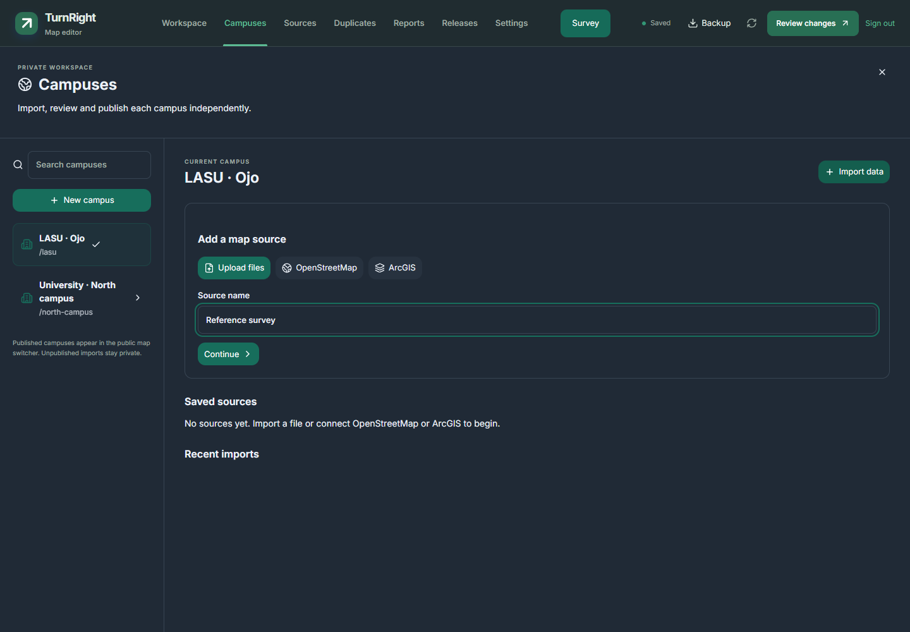

# Dark-mode readability

The 3D status tips used an undefined `--card` variable with a white fallback, while their text followed the active dark theme. They now pair the map or editor surface with its matching text colour, including an opaque background, border and shadow.

Shared light/dark tokens also cover link text, informational surfaces, errors, warnings and validation results. Muted labels use readable colours in both themes. Search and form placeholders specify a colour and full opacity instead of inheriting Tailwind's half-opacity text. Filled primary actions keep their existing blue background and white text; links have a separate colour so they remain readable on dark surfaces.

Use `--background` / `--foreground` for public UI and `--ed-bg` / `--ed-text` inside the editor. Use matching semantic background/text tokens for coloured notices. Do not add a fixed white fallback paired with inherited theme text.

The Campuses workspace binds its card surface to the shared theme background and uses the semantic error-text token. Live verification caught its previously undefined card variable falling back to white. A focused Chromium/WebKit regression requires at least 4.5:1 contrast for the header, campus search, import form and text fields in both themes, retaining the source name through theme changes.



The `readable interface` browser cases inspect computed colours and composited CSS backgrounds for visible text and placeholders. They require 4.5:1 contrast for normal text and 3:1 for large text. Coverage includes editing tips, notifications, place and route details, public settings and offline dialogs, editor Workspace/Settings/Sources/Duplicates/Reports/Releases, building/roof inspectors and survey controls. The checks exercise desktop light/dark themes and phone dark mode. Hidden text, disabled controls, decorative graphics and labels painted inside the map canvas are outside this DOM contrast check; screenshots provide an additional visual check.

From `web`:

```powershell
npx playwright test --grep "readable interface"
npx playwright test --config playwright.webkit.config.ts --grep "readable interface dark phone"
```

These are application style changes. Deploying them preserves the owner's current published campus package and does not submit or publish editor drafts.

Validation on 15 September 2026: all three Chromium cases and the WebKit phone case passed, along with 282 unit tests, client/server type checks, lint (seven existing warnings), and the production/PWA build. The lazy 3D renderer remains 119.7 KB gzip within its 300 KB budget. Physical-device checks remain separate from browser emulation.
