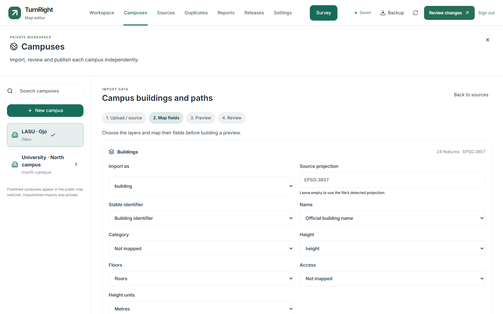
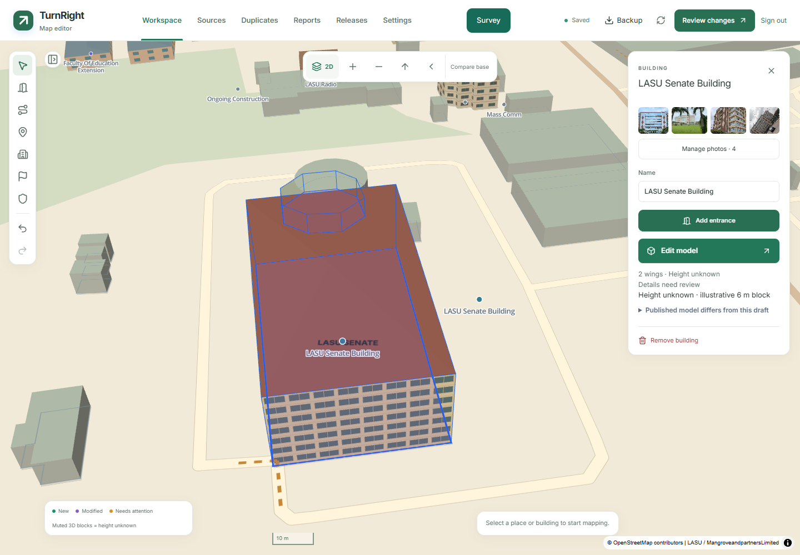

# Editing the campus map

## Campuses and imports

**Campuses** opens the owner directory and import workspace. Create a boundary, upload supported vector files or connect public OSM/ArcGIS sources, map fields and projections, then inspect a candidate before queuing it for source review. Each campus retains separate drafts, models, reports, survey sessions, source history and releases. Switching protects unfinished edits and pending saves. Public Editor links preserve the campus and selected building through sign-in.



See [Campuses and map imports](CAMPUS-IMPORTS.md) for the full workflow. Review and publication remain separate; a historical campus is restored through a new preview that preserves every other campus.


## Reference, mesh and model files

The unified workspace includes a remembered model/photo split, exterior wall and curve tools, and Mesh mode with Object/Vertex/Edge/Face selection. Import GLB/glTF, OBJ/MTL/textures or STL; export whole buildings or selected objects. Commands share undo, optimistic saves and owner-scoped recovery. Immutable private assets require migration 012, and authored revisions need review before publication. See [the complete guide](MODEL-AUTHORING.md).

On the public map, **Editor** opens and centres the selected building’s general card. The `/admin?building=<id>` handoff survives sign-in, resolves building aliases, and waits for recovered drawings or roof drafts to be resolved. Missing buildings show a notice; an ordinary `/admin` visit has no forced selection.



The private `/admin` workspace edits the existing campus map in 2D or a tilted 3D view. Drafts stay visible while you work. Campus navigation changes only after a release is reviewed and published.

**Drafts** and the colored map highlights show corrections made since the latest publication. Published corrections stay saved to protect your work during source updates, but stop appearing as pending drafts. Editing a published feature makes it a draft again; restoring an older release compares your current corrections with that restored version.

On phones, ordinary inspector cards and survey sheets use at most 42% of the screen height. Photo management and Edit model open dedicated full-screen workspaces with their own scrolling and view controls. Public panels and pop-up dialogs have a draggable top handle. They open at full height on desktop and can be shortened to reveal more of the map. On phones, their height stays within the available space above the keyboard and map controls. Scroll inside a card for the remaining controls; headings and close buttons stay accessible.

Selecting an object on the map or in the feature list animates the map into the space around the editor cards. On phones, long paths zoom out by at most 0.75 zoom levels, showing the stretch nearest the tap or current view instead of fitting the entire path. Short paths and buildings still fit their full geometry; multipart buildings include all wings. Desktop selection continues to fit the whole object. Closing properties returns to the view from before the selection. Editing fields or dragging vertices does not repeatedly refocus the camera.

Public navigation uses mode- and leg-aware GPS matching and rerouting. Driving arrival requires an explicit parked-to-walking transition and retains the chosen parking point and entrance. Architectural model edits never grant routing permissions. See [driving](DRIVING.md) and [arrival guides](ARRIVAL-GUIDES.md).

## Map an entrance and its approach

1. Search for a building or choose an item in **Needs mapping**. Select the building on the map, then choose **Add entrance**.
2. Click its ground footprint edge. Check the place association and give the entrance a useful name, such as “Library west entrance.” Several entrances can serve the same place.
3. Choose **Draw connecting path**. The first point starts at the entrance. Click to trace the actual approach and finish on a highlighted existing path or junction. Press **Enter** or **Finish**.
4. Paths that cross or touch at the same mapped level connect automatically, including crossings in the middle of a segment. **Join here** can also create an explicit connection.
5. Open **Test route**, choose starting and destination places, and preview the walk. Routing chooses the shortest permitted route through the available entrances and names the selected destination entrance.

Use the inspector to change access, direction, steps, building heights, labels, or connections. Drag vertices to adjust geometry; drag a midpoint to insert a vertex. Moving an established junction updates connected paths together. Mark a closure by selecting the actual graph segment; its reverse direction is also blocked. An expected reopening date never reopens a path automatically.

## Control automatic connections

Select a path and open **Path connections**. **Connect crossings automatically** is on by default. Turn it off to remove that path's automatic junctions, including junctions from a previously published release. Explicit connections remain; use **Connect start**, **Connect end**, or **Join here** to choose the junctions you want. **Disconnect** also turns automatic crossings off for that path so the removed join is not recreated.

For a bridge or tunnel, set **Crossing level** to **Bridge / above ground** or **Tunnel / below ground**. **Use mapped level** retains imported bridge, tunnel and layer information; unknown levels are treated as ground. Paths at different levels do not automatically join. For mixed sections, use separate paths with the appropriate settings.

Automatic connections cover actual intersections, touching endpoints and overlapping path sections. Nearby lines with a gap are not snapped together. Missing gate spans, mapped building/barrier conflicts, walking restrictions, one-way directions and active closures remain in force. Automatic junctions retain their original path identities so later edits can undo them. The editor route tester and release builder use the same connection logic. Publish a reviewed campus release to update public navigation; a code push alone does not change the public map package.

## Views and controls

| Control | Action |
| --- | --- |
| 2D / 3D button | Shows the view you can switch to. Tap to change view without losing your drawing or selection; the preference is remembered. |
| Settings → 3D rendering | Choose Enhanced (the default) or Simple. The choice is shared with the public map's Settings. |
| Settings → Tilt | Adjust the 3D camera angle; the slider follows the current tilt. |
| Rotation / north arrow | Orient the map. Mouse rotation also works. |
| Settings → Building opacity | Starts at 100%; adjust building transparency. Entrance and outline tools temporarily expose ground footprints. |
| Compare base | Temporarily show approved source geometry without draft corrections. Finish an active drawing first. |
| E / P / B / M | Add entrance / draw path / draw building / add place. |
| Enter / Escape | Finish / cancel a drawing. |
| Ctrl+Z / Ctrl+Shift+Z | Undo / redo a complete edit, including properties and connections. Cmd works on macOS. |

Public and editor views share the same height rules. Recorded heights take precedence, documented floor counts use 3 m per floor, and unknown heights use muted illustrative 6 m blocks. The illustrative heights are never stored as measurements or exported into campus packages. The public map defaults to 3D and remembers a visitor's 2D/3D choice. Building details explain height provenance. This editor models outdoor ground-level geometry, not building interiors or terrain.

Starting a drawing immediately collapses the explorer and route panel. Finish or cancel before selecting another feature, changing tools, or entering another review section. The prompt shows the first-point instruction and vertex count; Finish requires two distinct path points or three distinct building points. View changes and autosaves retain the drawing, including an empty session before the first point. Finish/Cancel restore the prior panel layout. Paths and barriers temporarily reduce building opacity to expose ground geometry.

Settings remains available during unfinished drawings and roof work. Opening and closing it preserves the map, inspector selection and editing state. Tilt and opacity changes affect this workspace's view; they do not create saved map edits.

## Building photos and models

The photo strip and **Manage photos** controls appear directly below the building title. Photo management covers uploads, captions, rights, cover ordering and private recovery; it remains separate from architectural modelling.

**Edit model** opens the dedicated building workspace. Appearance, Roof and Outline are workspace modes; duplicate model forms have been removed from the general building card. **Details** uses a measured wall canvas linked to selectable 3D and a collapsible photograph reference. It supports precise placement, duplicate/copy previews, groups, row/column patterns and independent presets. Mobile uses a full-screen canvas, a labelled mode selector and one focused tool sheet. Orbit, Edit surface and Photo share the selected target. Tap selects; Move and Resize explicitly edit. Pinching cancels an unfinished edit before navigation. Expand/Collapse/Done keep the sheet manageable, and focused inputs scroll into view.

The selected detail's **⋯** button, right-click menu or Shift+F10 opens Duplicate, Copy, Paste/copy-to, Delete, Lock and Hide. Mobile **More → Selection actions** retains access from a sheet. The keyboard shortcuts also work outside text inputs. **Appearance → Building height** edits building metres or recorded floor count inside Appearance; custom roof elevations follow proportionally by default, with explicit options to retain them or use building height for an overridden wing. **Review** identifies changed details, evidence gaps and wall assignments that need attention and opens the affected controls.

Completed actions autosave as individual commands in the shared 100-action history. Numeric input commits on Enter or blur; unfinished input remains private and recoverable. A drag commits on release. Closing the workspace retains unfinished work; explicit discard removes it. Saving does not approve all walls or publish the map. [Full controls and recovery guide](UNIFIED-MODEL-EDITOR.md) · [Appearance, roofs and rendering](BUILDING-EDITOR.md).


The structure tree has building/wing defaults, footprints, roofs, exterior and courtyard walls, details, groups and patterns. **Edit surface** aligns the same renderer to a selected wall/roof/footprint; **Orbit** restores its camera. Text can be added to walls and roofs. Individual windows are selected and edited without ungrouping; whole rows and collections remain explicit tree targets. Selected-item actions retain **Ungroup** and **Detach instance** for explicit groups/rows. **Mark all as reviewed** in Review approves eligible recorded walls in the current building with one undo.


## Duplicate review

Open **Duplicates** to review repeated names, nearby matching places and overlapping footprints. Opening the queue makes no changes. **Review exact duplicate cleanup** shows the proposed survivors, removed records and entrance redirects; **Apply reviewed duplicate cleanup** commits the proposal as one undoable batch. Changed proposals require another review. Approximate or conflicting matches remain for individual review. Inspect either record on the map, select its survivor, or keep the pair separate. The survivor retains its geometry and direct path connection; useful names/provenance are combined and entrance associations are redirected. Saved/recent public place references resolve through published ID aliases.

Decisions autosave through the existing batch API. Keep-separate decisions do not freeze source geometry; both kinds of decision survive source refreshes. Use **Undo last edit** or the standard undo/redo controls to reverse a decision. Nothing is removed from directed routing merely because its visual overlay overlaps another segment. Review access and closures before publishing any merged records.

Topology and duplicate checks run in a worker. Geometry and property feedback remain immediate, and route previews wait for the current validation result. Repeated issue rows are grouped by feature identity, with all reasons shown together.

The desktop layout provides the full workspace. Smaller screens support review, property changes, point placement, and moving features. The building model workspace provides all five modes on phones, with a visible **×** beside Undo/Redo and **Done** for closing only the active tool sheet. Short landscape screens keep the canvas beside a scrollable tools panel. Tap a 3D detail to select it or hold it for its action menu; an orbit drag or second touch cancels the pending hold. See [the model editor guide](UNIFIED-MODEL-EDITOR.md). Green draft geometry is new, purple is modified, amber needs attention, and red marks deletion.

## Saving and recovery

Completed edits autosave after 750 ms of inactivity. Related changes, such as an entrance and its approach or a moved junction, save in one database transaction. Incomplete topology can be saved privately but must be repaired before publication.

Typing in a text field is one undo step, including when autosave runs during the field session. Leaving the field, pressing Enter, selecting another feature or running another edit ends the group. Recovery snapshots continue to retain the latest input.

The status distinguishes **Saving**, **Saved**, and **Saved locally**. Interrupted requests retry with the same operation ID. The browser keeps an owner-scoped IndexedDB recovery copy, including unfinished drawings and undo history. Reopening the editor offers **Resume drawing**. A failed storage write is reported rather than represented as a successful recovery save.

If another session changes a draft, local work is preserved. **Review conflicts** compares original, local and server values. Independent property changes are combined; conflicting fields require an explicit choice. Geometry and its connection references are reviewed together. **Apply reviewed choices** checks the server again before saving; a newer revision requires another review. History preceding a changed remote snapshot is cleared after reconciliation so Undo cannot overwrite the reviewed remote changes.

**Backup → Download local recovery** works without the server. It includes the baseline version, edits, unfinished drawing, undo/redo history, original conflict base and pending operation receipts. The same download is available in Releases and beside save errors, including on phones. **Backup → Export backup** adds the server records and audit history. These are private JSON backups; importing/restoring one still requires a separate reviewed recovery procedure.

Action errors have their own controls, such as **Retry export**, **Retry route** or **Sign in again**, separate from draft-save errors. Network requests have bounded waits. Reads and transactional save batches can retry safely with the same operation ID; publication and job submissions are not automatically repeated after an uncertain response. **Check action status** refreshes state first.

An already-prepared owner workspace can open from its cache after a network failure even when the browser reports an online connection. The editor identifies offline work and the cached synchronization date. Authorization rejection does not open a cache as a fallback. Preparation is still required before the first offline session.

**Sources**, **Reports**, and **Releases** retain their separate review workflows. Building a release first flushes pending saves and validates the saved draft. The release worker independently validates the immutable snapshot before packaging it. Publishing and rollback retain the existing release controls.

## Repair and release review

Façade approval is checked before **Build review preview** becomes available. Pending reviews name their building, wing and wall and provide **Review model** to open the exact assignment. Editing details clears that wall's previous review; a height or roof change can also require placement review even with an unchanged footprint. A visually normal model may therefore need review without needing geometry repair. **Inspect details and evidence** expands the affected wall's review controls. Inspect the retained dimensions and evidence, then mark only that wall reviewed. Moved or reassigned walls also require confirmation of the wall match. These checks do not block ordinary draft saving. The server and release worker independently enforce the same review gate.

To undo a building correction made since publication, use **Restore published building** in its inspector. Review the proposed repair and apply it; Undo restores the draft. This restores that building's saved correction from the matching published release and leaves other features alone. The action is unavailable when that release snapshot is missing or out of date.

Validation issues identify their feature and offer **Choose entrance’s place**, **Connect to path**, or **Review blocked segment** where applicable. The control selects the feature and opens its relevant properties. Connection changes, guided geometry repairs and building-wing corrections show a red current / green proposed comparison before **Apply reviewed repair**. Cancel retains the current draft. Finish or cancel an active drawing before entering repair review.

Source review shows changed property rows and before/after map geometry. Raw source records remain available under Details. Source and release jobs refresh while the review panel is visible; polling does not save edits or refresh geometry beneath an active drawing.

Release impact compares the working map with the public package loaded by the app. It lists additions, changes, removals, entrance changes and destinations losing their mapped approach or directed reachability from Clinic. It also compares Clinic–Senate, Clinic–Law and Clinic–International Library routes using stable place IDs and published aliases. Unknown/missing endpoints are reported explicitly. These are software checks, not field verification.

Path properties distinguish unknown steps information, recorded steps, and recorded absence of steps. Public route details report those records without claiming verified step-free access. Public place details provide **Copy link**, native **Share** where available, and a selectable-link fallback. Shared destinations resolve published aliases; unavailable destinations offer campus search.

## Upgrade and verification

Entrance guides and building galleries require migration 008. The visual **Manage photos** workspace additionally requires migration 010 for private upload drafts and revision tracking. See the [photo owner guide](ARRIVAL-GUIDES.md#manage-photos) for multiple uploads, rights review, cover/order changes, public preview and recovery. Arrival observations are edited separately. Photo changes save to the draft and publish through Releases; author-provided photographs without external URLs require package schema 3 and compatible readers.

Photo uploads continue across inspector changes and dialog closure during the
owner session. Use the persistent **Pause uploads / Resume uploads** control;
pausing finishes the current file. Per-photo local recovery, separate private
saves and a single upload-owning tab protect unfinished work. Photo-only edits
reuse validated topology and map models; release review always runs full
validation. See [the recovery guide](ARRIVAL-GUIDES.md#recovery-and-privacy) and
[performance verification](PERFORMANCE.md).
Migration 011 completes the baseline comparison repair after migration 009:
parsed RPC inputs are copied into owned array values, and current records are
materialized once and compared with a full join. This bounds repeated work in
the API request path and cached database plans. The exact locked comparison,
owner authorization, unchanged timestamps and rollback history remain intact.
See [arrival editing, private uploads and publication](ARRIVAL-GUIDES.md) for the
review flow and photo package guarantees.

Apply `supabase/migrations/003_editor_batches.sql` once to the existing database **before deploying this editor and API**. For a new database, apply migrations 001, 002, and 003 in order. Migration 003 adds the service-role-only batch function and operation receipts; it does not modify published map packages. Retain operation receipts so delayed retries remain idempotent.

Migration 003 was applied to the TurnRight Supabase project on 11 September 2026. Live verification confirmed that receipt RLS is enabled, anonymous and authenticated roles cannot execute the function, and the service role can. The implementation passed 85 unit/database tests, seven real MapLibre/Terra Draw browser tests, seven Python tests, lint (existing warnings), and a production build on Node 22.23.2. Browser coverage includes undoing the first saved correction to a source building and retaining that building after reload.

The editor/API revision `562fa4d8931f5355b53656bf233026d54d443343` was verified in [Vercel preview](https://vercel.com/muhammed-abdulhadi-s-projects/turnright/AfnjaqHZRmqSXx2WZTrVvxkbSzVM), then deployed to [production](https://vercel.com/muhammed-abdulhadi-s-projects/turnright/3ym4sa7Z4h3Novt781vUUYw5Tgay). Live owner login, source loading, 3D building selection, an authenticated metadata autosave and its saved undo passed in preview. The temporary verification note was reverted; only audit/undo receipts remain. Production `/admin` returned 200 and an unauthenticated admin request returned 401. The published campus package remains `lasu-4e4c8008b38b`, schema version 1. No source proposals or campus-data releases were published by this rollout.

The existing approved database baseline predates some corrections in the published campus package. Review those pending source proposals before an editor-led map release, as documented in [PRODUCTION.md](PRODUCTION.md). This code deployment preserves the currently published package.

Use Node 22.13 or later in the 22.x line:

```sh
cd web
npm ci
npm test
npm run lint
npm run build
npx playwright install chromium
npm run test:browser
```

Unit tests exercise topology, entrances, route selection, recovery, and concurrency. Database tests run the real SQL migrations in PGlite PostgreSQL; only the unused PostGIS extension declaration is omitted. Browser tests use the actual MapLibre renderer and Terra Draw interactions with test-only authentication and API responses, including both views, dragging, undo/redo, reload recovery, full campus rendering, and smaller screens.

Deploy to a configured Vercel preview after applying the migration. Check a real owner login, a saved entrance/approach batch, source review, and release preparation against Supabase before promoting the application. Publishing new campus data remains a separate reviewed operation.
