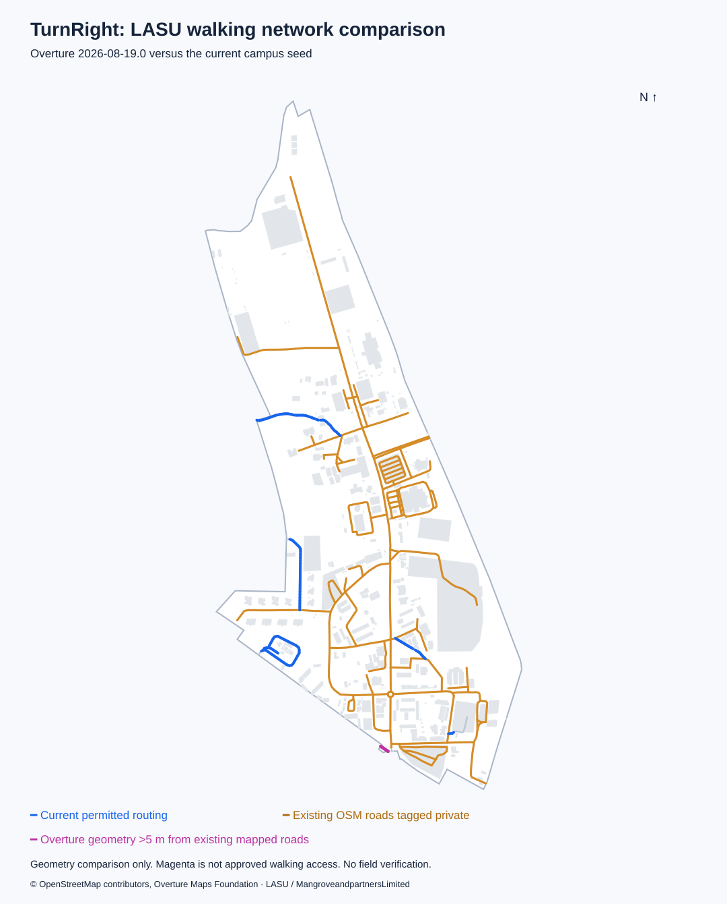

# LASU Ojo: Overture walking-data comparison

This report captures the dataset **before** the owner's student-access
confirmation. The subsequent [campus access correction](CAMPUS-ACCESS.md)
enables 62 existing roads and changes local coverage; counts below describe
the original `lasu-03bc96e56965` baseline, not the updated map.

Compared on 9 September 2026. **No useful additional campus walkway geometry was
identified in the Overture extract.** The main finding is that most of the roads
already drawn in TurnRight are tagged private in OSM and excluded from routing.
The next useful work is to review actual pedestrian access and connect confirmed
entrances to the existing network.

## Findings

| Measure | Result |
|---|---:|
| Overture release | `2026-08-19.0` |
| Extracted transport segments / connectors, including surroundings | 1,107 / 1,008 |
| Road/path segments intersecting the campus boundary | 81 |
| Campus segments whose source records cite OSM | 81 of 81 |
| Campus segment classes | 76 service, 2 residential, 1 path, 1 footway, 1 primary |
| Overture segments with a private-access condition | 74 |
| Overture segments with a foot-denial rule on some portion | 2 |
| Current OSM roads/paths intersecting campus | 89 |
| Current OSM ways tagged `access=private` | 77 |
| Current OSM ways tagged `foot=no` | 4 (overlaps the private group) |
| Existing mapped line length, with overlap/directions deduplicated | About 13.85 km |
| Existing permitted, unclosed, unblocked routing line length | About 1.22 km |
| Overture line length inside campus | About 13.76 km |
| Overture geometry more than 5 m from current mapped roads | 33.8 m |
| Currently unmapped destinations within 90 m of a private-tagged road | 154 of 165 |

OSM ways and Overture segments use different splitting/merging rules; their counts
are not directly comparable. The 91 OSM source references across 81 Overture
segments are provenance references, not additional paths.

The sole source way absent from the current map is `w1061552172@11`, represented
by Overture segment `c6c6d709-5957-47b7-aa92-454b5d5e1857`: **Lagos–Badagry
Expressway**, class `primary`. It intersects the campus polygon for 33.8 m near
the southern boundary and conflicts with a mapped footprint. It is not evidence
of a missing campus footpath or entrance. All other source ways were already in
the local map. The geometric result was unchanged at 2 m, 5 m, and 10 m tolerances.
About 114 m of current map geometry is outside Overture's 5 m buffer, so replacing
the current dataset would also discard geometry.

The one OSM entrance node found inside the boundary is `5482703069`, tagged
`entrance=main`, `barrier=gate`, and `access=private`. It does not establish a
publicly accessible entrance connection. Overture's private conditions retain
`recognized: ["as_private"]`; they must not be interpreted as unconditional
walking permission simply because their `access_type` is `allowed`.

## Visual comparison



The 154 nearby destinations are a prioritization aid only. Proximity to a road
does not establish an actual entrance, a final walkway, access permission, or
connection to another permitted route. No such connections were automatically
created.

## Recommended project work

1. Review the existing private-tagged campus roads against actual student and
   visitor walking permissions. Preserve restricted staff areas, closed gates,
   and explicit no-foot access. Record reviewed corrections separately from OSM.
2. Where walking is confirmed, update the existing path's access and check its
   junctions, barriers, and footprint conflicts. Add real connecting walkways
   and entrances where needed; access changes alone do not link every destination.
3. Make the editor's access state visible on the map and replace coordinate-only
   connection selection with a map-based workflow before a large review session.
4. Validate routes in drafts, field-check representative walks, and build a new
   review release. Existing offline packages need a downloaded update afterward.

An Overture routing importer is not justified by this comparison. No application
code, current routing data, administrator drafts, Supabase records, or deployments
were changed by the audit.

## Reproduction and retained files

The tested isolated environment uses Python 3.14, `overturemaps==1.0.2`,
`shapely==2.1.2`, and `pyarrow==25.0.1`. Run from the repository root in PowerShell:

```powershell
python -m venv data/raw/overture-tools
& data/raw/overture-tools/Scripts/python.exe -m pip install overturemaps==1.0.2 shapely==2.1.2 pyarrow==25.0.1
& data/raw/overture-tools/Scripts/python.exe -m overturemaps download --bbox=3.190,6.455,3.215,6.489 --release=2026-08-19.0 --type=segment -f geojson -o data/raw/overture-2026-08-19.0/segments.geojson
& data/raw/overture-tools/Scripts/python.exe -m overturemaps download --bbox=3.190,6.455,3.215,6.489 --release=2026-08-19.0 --type=connector -f geojson -o data/raw/overture-2026-08-19.0/connectors.geojson
& data/raw/overture-tools/Scripts/python.exe scripts/compare_overture.py --base data/candidates/overture/baseline-campus.json --segments data/raw/overture-2026-08-19.0/segments.geojson --connectors data/raw/overture-2026-08-19.0/connectors.geojson --release=2026-08-19.0
```

Create the download directory before running the two download commands. Older
Overture releases may cease to be available; retain the raw extracts and their
`.state` files to reproduce these exact results. Using another release produces
a new comparison and must not be described as this dated audit.

The original seed is retained locally as
`data/candidates/overture/baseline-campus.json` (ignored by Git), and in Git
revision `5472788:data/seed/campus.json`. Use that baseline for these historical
metrics; omitting `--base` compares against the current seed instead.

- Raw extracts and CLI release metadata: `data/raw/overture-2026-08-19.0/`.
- Full metrics, source IDs, access rules, and input SHA-256 hashes:
  `data/candidates/overture/comparison.json`.
- Campus-clipped review geometry: `data/candidates/overture/overture-campus-review.geojson`.
- Generated SVG/PNG: `data/candidates/overture/comparison.svg` and `comparison.png`.
- Portable summary: [data/overture-comparison-summary.json](../data/overture-comparison-summary.json).

Raw downloads, the isolated tool environment, and review candidates are ignored
by Git. The review GeoJSON is for inspection and is not a TurnRight routing package.

## Method and limits

Inputs: local seed `lasu-03bc96e56965`, its retained OSM XML, and the pinned Overture
release. Segments are clipped to the actual ArcGIS campus polygon, not counted
across the whole download rectangle. Distances use a local equirectangular metric
projection and are approximate. Unioning lines removes duplicate directions and
overlaps. The audit separately compares Overture with all displayed roads and
with only usable routing edges. Buffer overlap measures geometry similarity,
not topology equivalence. All connector IDs referenced by intersecting segments
were present in the connector extract. Sanity checks confirmed that routing
geometry lies on the source paths and unmatched lengths do not exceed totals.

Two import-quality issues were recorded for subsequent work: the existing OSM
download rectangle ends about 65 m short of the campus's northernmost point;
this audit's rectangle covers the entire campus. Also, nine ArcGIS building
features contain external rings represented as holes. Copies were repaired with
Shapely solely for this audit's footprint measurements and illustration. The
actual seed was not modified. These findings do not create additional permitted
walking routes. The audit does not inspect unsaved/hosted edits or establish
field accuracy.

## Sources and reuse

- [Overture transportation documentation](https://docs.overturemaps.org/guides/transportation/)
- [Overture Python download client](https://docs.overturemaps.org/getting-data/overturemaps-py/)
- [Overture release catalog](https://stac.overturemaps.org/2026-08-19.0/catalog.json)
- [Overture attribution and licensing](https://docs.overturemaps.org/attribution/)
- [OSM private-access tag](https://wiki.openstreetmap.org/wiki/Tag:access%3Dprivate)
- [OSM copyright and licence](https://www.openstreetmap.org/copyright)

Transport data: © OpenStreetMap contributors, Overture Maps Foundation, ODbL 1.0.
Boundary and building reference geometry: LASU / MangroveandpartnersLimited,
under the project owner's previously confirmed redistribution permission. This
audit uses the existing permission record; it does not verify the agreement.
