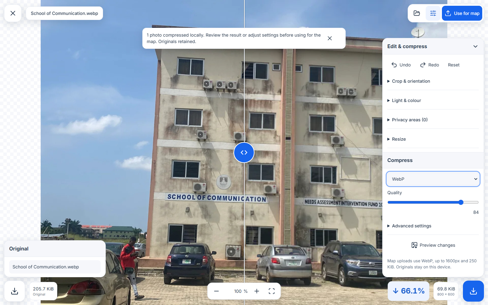
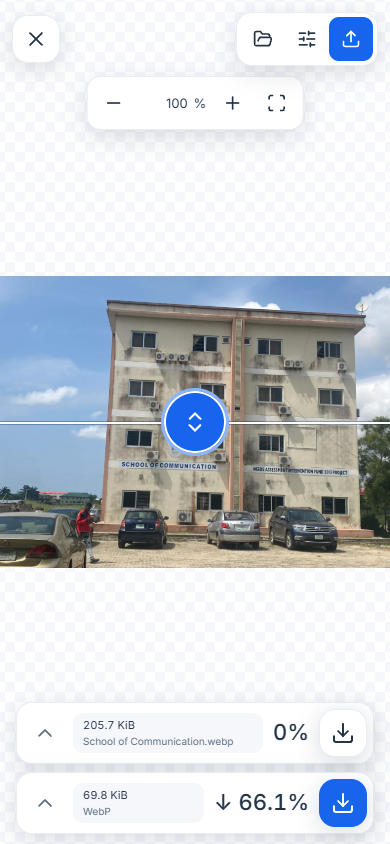
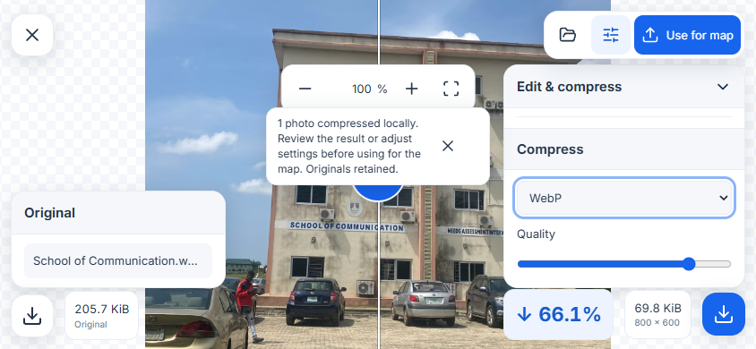
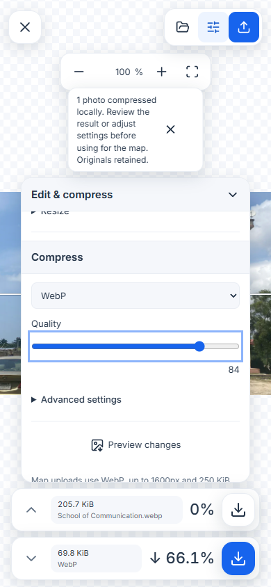
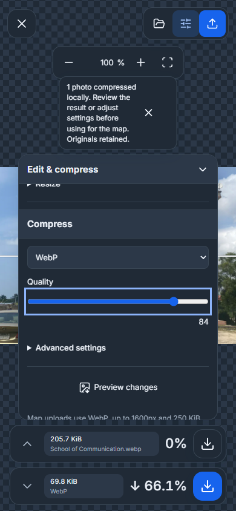

# Offline image editing and compression

## Workspace organization

Desktop separates the file list, comparison canvas and inspector. **Edit** contains crop, orientation, adjustment, privacy and resize controls; **Compress** contains output format and quality; **Details** contains image metadata. Pane controls collapse, resize or maximize the surrounding tools without interrupting processing. Phones retain a full-screen comparison with one focused controls sheet.


These captures use the local editor harness and an attributed repository photograph; see [capture records](SCREENSHOTS.md).

## Campus GIS integration

Local image recipes and unfinished uploads remain personal. Authorized campus teammates can read and reuse approved photographs attached to current or immutable work; private original paths and unrelated drafts are not exposed. Publishing a gallery change follows the shared independent-review workflow. [Team workflow and roles](GIS-PLATFORM.md).

Open **Manage photos** on a building and use its sliders icon to open one editor for pixels, caption, building assignment and credits. **Add photos** and **Local image drafts · edit offline** open the same workspace. Editing stays on this device; private upload and release publication remain separate.

## Compare and compress

The workspace combines a Squoosh-inspired full-screen comparison with TurnRight's blue actions, rounded controls, Inter typography and shared light/dark theme. Settings float in white or slate panels beside the image. Phone portrait starts with a horizontal divider: original above, edited output below, and two compact download/settings bars at the bottom. Expand a bar's chevron for local files or compression settings. Desktop and landscape keep the vertical divider. The header keeps Close, details and **Use for map** reachable.



| Phone portrait | Phone landscape |
| --- | --- |
|  |  |

1. Choose still JPEG, PNG or WebP inputs: up to 25 MiB and 40 megapixels each, or 20 images / 100 MiB per batch. Animated inputs are rejected. **Adding files automatically compresses every new image** to WebP, at most 1,600 pixels, starting at quality 84 with a 250 KiB target and a quality floor of 65. Originals are saved first. Progress, pause and cancellation remain visible; one encoding failure retains that original and does not stop other valid files.
2. **Crop & orientation** offers drawing, numeric percentages, aspect ratios, rotation, straighten and flips. **Light & colour** adjusts exposure, contrast, saturation and temperature. **Resize** sets the longest edge while retaining proportions and never enlarging the original.
3. Choose WebP, MozJPEG, OxiPNG or AVIF. These are Squoosh's local WebAssembly encoders, not a remote image service. WebP offers lossless mode, JPEG offers progressive output, PNG is lossless, and compression effort trades time for size. JPEG flattens transparency over white.
4. Changes trigger a cancellable preview after a short debounce. Drag the portrait divider up/down or use keyboard Up/Down and Home/End; desktop/landscape move it left/right. Rotation retains its position and the current recipe. Pan with a pointer or the canvas arrow keys; pinch or scroll to zoom. Fit resets pan and zoom. Both versions share the same navigation transform; after crop/rotation the original is fitted into the edited frame for reference rather than pretending the pixels still align.
5. Inspect the actual bytes and percentage change. A downward arrow means smaller; an upward arrow means larger. **Download edited image** exports the result; the other download retains the original. Undo, redo and reset affect the recipe, never the source.

**Advanced settings** offers an optional size target and a minimum quality. A bounded search chooses the highest successful quality it measured; it never silently resizes or drops below the floor. Lossless modes do not search lossy qualities. Impossible targets remain recoverable and explain what to change. Set the target to zero to encode at exactly the selected quality. A smaller output is not guaranteed for already optimised originals; compare visually before using it.

| Expanded settings · light | Expanded settings · dark |
| --- | --- |
|  |  |

A photographic regression fixture at 800 × 600 produced 77,784-byte WebP, 87,777-byte JPEG and 111,320-byte AVIF from a 723,600-byte PNG at quality 85. Mean absolute pixel errors were 2.11, 2.48 and 1.48 out of 255 respectively. These are fixture measurements, not quality guarantees for every image.

## Privacy, details and gallery ordering

Preview the edited geometry before marking blur, pixelation or solid redaction. Coordinate fields offer equivalent controls. Privacy areas are flattened into output pixels; geometry changes clear old areas and request a new check. Use solid redaction for sensitive content. Exports strip embedded metadata, while captions, attribution, source and licence remain in review records and public credits.

The **Photo details** icon opens caption, alternative text, pictured building/entrance, dates, source and rights in this same editor. Review and save metadata without re-encoding the original, or choose **Use for map** to prepare a changed image and return it for final quality review. Metadata typed while compression runs is retained. Replacements keep their gallery position; an active private upload must finish before it can be replaced.

Drag the grip on a gallery card to reorder. The first photograph is the cover. Keyboard users press Space/Enter to pick up, arrows or Home/End to choose a position, and Space/Enter to drop. Escape or viewport resizing cancels an unfinished move. A drop creates one undoable map edit. The sliders icon opens the combined editor; the trash icon removes a gallery attachment with Undo. Moving, reordering or removing a draft attachment does not itself publish anything.

## Batch processing and upload

The local-files icon opens drafts, offline preparation and **Batch tools**. New files compress automatically one at a time; you do not need to select each image or press an Optimise button. Batch tools can later apply different compression settings while retaining each photograph's crop, orientation and privacy regions. Pause waits between images and cancellation keeps completed results. Unachievable targets explain the remaining size rather than degrading below the quality floor.

**Use for map** or **Use batch for map** prepares WebP up to 1,600 pixels and 250 KiB. Oversized results remain local. Identical ready previews are reused instead of encoding twice. Queued uploads retain an immutable output copy; later local edits cannot change it. Complete individual identity, visual quality and rights checks before adding to the map draft. Publishing still requires a reviewed release.

The server validates bytes and strips metadata if needed. Bounded metadata-free WebP passes through without another lossy encode. Without a cached original, editing a gallery image starts from the available derivative and says so.

## Prepare and recover offline

While connected, prepare the owner workspace through **Survey → Prepare for offline survey**. Open the image editor's local-files panel and select **Prepare for offline use**. This verifies and caches approximately 3.6 MB of versioned encoder files. They are excluded from public-map startup and the ordinary app precache; merely opening the map does not download them.

Originals, recipes and previews use owner- and campus-scoped IndexedDB. They are local recovery, not an online backup. Preview writes update only the output and metadata, preserving original bytes and concurrent photo associations. Download important originals before clearing browser data. **Remove local files** is unavailable while a pending upload depends on that original. Storage errors report failed recovery instead of claiming a successful save.

TurnRight uses four pinned Squoosh encoders, with their original licences and checksums under `web/public/photo-codecs/e8d35e0`. This is an integrated editor, not a distribution of every experimental Squoosh format. Native decoding and canvas transforms precede worker encoding. No external image service receives the editing inputs.

## Verification

```sh
cd web
npx vitest run tests/photo-edit.test.ts tests/photo-compression.test.ts tests/photo-codecs.test.ts tests/photo-local-migration.test.ts
npx playwright test photo-processing --reporter=line
npx playwright test --config playwright.photos.webkit.config.ts
npx playwright test --config playwright.photos.pwa.config.ts
```

Coverage includes actual encoding/decoding and size reduction, redaction, EXIF orientation, stale-preview cancellation, local recovery, keyboard comparison, desktop/portrait/landscape layout, gallery drag and keyboard order, undo, private upload retry and metadata save/reopen. The production-service-worker journey disconnects and reloads an original before editing and queueing it offline. Physical-device performance remains a separate acceptance check.

See [arrival and photo review](ARRIVAL-GUIDES.md), [activity monitoring](PROGRESS-MONITOR.md), [architecture](ARCHITECTURE.md) and [screenshot provenance](assets/screenshots/README.md).
