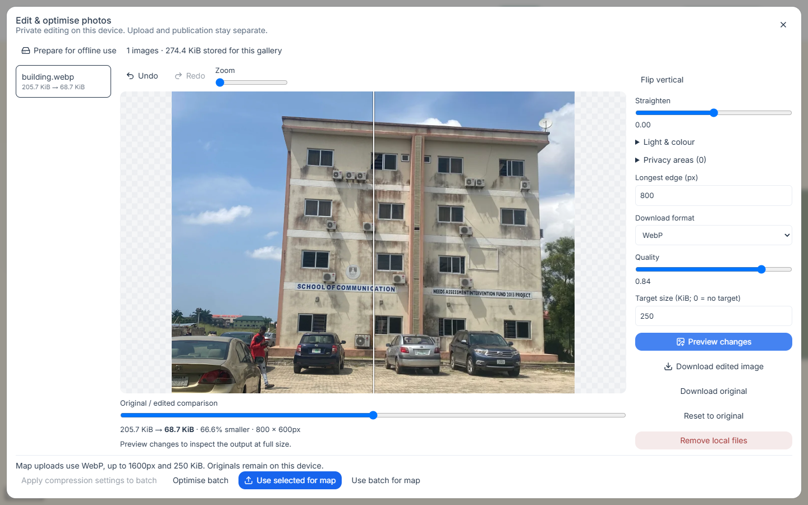
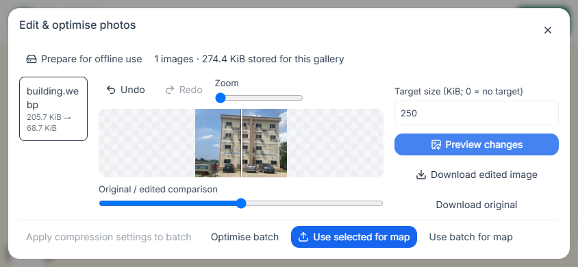
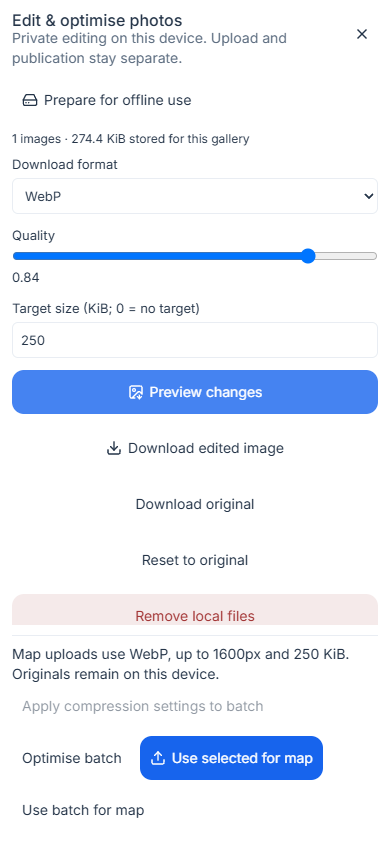
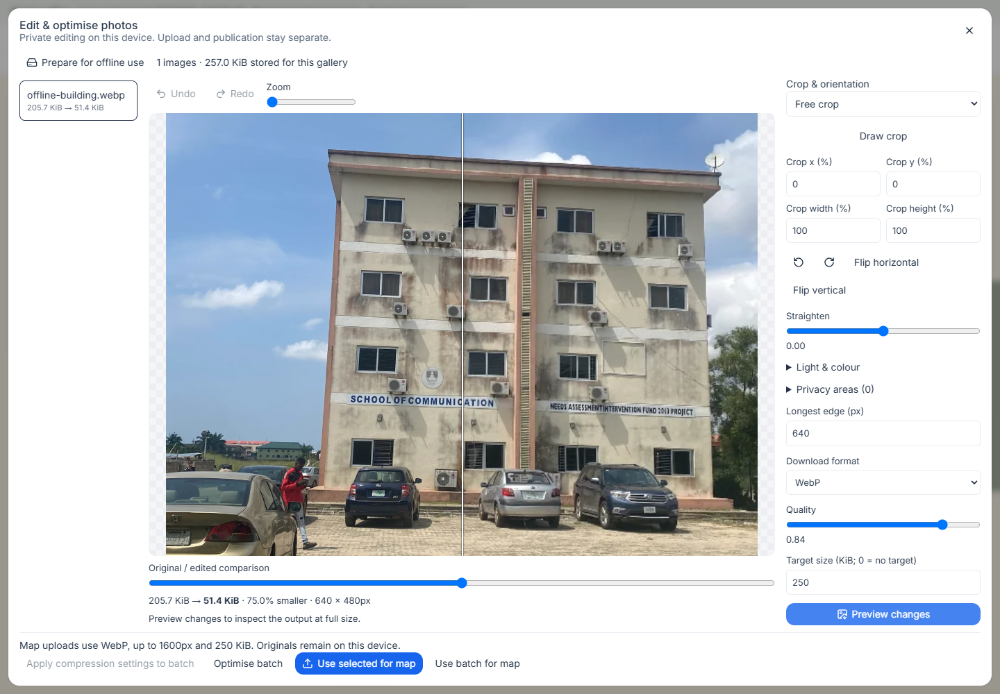

# Offline image editing and compression

Open a building's **Manage photos** workspace and choose **Add photos**, **Local image drafts · edit offline**, or **Edit & optimise** on an existing photograph. Processing runs on your device. Upload review and map publication remain separate steps.



## Edit an image

1. Select JPEG, PNG or WebP files: up to 20 images and 100 MiB per batch, 25 MiB and 40 megapixels per image. Animated images are rejected.
2. Crop by drawing or entering percentages. Choose an aspect ratio, rotate, straighten or flip. Light and colour controls adjust exposure, contrast, saturation and temperature.
3. Choose the longest edge, output format, quality and optional target size. **Preview changes** produces a new image from the retained original. Small images are not enlarged. PNG is lossless; JPEG uses white behind transparent areas.
4. Compare the original and edited output with the divider. When crop or orientation changes, separate **Original / Edited** controls avoid overlaying mismatched geometry. Zoom and scroll to inspect details.
5. Use **Download edited image** for a local export. **Download original** retrieves the retained source. Undo, redo and reset affect the recipe; they do not overwrite the source file.

The target size is a goal, not a promise. Encoding tries a bounded set of quality settings and reports if the target cannot be met. Reduce the dimensions or choose another format after checking the result. Available codecs depend on the browser; unsupported encoders report an error rather than returning a differently labelled format.





## Privacy areas

Preview the edited geometry first, then draw blur, pixelation or solid redaction areas. **Add redaction with coordinates** and the area percentage fields also work without dragging. These areas are flattened into the exported pixels. Prefer solid redaction for sensitive information. Changing crop, rotation or flips clears the areas and asks you to mark them again against the new geometry.

Exports strip embedded metadata. The retained original still contains its original pixels and metadata, so only share it deliberately. Attribution, source, licence and modification notes remain in the photo review form and public credits; stripping embedded metadata does not remove those credits.

## Batch processing and upload

**Apply compression settings to batch** copies only the format, longest edge, quality and target size. Each photograph keeps its own crop, orientation and privacy areas. **Optimise batch** processes one image at a time. Pause waits between images; cancellation preserves completed results and original files.

**Use selected for map** or **Use batch for map** prepares WebP images with a maximum 1,600-pixel edge and 250 KiB size, then opens the existing upload review. Oversized results remain local until you adjust them. The upload queue retains an immutable copy of the prepared output: later local edits cannot change a file already waiting to upload. Files queued offline resume when connected. Complete the attribution/rights review before attaching photos to a building draft; publishing the map still requires the release workflow.

The server validates uploaded bytes and strips metadata when needed. A valid bounded, metadata-free WebP passes through without another lossy encode. Gallery replacements retain their position and existing source metadata. Without a local original, editing an existing photograph starts from the available gallery derivative and explains that limitation.

## Prepare and recover offline

While online, use **Survey → Prepare for offline survey** to cache the owner workspace and selected campus. Open the image editor and choose **Prepare for offline use** to verify the installed app cache and exercise the image codec. Then disconnect. Local drafts can be reopened, edited and downloaded after a reload.



Original bytes, recipes and previews use owner- and campus-scoped IndexedDB. They remain on this browser profile until removed; they are not an online backup. Clearing site data or browser storage eviction can remove them. Download important originals. **Remove local files** deletes a selected local draft; remove its pending upload from the queue first. Storage errors keep the panel open and explain recovery instead of claiming the changes were saved.

Storage version 2 separates image bytes from recipe metadata. Editing a field
updates only the metadata; opening a gallery reads that gallery's local images.
The upgrade preserves existing originals, prepared outputs and recipes in one
transaction. Undo and redo discard outdated previews, and repeated 90-degree
rotation reaches all four orientations. [Audit and measurements](AUDIT-2026-09-27.md).

The lazy worker uses native image decoding and encoding, with a canvas fallback where supported. No external image service receives local editing inputs. The image editor does not add Squoosh as a dependency; it supplies an integrated offline workflow with the formats above.

## Verification

Focused tests cover recipe validation, owner/campus isolation, metadata stripping, image orientation, JPEG/PNG/WebP results, redaction pixels, cancellation, gallery upload/retry, recovery and responsive controls. The production-service-worker test disconnects, reloads and edits a saved original before queueing it without an upload.

```sh
cd web
npx vitest run tests/photo-edit.test.ts tests/photo-local-migration.test.ts tests/media.test.ts tests/photo-workspace.test.ts
npx playwright test --grep "offline image editor|image worker|photo workspace"
npx playwright test --config playwright.photos.webkit.config.ts
npx playwright test --config playwright.photos.pwa.config.ts
```

See [photo review and arrival guides](ARRIVAL-GUIDES.md), [activity monitoring](PROGRESS-MONITOR.md), [architecture](ARCHITECTURE.md) and [screenshot provenance](assets/screenshots/README.md).
