# Photographic model coverage · 24 September 2026

Baseline: **lasu-8577d5c85d2c**, campus SHA-256 `0075f0ff11d1df45c3b9c5be6c6d72d230a12230f6b504bc2bcd59171f2d93c3`. All 395 published building identities and all 39 photographs were accounted for. The 19 photographed buildings receive reviewed observation proposals; 376 buildings have no published photograph and retain their existing treatment. No footprint, routing connection or access approval is created.

| Coverage | Before | Candidate |
|---|---:|---:|
| Buildings | 395 | 395 |
| Buildings with photographs | 19 | 19 |
| Published photographs | 39 | 39 |
| Buildings with this photographic evidence assessment | 0 | 19 |
| Detailed / simplified / extrusion treatments | 56 / 3 / 336 | 57 / 3 / 335 |
| Model geometry bytes | 1,024,370 | 9,084,537 |
| Approved wall textures | 0 | 0 |

The initial candidate improves frame relief and opening proportions, preserving existing owner colours and roof plans. One previously unknown height receives a labelled floor-based estimate. Wall directions are not established by these photographs. Texture crops and wall-specific doors, columns, balconies and canopies remain in the guided owner review queue until their location is supported. No image is silently assigned to a wall. See [the workflow and limits](PHOTO-MODELS.md).

## Building comparisons

Each sheet combines the identified reference photo with before/after model renders. Views are **not georeferenced photographic matches**; hidden elevations and dimensions remain estimates. Each reference retains the author's licence below. Sheets resize the photo and add illustrative renders and labels, so the stated attribution includes these modifications. Share-alike photographs retain the linked share-alike terms for their adapted portion.

### LASU Main Auditorium

Stable ID: `arcgis:University_Property:2`. Evidence: 2 photograph(s).

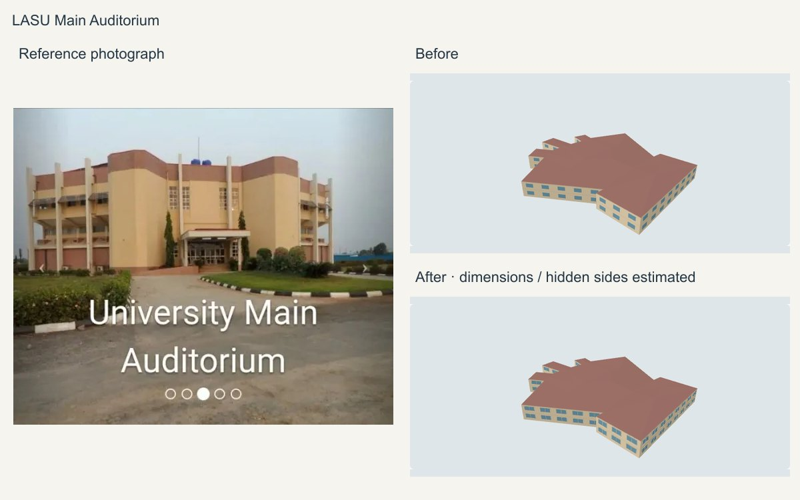

Reference credit: LASU Admission facebook account · [Public domain](https://www.google.com/url?sa=t&source=web&rct=j&url=https%3A%2F%2Fwww.facebook.com%2Flasuadmission%2Fphotos%2F462968039196882%2F&ved=0CAMQjB1qFwoTCIC3_NCLhZcDFQAAAAAdAAAAABBq&opi=89978449) · [original source](https://www.google.com/url?sa=t&source=web&rct=j&url=https%3A%2F%2Fwww.facebook.com%2Flasuadmission%2Fphotos%2F462968039196882%2F&ved=0CAMQjB1qFwoTCIC3_NCLhZcDFQAAAAAdAAAAABBq&opi=89978449). Capture date: unknown. Modifications in this sheet: resized photograph; model renders and labels added.

**Observed:** Cream and muted red-brown wall planes; tall vertical fins; entrance canopy and side galleries.

**Candidate:** Framed openings with width ratio 0.64 and height ratio 0.6, filling missing settings only. 

**Estimated:** Window-frame relief and regularized opening proportions are illustrative. Unseen elevations and exact dimensions are unknown.

**Remaining:** One linked image shows the campus gate and is excluded from model evidence. Low-resolution overlay photograph is not a texture source. Match photographic elevation to stable wall IDs in Photo & model before using wall-specific features or textures.

### LASU International Library

Stable ID: `arcgis:University_Property:3`. Evidence: 2 photograph(s).

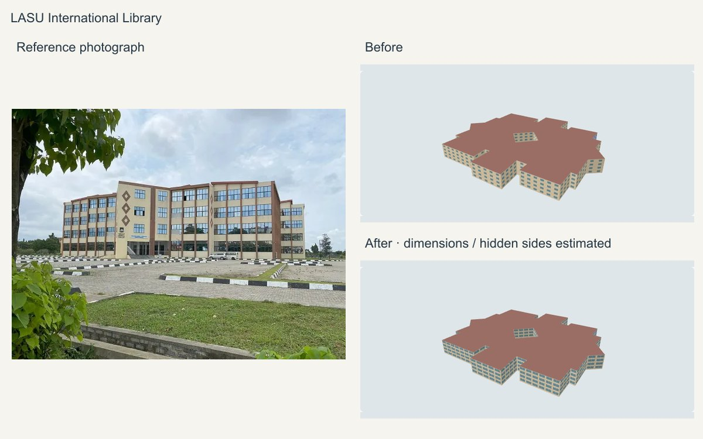

Reference credit: FrankvEck · [CC BY-SA 4.0](https://creativecommons.org/licenses/by-sa/4.0) · [original source](https://commons.wikimedia.org/wiki/File:Lagos_State_University_Babajide_Olusola_Sanwo-Olu_Library_Complex_aug_2026_IMG_5994b.jpg). Capture date: 2026-08-27. Modifications in this sheet: resized photograph; model renders and labels added.

**Observed:** Four exterior levels; broad blue glazing; cream framing and red-brown vertical panels. Interior image shows covered atrium.

**Candidate:** Framed openings with width ratio 0.82 and height ratio 0.66, filling missing settings only. 

**Estimated:** Window-frame relief and regularized opening proportions are illustrative. Unseen elevations and exact dimensions are unknown.

**Remaining:** Interior view does not locate the atrium roof in map coordinates. Preserve the mapped courtyard and owner roof. Match photographic elevation to stable wall IDs in Photo & model before using wall-specific features or textures.

### Mass Communication

Stable ID: `arcgis:University_Property:22`. Evidence: 2 photograph(s).

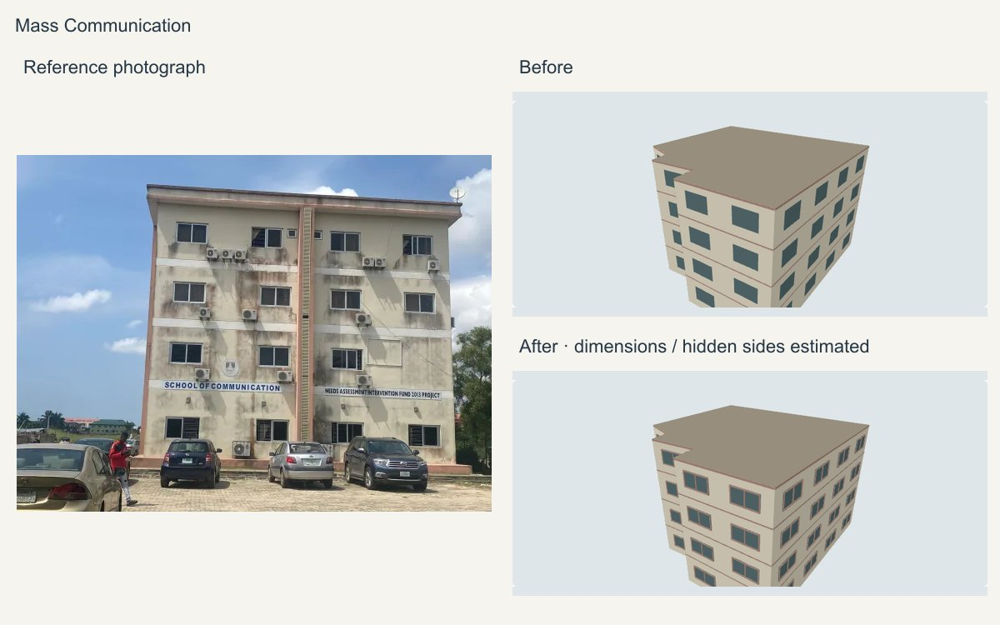

Reference credit: Abiolakintrunde · [CC BY-SA 4.0](https://creativecommons.org/licenses/by-sa/4.0) · [original source](https://commons.wikimedia.org/wiki/File:Lagos_state_university_school_of_communication.jpg). Historical view. Capture date: 2021-11-15. Modifications in this sheet: resized photograph; model renders and labels added.

**Observed:** Four visible storeys; paired rectangular windows; pale wall panels and red-brown vertical strips.

**Candidate:** Framed openings with width ratio 0.56 and height ratio 0.46, filling missing settings only. 

**Estimated:** Window-frame relief and regularized opening proportions are illustrative. Unseen elevations and exact dimensions are unknown.

**Remaining:** Flat parapet visible. Air-conditioning units are omitted. Match photographic elevation to stable wall IDs in Photo & model before using wall-specific features or textures.

### Faculty of Art Language Lab

Stable ID: `arcgis:University_Property:25`. Evidence: 1 photograph(s).

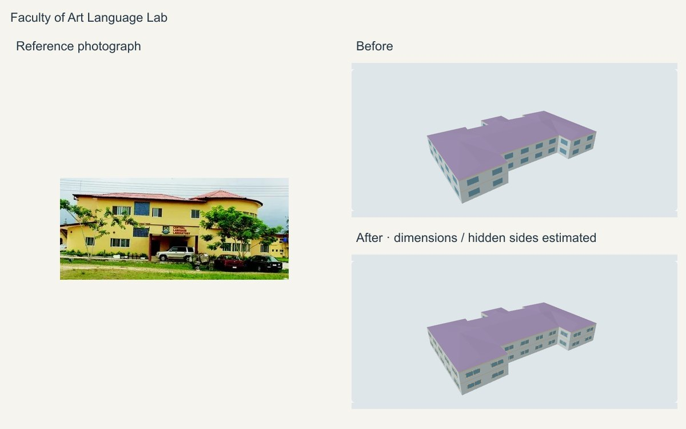

Reference credit: The Intellectual · [Public domain](https://theintellectualmag.com/excitement-as-lasu-begins-new-phase/) · [original source](https://theintellectualmag.com/excitement-as-lasu-begins-new-phase/). Capture date: unknown. Modifications in this sheet: resized photograph; model renders and labels added.

**Observed:** Two levels; yellow walls; red pitched roof; rounded end and recessed entrance.

**Candidate:** Framed openings with width ratio 0.57 and height ratio 0.45, filling missing settings only. 

**Estimated:** Window-frame relief and regularized opening proportions are illustrative. Unseen elevations and exact dimensions are unknown.

**Remaining:** Trees obscure the end façade. Preserve owner outline and custom roof; do not infer circular footprint from perspective. Match photographic elevation to stable wall IDs in Photo & model before using wall-specific features or textures.

### Makanjuola Lecture Theatre

Stable ID: `arcgis:University_Property:28`. Evidence: 3 photograph(s).

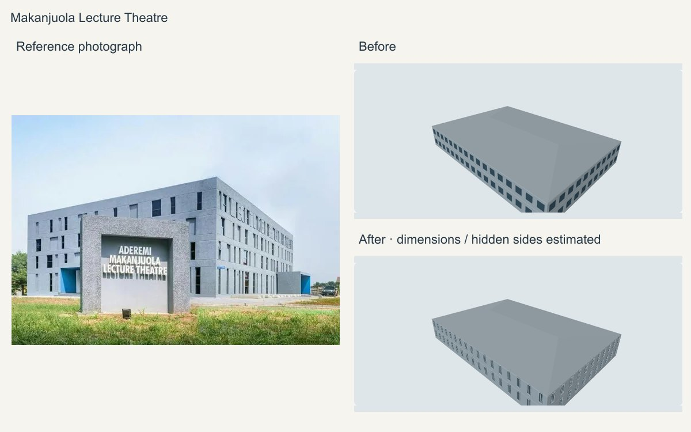

Reference credit: Photo © PWDC · [Public domain](https://www.world-architects.com/en/pwdc-patrickwaheed-design-consultancy-lagos/project/aderemi-makanjuola-lecture-theatre) · [original source](https://www.world-architects.com/en/pwdc-patrickwaheed-design-consultancy-lagos/project/aderemi-makanjuola-lecture-theatre). Capture date: unknown. Modifications in this sheet: resized photograph; model renders and labels added.

**Observed:** Three visible levels; grey exterior screen with irregular tall narrow openings; blue entrance canopies; flat parapet.

**Candidate:** Framed openings with width ratio 0.3 and height ratio 0.67, filling missing settings only. 

**Estimated:** Window-frame relief and regularized opening proportions are illustrative. Unseen elevations and exact dimensions are unknown.

**Remaining:** Screen pattern is irregular: regularized model openings remain estimates. Existing owner roof retained pending review. Match photographic elevation to stable wall IDs in Photo & model before using wall-specific features or textures.

### ICT

Stable ID: `arcgis:University_Property:31`. Evidence: 1 photograph(s).

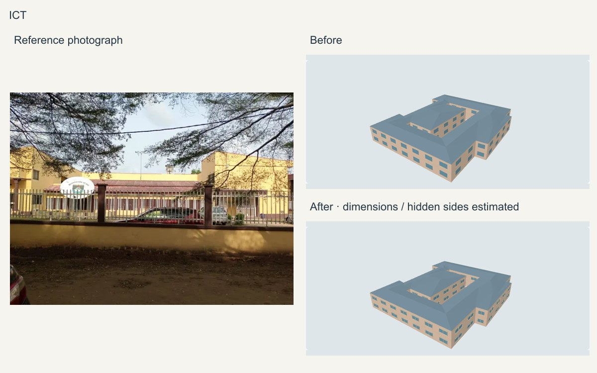

Reference credit: Ajokeoba · [CC BY-SA 4.0](https://creativecommons.org/licenses/by-sa/4.0) · [original source](https://commons.wikimedia.org/wiki/File:IMG-20220313-WA0000.jpg). Historical view. Capture date: 2022-03-13. Modifications in this sheet: resized photograph; model renders and labels added.

**Observed:** Yellow walls and brown trim; recessed low entrance section between taller end blocks.

**Candidate:** Framed openings with width ratio 0.55 and height ratio 0.45, filling missing settings only. 

**Estimated:** Window-frame relief and regularized opening proportions are illustrative. Unseen elevations and exact dimensions are unknown.

**Remaining:** Fence and trees obstruct the façade. No whole-wall photographic texture is safe. Match photographic elevation to stable wall IDs in Photo & model before using wall-specific features or textures.

### Student Arcade

Stable ID: `arcgis:University_Property:32`. Evidence: 1 photograph(s).

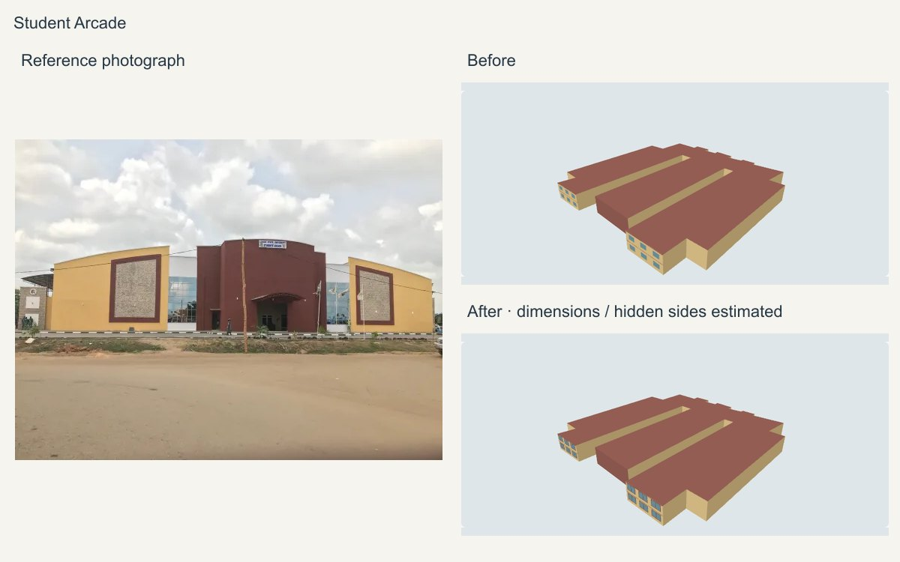

Reference credit: Shedyflowz · [CC BY-SA 4.0](https://creativecommons.org/licenses/by-sa/4.0) · [original source](https://commons.wikimedia.org/wiki/File:Lagos_State_University_Students%E2%80%99_Arcade.jpg). Historical view. Capture date: 2022-03-11. Modifications in this sheet: resized photograph; model renders and labels added.

**Observed:** Yellow solid façade panels; red-brown central entrance block; central glazing.

**Candidate:** Framed openings with width ratio 0.7 and height ratio 0.65, filling missing settings only. 

**Estimated:** Window-frame relief and regularized opening proportions are illustrative. Unseen elevations and exact dimensions are unknown.

**Remaining:** Wall orientation and relief-panel motifs need owner matching. Preserve existing solid walls. Match photographic elevation to stable wall IDs in Photo & model before using wall-specific features or textures.

### SDG-PHC FACILITY

Stable ID: `arcgis:University_Property:33`. Evidence: 3 photograph(s).

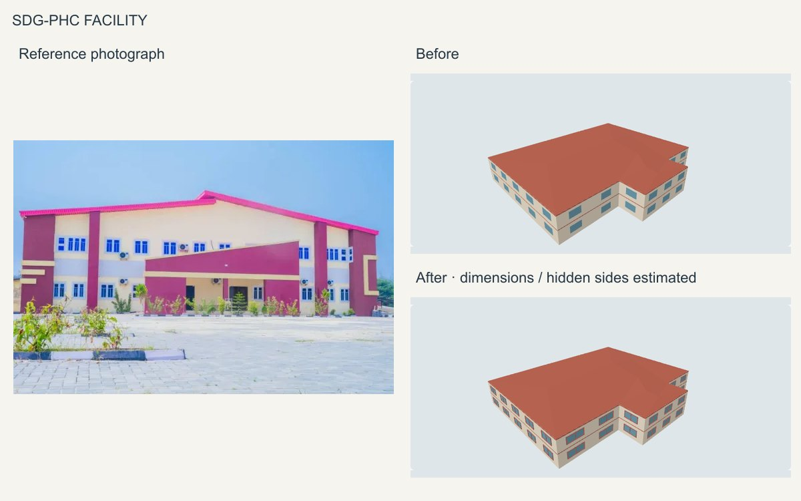

Reference credit: LASU · [Public domain](https://csc.lasu.edu.ng/lasu_library/) · [original source](https://csc.lasu.edu.ng/lasu_library/). Capture date: unknown. Modifications in this sheet: resized photograph; model renders and labels added.

**Observed:** Two levels; cream walls; red-brown vertical bands and canopy; white-framed blue windows.

**Candidate:** Framed openings with width ratio 0.52 and height ratio 0.5, filling missing settings only. 

**Estimated:** Window-frame relief and regularized opening proportions are illustrative. Unseen elevations and exact dimensions are unknown.

**Remaining:** Strong colour grading in one image is unsuitable for texture/material sampling. External ramp does not establish routing permission. Match photographic elevation to stable wall IDs in Photo & model before using wall-specific features or textures.

### FMS

Stable ID: `arcgis:University_Property:39`. Evidence: 2 photograph(s).

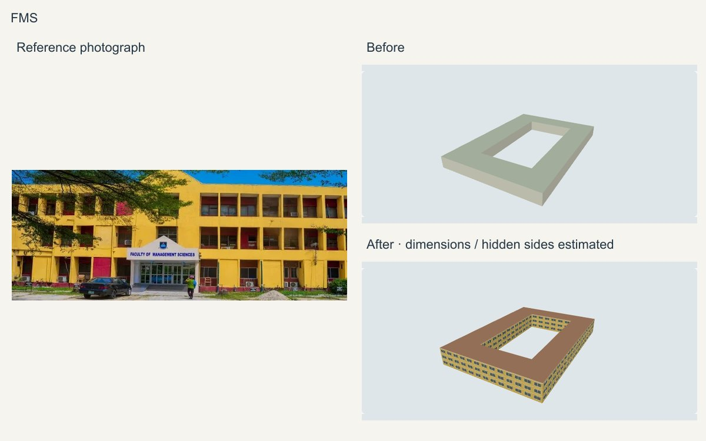

Reference credit: LASU · [Public domain](https://lasu.edu.ng/home/lasuss/) · [original source](https://lasu.edu.ng/home/lasuss/). Capture date: unknown. Modifications in this sheet: resized photograph; model renders and labels added.

**Observed:** Three visible levels; yellow infill; repeated rectangular windows; white entrance portico.

**Candidate:** Framed openings with width ratio 0.7 and height ratio 0.53, filling missing settings only. 3 visible floors support a floor-based height only where no owner height exists.

**Estimated:** Window-frame relief and regularized opening proportions are illustrative. Unseen elevations and exact dimensions are unknown.

**Remaining:** Previously illustrative height can use three observed floors at an estimated 3 m per floor. Exact front-wall location remains unconfirmed. Match photographic elevation to stable wall IDs in Photo & model before using wall-specific features or textures.

### PG School

Stable ID: `arcgis:University_Property:43`. Evidence: 1 photograph(s).

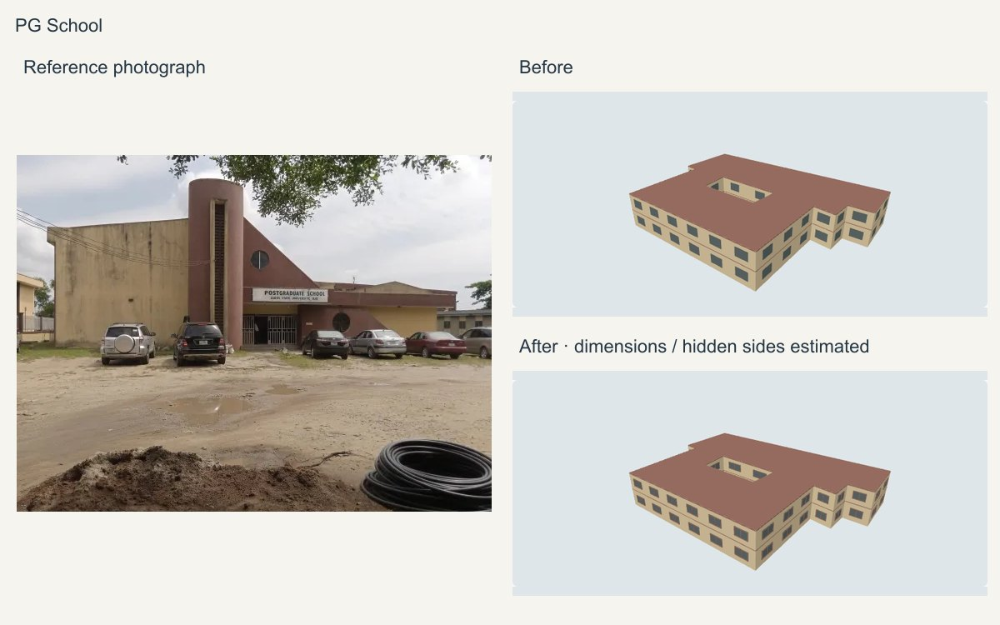

Reference credit: Official alade · [CC BY-SA 4.0](https://creativecommons.org/licenses/by-sa/4.0) · [original source](https://commons.wikimedia.org/wiki/File:Post-graduate_school,_LASU.jpg). Historical view. Capture date: 2021-11-12. Modifications in this sheet: resized photograph; model renders and labels added.

**Observed:** Cream wall planes and red-brown entrance framing; tall solid tower and triangular entrance feature.

**Candidate:** Framed openings with width ratio 0.5 and height ratio 0.45, filling missing settings only. 

**Estimated:** Window-frame relief and regularized opening proportions are illustrative. Unseen elevations and exact dimensions are unknown.

**Remaining:** Tower silhouette cannot be assigned confidently to the footprint from this view. Match photographic elevation to stable wall IDs in Photo & model before using wall-specific features or textures.

### Department of Theartre Arts and Music

Stable ID: `arcgis:University_Property:44`. Evidence: 1 photograph(s).

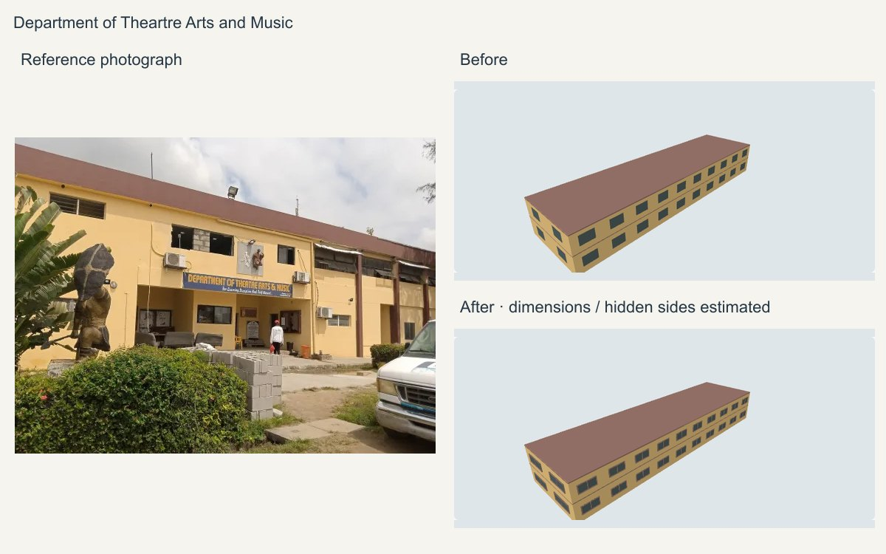

Reference credit: Official alade · [CC BY-SA 4.0](https://creativecommons.org/licenses/by-sa/4.0) · [original source](https://commons.wikimedia.org/wiki/File:Department_of_Theater_Art_and_Music,_Lagos_State_University.jpg). Historical view. Capture date: 2021-11-12. Modifications in this sheet: resized photograph; model renders and labels added.

**Observed:** Two levels; yellow walls; red-brown roof-edge trim; rectangular dark windows.

**Candidate:** Framed openings with width ratio 0.6 and height ratio 0.42, filling missing settings only. 

**Estimated:** Window-frame relief and regularized opening proportions are illustrative. Unseen elevations and exact dimensions are unknown.

**Remaining:** Trees obscure some openings. Wall position needs matching. Match photographic elevation to stable wall IDs in Photo & model before using wall-specific features or textures.

### Faculty Of Education 3 In 1

Stable ID: `arcgis:University_Property:54`. Evidence: 2 photograph(s).

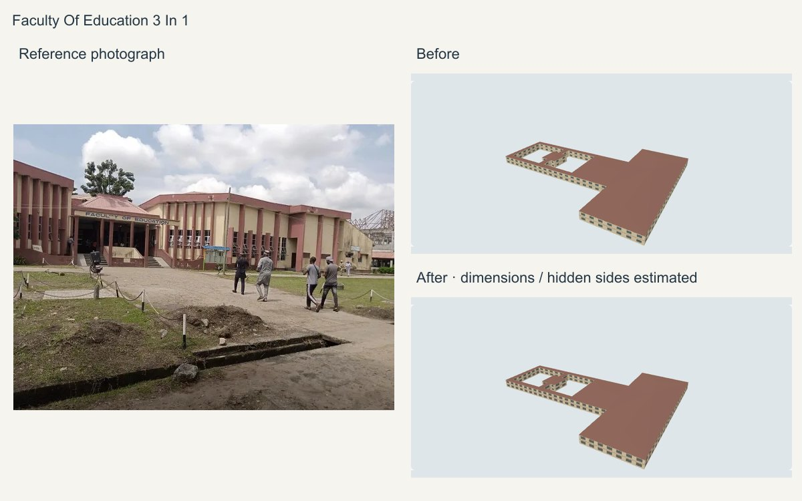

Reference credit: Official alade · [CC BY-SA 4.0](https://creativecommons.org/licenses/by-sa/4.0) · [original source](https://commons.wikimedia.org/wiki/File:Faculty_of_Education,_Lagos_State_University(LASU).jpg). Historical view. Capture date: 2021-11-12. Modifications in this sheet: resized photograph; model renders and labels added.

**Observed:** Cream/yellow infill; tall red-brown vertical columns; entrance portico and pitched roof sections.

**Candidate:** Framed openings with width ratio 0.55 and height ratio 0.56, filling missing settings only. 

**Estimated:** Window-frame relief and regularized opening proportions are illustrative. Unseen elevations and exact dimensions are unknown.

**Remaining:** Existing custom roof retained. Photographs do not resolve all courtyard roof ridges. Match photographic elevation to stable wall IDs in Photo & model before using wall-specific features or textures.

### LASU Radio

Stable ID: `arcgis:University_Property:55`. Evidence: 1 photograph(s).

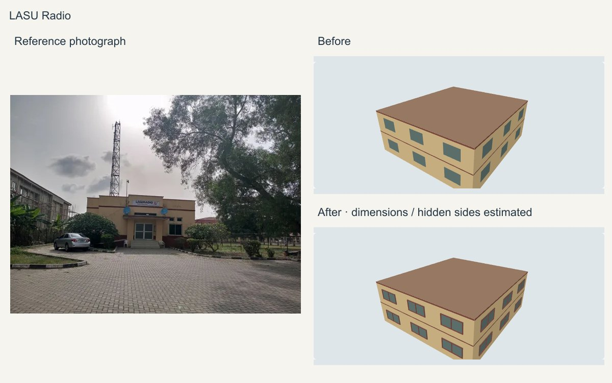

Reference credit: Justjin · [CC BY-SA 4.0](https://creativecommons.org/licenses/by-sa/4.0) · [original source](https://commons.wikimedia.org/wiki/File:Lagos_state_university_radio.jpg). Historical view. Capture date: 2022-03-11. Modifications in this sheet: resized photograph; model renders and labels added.

**Observed:** Cream/yellow entrance elevation; flat parapet; glazed entrance doors.

**Candidate:** Framed openings with width ratio 0.55 and height ratio 0.45, filling missing settings only. 

**Estimated:** Window-frame relief and regularized opening proportions are illustrative. Unseen elevations and exact dimensions are unknown.

**Remaining:** Mast is separate from the building. Concealed levels and side windows remain unknown. Match photographic elevation to stable wall IDs in Photo & model before using wall-specific features or textures.

### LASU CBT

Stable ID: `arcgis:University_Property:73`. Evidence: 3 photograph(s).

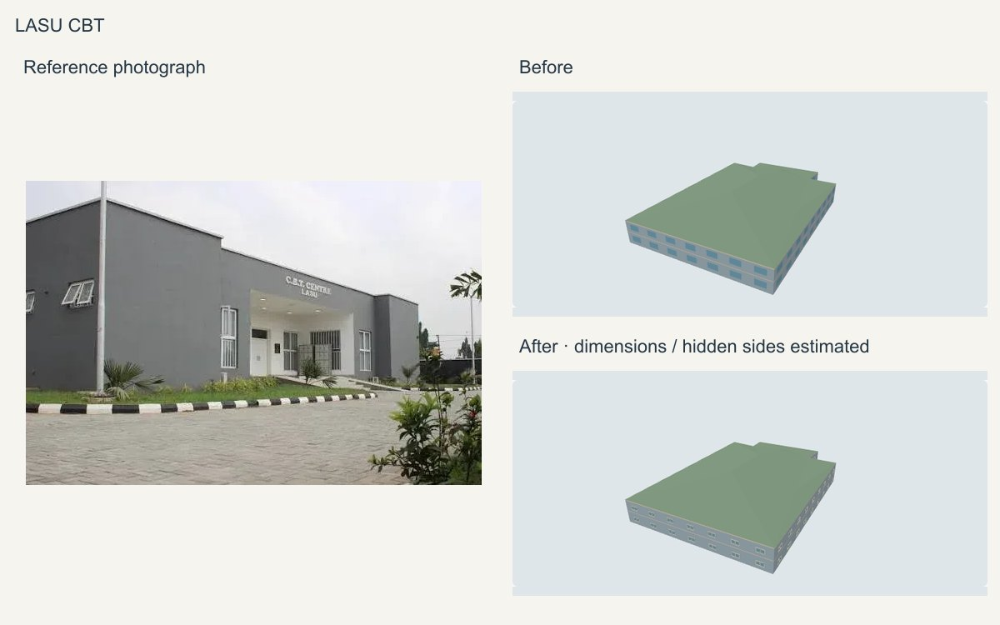

Reference credit: LASU Ventures limited · [Public domain](https://www.google.com/url?sa=t&source=web&rct=j&url=https%3A%2F%2Fwww.facebook.com%2FLASUVenturesLtd%2Fposts%2Fthe-lagos-state-university-computer-based-test-centre-ojo-is-unarguably-the-best%2F120812789452891%2F&ved=0CAMQjB1qFwoTCLDajf6UhZcDFQAAAAAdAAAAABA4&opi=89978449) · [original source](https://www.google.com/url?sa=t&source=web&rct=j&url=https%3A%2F%2Fwww.facebook.com%2FLASUVenturesLtd%2Fposts%2Fthe-lagos-state-university-computer-based-test-centre-ojo-is-unarguably-the-best%2F120812789452891%2F&ved=0CAMQjB1qFwoTCLDajf6UhZcDFQAAAAAdAAAAABA4&opi=89978449). Capture date: unknown. Modifications in this sheet: resized photograph; model renders and labels added.

**Observed:** Large grey hall; stepped façade/parapet; light entrance surround; small high windows. Interior shows computer hall.

**Candidate:** Framed openings with width ratio 0.35 and height ratio 0.35, filling missing settings only. 

**Estimated:** Window-frame relief and regularized opening proportions are illustrative. Unseen elevations and exact dimensions are unknown.

**Remaining:** Interior photograph cannot establish exterior floor count. Retain existing roof and height pending survey; do not texture with the approach or interior. Match photographic elevation to stable wall IDs in Photo & model before using wall-specific features or textures.

### M.B.A

Stable ID: `arcgis:University_Property:75`. Evidence: 2 photograph(s).

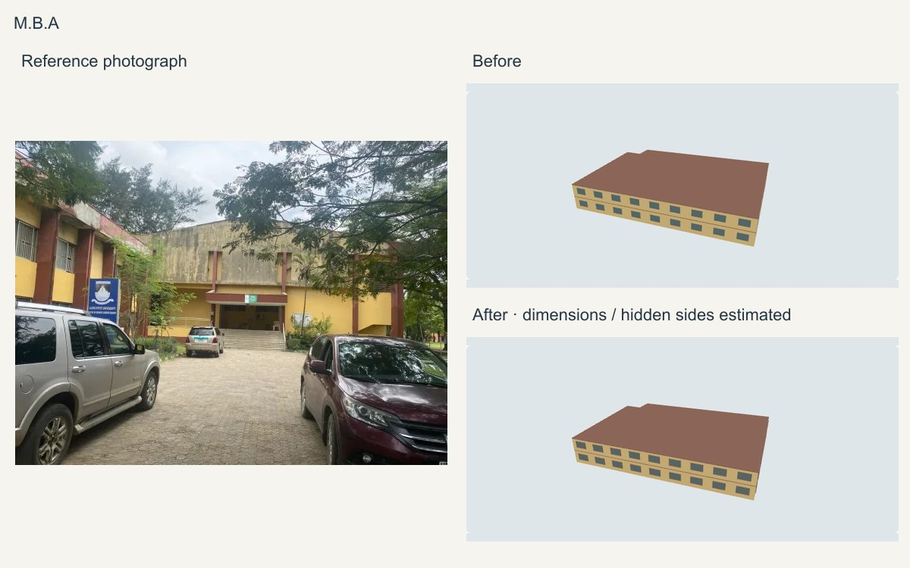

Reference credit: Abiolakintrunde · [CC BY-SA 4.0](https://creativecommons.org/licenses/by-sa/4.0) · [original source](https://commons.wikimedia.org/wiki/File:Lasu_master_of_Business_Administration_complex.jpg). Historical view. Capture date: 2021-12-22. Modifications in this sheet: resized photograph; model renders and labels added.

**Observed:** Yellow infill with red-brown vertical framing; recessed entrance approach.

**Candidate:** Framed openings with width ratio 0.56 and height ratio 0.5, filling missing settings only. 

**Estimated:** Window-frame relief and regularized opening proportions are illustrative. Unseen elevations and exact dimensions are unknown.

**Remaining:** Trees obscure the upper façade and roof. Courtyard structure is not a surveyed footprint. Match photographic elevation to stable wall IDs in Photo & model before using wall-specific features or textures.

### Law Library

Stable ID: `arcgis:University_Property:76`. Evidence: 1 photograph(s).

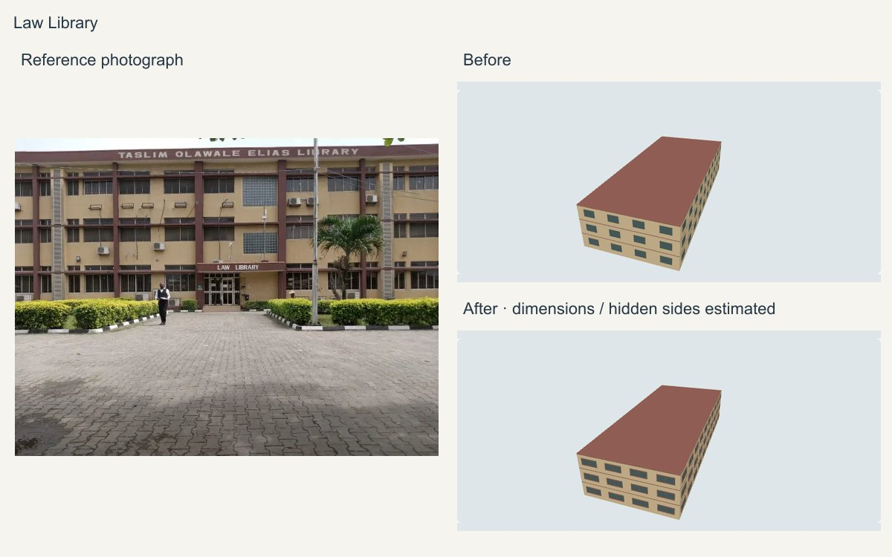

Reference credit: Official alade · [CC BY-SA 4.0](https://creativecommons.org/licenses/by-sa/4.0) · [original source](https://commons.wikimedia.org/wiki/File:Law_library,_LASU.jpg). Historical view. Capture date: 2021-11-12. Modifications in this sheet: resized photograph; model renders and labels added.

**Observed:** Three visible levels; cream infill, dark windows, red-brown pilasters and continuous floor bands.

**Candidate:** Framed openings with width ratio 0.65 and height ratio 0.45, filling missing settings only. 

**Estimated:** Window-frame relief and regularized opening proportions are illustrative. Unseen elevations and exact dimensions are unknown.

**Remaining:** Exact pilaster spacing and façade orientation require matching. Match photographic elevation to stable wall IDs in Photo & model before using wall-specific features or textures.

### Law Clinic

Stable ID: `arcgis:University_Property:78`. Evidence: 4 photograph(s).

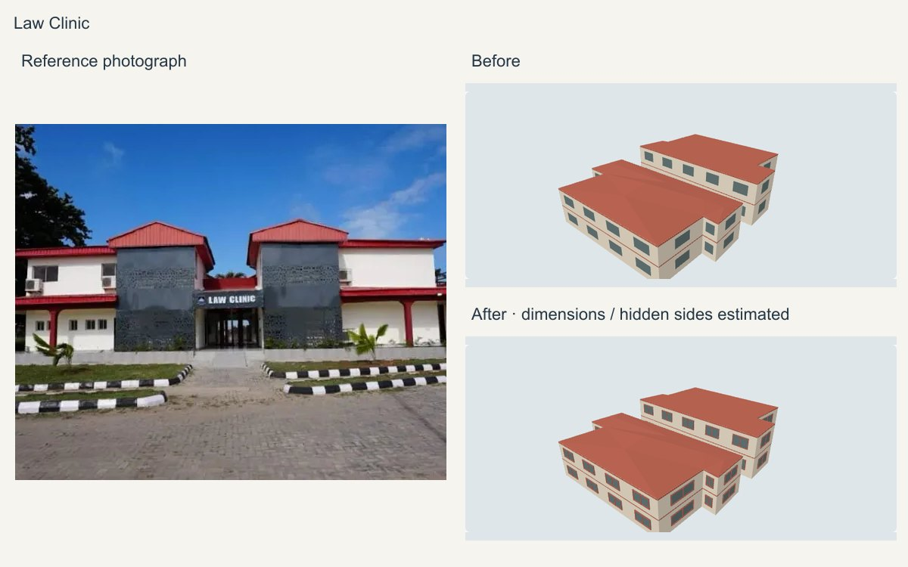

Reference credit: The Nation · [Public domain](https://thenationonlineng.net/donors-renovate-lasu-law-clinic-in-honour-of-oguntade/) · [original source](https://thenationonlineng.net/donors-renovate-lasu-law-clinic-in-honour-of-oguntade/). Capture date: unknown. Modifications in this sheet: resized photograph; model renders and labels added.

**Observed:** Two levels; red pitched roofs; cream walls, veranda columns and balcony rails. Views show different entrance finishes.

**Candidate:** Framed openings with width ratio 0.52 and height ratio 0.5, filling missing settings only. 

**Estimated:** Window-frame relief and regularized opening proportions are illustrative. Unseen elevations and exact dimensions are unknown.

**Remaining:** New-looking dark-clad view has no capture date; material chronology unresolved. Preserve owner cream finish and custom roof. Match photographic elevation to stable wall IDs in Photo & model before using wall-specific features or textures.

### School Of TransportC

Stable ID: `arcgis:University_Property:103`. Evidence: 2 photograph(s).

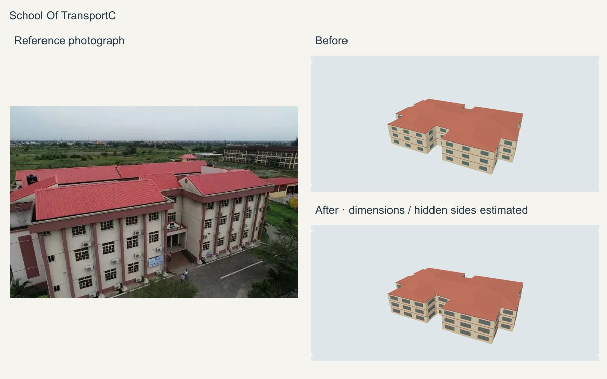

Reference credit: LASU · [Public domain](https://lasu.edu.ng/home/faculties/) · [original source](https://lasu.edu.ng/home/faculties/). Capture date: unknown. Modifications in this sheet: resized photograph; model renders and labels added.

**Observed:** Four visible levels; cream infill with red-brown vertical framing; multiple red pitched roof sections.

**Candidate:** Framed openings with width ratio 0.62 and height ratio 0.5, filling missing settings only. 

**Estimated:** Window-frame relief and regularized opening proportions are illustrative. Unseen elevations and exact dimensions are unknown.

**Remaining:** Aerial image supports roof form, not surveyed ridge elevations. Owner roof retained. Match photographic elevation to stable wall IDs in Photo & model before using wall-specific features or textures.

### LASU Senate Building

Stable ID: `arcgis:University_Property:120`. Evidence: 4 photograph(s).

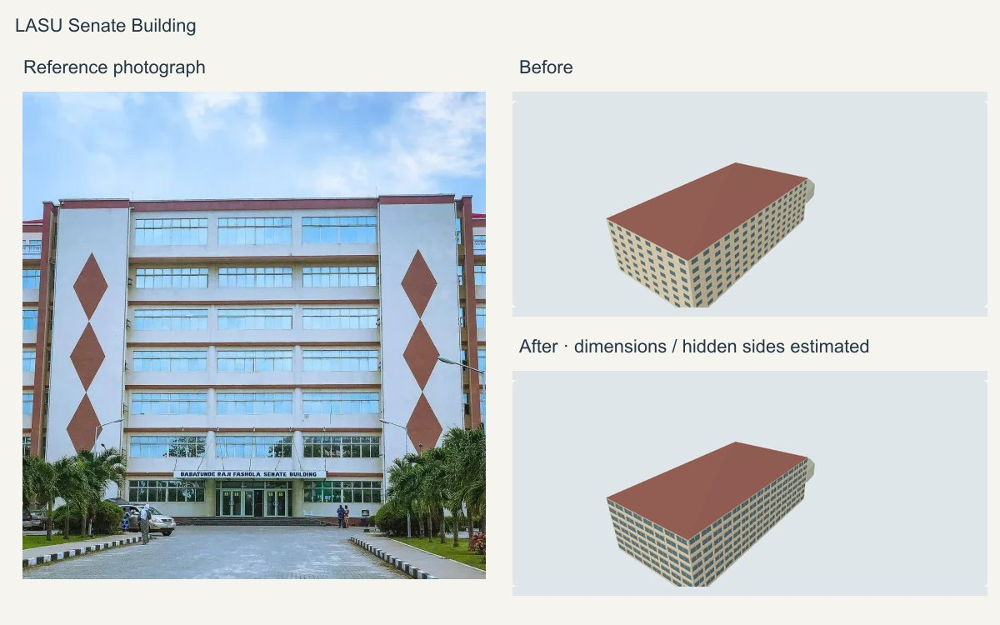

Reference credit: Aimee.shot.it · [CC BY-SA 4.0](https://creativecommons.org/licenses/by-sa/4.0) · [original source](https://commons.wikimedia.org/wiki/File:Lagos_State_University_Senate_Building.jpg). Historical view. Capture date: 2023-07-07. Modifications in this sheet: resized photograph; model renders and labels added.

**Observed:** Seven visible levels; long blue-glazed window bands; cream horizontal bands; red diamond motifs on tall side panels.

**Candidate:** Framed openings with width ratio 0.86 and height ratio 0.63, filling missing settings only. 

**Estimated:** Window-frame relief and regularized opening proportions are illustrative. Unseen elevations and exact dimensions are unknown.

**Remaining:** Different dated views show finish changes. Exact front-wall orientation and diamond placement need review. Match photographic elevation to stable wall IDs in Photo & model before using wall-specific features or textures.

## All 39 image decisions

35 exterior evidence views; two interior views; one approach-only view; one rejected model match. No duplicates were discovered among these 39 immutable published photo assets. Every image is accounted for below; this is not a claim about all photographs online. Source dates and historical status are retained in the linked inventory.

| Photo ID | Building ID | Evidence decision | Texture decision | Source / rights |
|---|---|---|---|---|
| commons:112540966 | arcgis:University_Property:22 | exterior-evidence: Supports visible architectural observations. Camera orientation is not georeferenced; do not silently choose a wall. | awaiting-wall-orientation-and-unobstructed-crop | Abiolakintrunde · [CC BY-SA 4.0](https://creativecommons.org/licenses/by-sa/4.0) · [source](https://commons.wikimedia.org/wiki/File:Lagos_state_university_school_of_communication.jpg) |
| commons:115984120 | arcgis:University_Property:32 | exterior-evidence: Supports visible architectural observations. Camera orientation is not georeferenced; do not silently choose a wall. | awaiting-wall-orientation-and-unobstructed-crop | Shedyflowz · [CC BY-SA 4.0](https://creativecommons.org/licenses/by-sa/4.0) · [source](https://commons.wikimedia.org/wiki/File:Lagos_State_University_Students%E2%80%99_Arcade.jpg) |
| commons:115996430 | arcgis:University_Property:55 | exterior-evidence: Supports visible architectural observations. Camera orientation is not georeferenced; do not silently choose a wall. | awaiting-wall-orientation-and-unobstructed-crop | Justjin · [CC BY-SA 4.0](https://creativecommons.org/licenses/by-sa/4.0) · [source](https://commons.wikimedia.org/wiki/File:Lagos_state_university_radio.jpg) |
| commons:112834702 | arcgis:University_Property:43 | exterior-evidence: Supports visible architectural observations. Camera orientation is not georeferenced; do not silently choose a wall. | awaiting-wall-orientation-and-unobstructed-crop | Official alade · [CC BY-SA 4.0](https://creativecommons.org/licenses/by-sa/4.0) · [source](https://commons.wikimedia.org/wiki/File:Post-graduate_school,_LASU.jpg) |
| commons:112835955 | arcgis:University_Property:76 | exterior-evidence: Supports visible architectural observations. Camera orientation is not georeferenced; do not silently choose a wall. | awaiting-wall-orientation-and-unobstructed-crop | Official alade · [CC BY-SA 4.0](https://creativecommons.org/licenses/by-sa/4.0) · [source](https://commons.wikimedia.org/wiki/File:Law_library,_LASU.jpg) |
| commons:113564415 | arcgis:University_Property:75 | exterior-evidence: Supports visible architectural observations. Camera orientation is not georeferenced; do not silently choose a wall. | awaiting-wall-orientation-and-unobstructed-crop | Abiolakintrunde · [CC BY-SA 4.0](https://creativecommons.org/licenses/by-sa/4.0) · [source](https://commons.wikimedia.org/wiki/File:Lasu_master_of_Business_Administration_complex.jpg) |
| commons:116073666 | arcgis:University_Property:22 | exterior-evidence: Supports visible architectural observations. Camera orientation is not georeferenced; do not silently choose a wall. | awaiting-wall-orientation-and-unobstructed-crop | SIMIOFAFRICA · [CC BY-SA 4.0](https://creativecommons.org/licenses/by-sa/4.0) · [source](https://commons.wikimedia.org/wiki/File:School_of_Communication.jpg) |
| commons:112834607 | arcgis:University_Property:54 | exterior-evidence: Supports visible architectural observations. Camera orientation is not georeferenced; do not silently choose a wall. | awaiting-wall-orientation-and-unobstructed-crop | Official alade · [CC BY-SA 4.0](https://creativecommons.org/licenses/by-sa/4.0) · [source](https://commons.wikimedia.org/wiki/File:Faculty_of_Education,_Lagos_State_University(LASU).jpg) |
| commons:112838171 | arcgis:University_Property:44 | exterior-evidence: Supports visible architectural observations. Camera orientation is not georeferenced; do not silently choose a wall. | awaiting-wall-orientation-and-unobstructed-crop | Official alade · [CC BY-SA 4.0](https://creativecommons.org/licenses/by-sa/4.0) · [source](https://commons.wikimedia.org/wiki/File:Department_of_Theater_Art_and_Music,_Lagos_State_University.jpg) |
| commons:115992650 | arcgis:University_Property:54 | exterior-evidence: Supports visible architectural observations. Camera orientation is not georeferenced; do not silently choose a wall. | awaiting-wall-orientation-and-unobstructed-crop | SIMIOFAFRICA · [CC BY-SA 4.0](https://creativecommons.org/licenses/by-sa/4.0) · [source](https://commons.wikimedia.org/wiki/File:Faculty_of_Education,_Lagos_State_University_(LASU)_Ojo.jpg) |
| commons:116026274 | arcgis:University_Property:31 | exterior-evidence: Supports visible architectural observations. Camera orientation is not georeferenced; do not silently choose a wall. | awaiting-wall-orientation-and-unobstructed-crop | Ajokeoba · [CC BY-SA 4.0](https://creativecommons.org/licenses/by-sa/4.0) · [source](https://commons.wikimedia.org/wiki/File:IMG-20220313-WA0000.jpg) |
| commons:116026424 | arcgis:University_Property:75 | exterior-evidence: Supports visible architectural observations. Camera orientation is not georeferenced; do not silently choose a wall. | awaiting-wall-orientation-and-unobstructed-crop | Ajokeoba · [CC BY-SA 4.0](https://creativecommons.org/licenses/by-sa/4.0) · [source](https://commons.wikimedia.org/wiki/File:IMG-20220313-WA0007.jpg) |
| owner:08cac3ae-a759-47f9-a52c-5db81314683d | arcgis:University_Property:103 | exterior-evidence: Supports visible architectural observations. Camera orientation is not georeferenced; do not silently choose a wall. | awaiting-wall-orientation-and-unobstructed-crop | LASU · [Public domain](https://lasu.edu.ng/home/faculties/) · [source](https://lasu.edu.ng/home/faculties/) |
| commons:112540904 | arcgis:University_Property:103 | exterior-evidence: Supports visible architectural observations. Camera orientation is not georeferenced; do not silently choose a wall. | awaiting-wall-orientation-and-unobstructed-crop | Abiolakintrunde · [CC BY-SA 4.0](https://creativecommons.org/licenses/by-sa/4.0) · [source](https://commons.wikimedia.org/wiki/File:Lasu_School_of_transport.jpg) |
| commons:138069484 | arcgis:University_Property:120 | exterior-evidence: Supports visible architectural observations. Camera orientation is not georeferenced; do not silently choose a wall. | awaiting-wall-orientation-and-unobstructed-crop | Aimee.shot.it · [CC BY-SA 4.0](https://creativecommons.org/licenses/by-sa/4.0) · [source](https://commons.wikimedia.org/wiki/File:Lagos_State_University_Senate_Building.jpg) |
| commons:198256507 | arcgis:University_Property:120 | exterior-evidence: Supports visible architectural observations. Camera orientation is not georeferenced; do not silently choose a wall. | awaiting-wall-orientation-and-unobstructed-crop | FrankvEck · [CC BY-SA 4.0](https://creativecommons.org/licenses/by-sa/4.0) · [source](https://commons.wikimedia.org/wiki/File:Lagos_State_University_Senate_building_aug_2026_IMG_5989b.jpg) |
| commons:116073984 | arcgis:University_Property:120 | exterior-evidence: Supports visible architectural observations. Camera orientation is not georeferenced; do not silently choose a wall. | awaiting-wall-orientation-and-unobstructed-crop | SIMIOFAFRICA · [CC BY-SA 4.0](https://creativecommons.org/licenses/by-sa/4.0) · [source](https://commons.wikimedia.org/wiki/File:LASU_Senate_Building_Right_Section_1.jpg) |
| commons:115987634 | arcgis:University_Property:120 | exterior-evidence: Supports visible architectural observations. Camera orientation is not georeferenced; do not silently choose a wall. | awaiting-wall-orientation-and-unobstructed-crop | Ebubechukwu1 · [CC BY-SA 4.0](https://creativecommons.org/licenses/by-sa/4.0) · [source](https://commons.wikimedia.org/wiki/File:Senate_building.jpg) |
| owner:0d3bf62a-b1ad-4784-97e0-ca5ef7d75f12 | arcgis:University_Property:2 | exterior-evidence: Supports visible architectural observations. Camera orientation is not georeferenced; do not silently choose a wall. | awaiting-wall-orientation-and-unobstructed-crop | LASU Admission facebook account · [Public domain](https://www.google.com/url?sa=t&source=web&rct=j&url=https%3A%2F%2Fwww.facebook.com%2Flasuadmission%2Fphotos%2F462968039196882%2F&ved=0CAMQjB1qFwoTCIC3_NCLhZcDFQAAAAAdAAAAABBq&opi=89978449) · [source](https://www.google.com/url?sa=t&source=web&rct=j&url=https%3A%2F%2Fwww.facebook.com%2Flasuadmission%2Fphotos%2F462968039196882%2F&ved=0CAMQjB1qFwoTCIC3_NCLhZcDFQAAAAAdAAAAABBq&opi=89978449) |
| owner:f4f817e8-8ee9-4870-9838-26c6b28ea1d2 | arcgis:University_Property:2 | exterior-evidence: Supports visible architectural observations. Camera orientation is not georeferenced; do not silently choose a wall. | awaiting-wall-orientation-and-unobstructed-crop | LASU Admission facebook account · [Public domain](https://www.google.com/url?sa=t&source=web&rct=j&url=https%3A%2F%2Fwww.facebook.com%2Flasuadmission%2Fphotos%2F462968039196882%2F&ved=0CAMQjB1qFwoTCIC3_NCLhZcDFQAAAAAdAAAAABBq&opi=89978449) · [source](https://www.google.com/url?sa=t&source=web&rct=j&url=https%3A%2F%2Fwww.facebook.com%2Flasuadmission%2Fphotos%2F462968039196882%2F&ved=0CAMQjB1qFwoTCIC3_NCLhZcDFQAAAAAdAAAAABBq&opi=89978449) |
| owner:219bff19-0911-4994-9e4b-1b88c02de40a | arcgis:University_Property:2 | rejected-building-match: Shows LASU campus gate, not the Main Auditorium. Gallery correction requires owner review. | rejected | LASU Admission facebook account · [Public domain](https://www.google.com/url?sa=t&source=web&rct=j&url=https%3A%2F%2Fwww.facebook.com%2Flasuadmission%2Fphotos%2F462968039196882%2F&ved=0CAMQjB1qFwoTCIC3_NCLhZcDFQAAAAAdAAAAABBq&opi=89978449) · [source](https://www.google.com/url?sa=t&source=web&rct=j&url=https%3A%2F%2Fwww.facebook.com%2Flasuadmission%2Fphotos%2F462968039196882%2F&ved=0CAMQjB1qFwoTCIC3_NCLhZcDFQAAAAAdAAAAABBq&opi=89978449) |
| owner:120ff88a-b28c-45b9-95d4-4d1ada0c6faf | arcgis:University_Property:25 | exterior-evidence: Supports visible architectural observations. Camera orientation is not georeferenced; do not silently choose a wall. | awaiting-wall-orientation-and-unobstructed-crop | The Intellectual · [Public domain](https://theintellectualmag.com/excitement-as-lasu-begins-new-phase/) · [source](https://theintellectualmag.com/excitement-as-lasu-begins-new-phase/) |
| owner:29167df2-b9dc-4031-86ab-7b27a9ec1ad4 | arcgis:University_Property:28 | exterior-evidence: Supports visible architectural observations. Camera orientation is not georeferenced; do not silently choose a wall. | awaiting-wall-orientation-and-unobstructed-crop | Photo © PWDC · [Public domain](https://www.world-architects.com/en/pwdc-patrickwaheed-design-consultancy-lagos/project/aderemi-makanjuola-lecture-theatre) · [source](https://www.world-architects.com/en/pwdc-patrickwaheed-design-consultancy-lagos/project/aderemi-makanjuola-lecture-theatre) |
| owner:5938e73d-5f89-4688-8c55-1bd8a04afce3 | arcgis:University_Property:28 | exterior-evidence: Supports visible architectural observations. Camera orientation is not georeferenced; do not silently choose a wall. | awaiting-wall-orientation-and-unobstructed-crop | Patrickwaheed Design Consultancy · [Public domain](https://world-architects.com/en/pwdc-patrickwaheed-design-consultancy-lagos/project/aderemi-makanjuola-lecture-theatre) · [source](https://world-architects.com/en/pwdc-patrickwaheed-design-consultancy-lagos/project/aderemi-makanjuola-lecture-theatre) |
| owner:157703d4-eac0-43a7-aba5-49670c40241a | arcgis:University_Property:28 | exterior-evidence: Supports visible architectural observations. Camera orientation is not georeferenced; do not silently choose a wall. | awaiting-wall-orientation-and-unobstructed-crop | Patrickwaheed Design Consultancy · [Public domain](https://world-architects.com/en/pwdc-patrickwaheed-design-consultancy-lagos/project/aderemi-makanjuola-lecture-theatre) · [source](https://world-architects.com/en/pwdc-patrickwaheed-design-consultancy-lagos/project/aderemi-makanjuola-lecture-theatre) |
| commons:198256532 | arcgis:University_Property:3 | exterior-evidence: Supports visible architectural observations. Camera orientation is not georeferenced; do not silently choose a wall. | awaiting-wall-orientation-and-unobstructed-crop | FrankvEck · [CC BY-SA 4.0](https://creativecommons.org/licenses/by-sa/4.0) · [source](https://commons.wikimedia.org/wiki/File:Lagos_State_University_Babajide_Olusola_Sanwo-Olu_Library_Complex_aug_2026_IMG_5994b.jpg) |
| commons:198256515 | arcgis:University_Property:3 | interior-evidence: Useful interior evidence; does not establish an exterior façade. | not-exterior-texture | FrankvEck · [CC BY-SA 4.0](https://creativecommons.org/licenses/by-sa/4.0) · [source](https://commons.wikimedia.org/wiki/File:Lagos_State_University_Babajide_Olusola_Sanwo-Olu_Library_Complex_aug_2026_IMG_5997b.jpg) |
| owner:0ba05a1b-e039-43d1-8535-135e1e459aac | arcgis:University_Property:33 | exterior-evidence: Supports visible architectural observations. Camera orientation is not georeferenced; do not silently choose a wall. | awaiting-wall-orientation-and-unobstructed-crop | LASU · [Public domain](https://csc.lasu.edu.ng/lasu_library/) · [source](https://csc.lasu.edu.ng/lasu_library/) |
| owner:73efc2f9-7739-4745-a2c4-5f7f7505805d | arcgis:University_Property:33 | exterior-evidence: Supports visible architectural observations. Camera orientation is not georeferenced; do not silently choose a wall. | awaiting-wall-orientation-and-unobstructed-crop | LASU · [Public domain](https://csc.lasu.edu.ng/lasu_library/) · [source](https://csc.lasu.edu.ng/lasu_library/) |
| owner:09ebfc32-c724-4d9e-b4dd-5e40ca72b555 | arcgis:University_Property:33 | exterior-evidence: Supports visible architectural observations. Camera orientation is not georeferenced; do not silently choose a wall. | awaiting-wall-orientation-and-unobstructed-crop | LASU · [Public domain](https://csc.lasu.edu.ng/lasu_library/) · [source](https://csc.lasu.edu.ng/lasu_library/) |
| owner:159018c2-ccca-42ac-a968-5afde86e47af | arcgis:University_Property:39 | exterior-evidence: Supports visible architectural observations. Camera orientation is not georeferenced; do not silently choose a wall. | awaiting-wall-orientation-and-unobstructed-crop | LASU · [Public domain](https://lasu.edu.ng/home/lasuss/) · [source](https://lasu.edu.ng/home/lasuss/) |
| owner:855bc0a5-efd2-40c5-85ee-81206f2750e9 | arcgis:University_Property:39 | exterior-evidence: Supports visible architectural observations. Camera orientation is not georeferenced; do not silently choose a wall. | awaiting-wall-orientation-and-unobstructed-crop | LASU · [Public domain](https://lasu.edu.ng/home/lasuss/) · [source](https://lasu.edu.ng/home/lasuss/) |
| owner:b4086f16-2907-435d-82ec-bed122723989 | arcgis:University_Property:73 | exterior-evidence: Supports visible architectural observations. Camera orientation is not georeferenced; do not silently choose a wall. | awaiting-wall-orientation-and-unobstructed-crop | LASU Ventures limited · [Public domain](https://www.google.com/url?sa=t&source=web&rct=j&url=https%3A%2F%2Fwww.facebook.com%2FLASUVenturesLtd%2Fposts%2Fthe-lagos-state-university-computer-based-test-centre-ojo-is-unarguably-the-best%2F120812789452891%2F&ved=0CAMQjB1qFwoTCLDajf6UhZcDFQAAAAAdAAAAABA4&opi=89978449) · [source](https://www.google.com/url?sa=t&source=web&rct=j&url=https%3A%2F%2Fwww.facebook.com%2FLASUVenturesLtd%2Fposts%2Fthe-lagos-state-university-computer-based-test-centre-ojo-is-unarguably-the-best%2F120812789452891%2F&ved=0CAMQjB1qFwoTCLDajf6UhZcDFQAAAAAdAAAAABA4&opi=89978449) |
| owner:1e00f010-dda4-4a21-848b-bbd83f90d334 | arcgis:University_Property:73 | approach-only: Approach overview; exterior detail too small for a façade texture. | not-exterior-texture | LASU Ventures limited · [Public domain](https://www.google.com/url?sa=t&source=web&rct=j&url=https%3A%2F%2Fwww.facebook.com%2FLASUVenturesLtd%2Fposts%2Fthe-lagos-state-university-computer-based-test-centre-ojo-is-unarguably-the-best%2F120812789452891%2F&ved=0CAMQjB1qFwoTCLDajf6UhZcDFQAAAAAdAAAAABA4&opi=89978449) · [source](https://www.google.com/url?sa=t&source=web&rct=j&url=https%3A%2F%2Fwww.facebook.com%2FLASUVenturesLtd%2Fposts%2Fthe-lagos-state-university-computer-based-test-centre-ojo-is-unarguably-the-best%2F120812789452891%2F&ved=0CAMQjB1qFwoTCLDajf6UhZcDFQAAAAAdAAAAABA4&opi=89978449) |
| owner:7ca67767-8c67-4376-9a27-ca9c4f7cb3b8 | arcgis:University_Property:73 | interior-evidence: Useful interior evidence; does not establish an exterior façade. | not-exterior-texture | LASU Ventures limited · [Public domain](https://www.google.com/url?sa=t&source=web&rct=j&url=https%3A%2F%2Fwww.facebook.com%2FLASUVenturesLtd%2Fposts%2Fthe-lagos-state-university-computer-based-test-centre-ojo-is-unarguably-the-best%2F120812789452891%2F&ved=0CAMQjB1qFwoTCLDajf6UhZcDFQAAAAAdAAAAABA4&opi=89978449) · [source](https://www.google.com/url?sa=t&source=web&rct=j&url=https%3A%2F%2Fwww.facebook.com%2FLASUVenturesLtd%2Fposts%2Fthe-lagos-state-university-computer-based-test-centre-ojo-is-unarguably-the-best%2F120812789452891%2F&ved=0CAMQjB1qFwoTCLDajf6UhZcDFQAAAAAdAAAAABA4&opi=89978449) |
| owner:e65a2dc2-99f8-4113-a25d-4a749edc10b0 | arcgis:University_Property:78 | exterior-evidence: Supports visible architectural observations. Camera orientation is not georeferenced; do not silently choose a wall. | awaiting-wall-orientation-and-unobstructed-crop | The Nation · [Public domain](https://thenationonlineng.net/donors-renovate-lasu-law-clinic-in-honour-of-oguntade/) · [source](https://thenationonlineng.net/donors-renovate-lasu-law-clinic-in-honour-of-oguntade/) |
| commons:116180211 | arcgis:University_Property:78 | exterior-evidence: Supports visible architectural observations. Camera orientation is not georeferenced; do not silently choose a wall. | awaiting-wall-orientation-and-unobstructed-crop | SIMIOFAFRICA · [CC BY-SA 4.0](https://creativecommons.org/licenses/by-sa/4.0) · [source](https://commons.wikimedia.org/wiki/File:LASU_L%C3%A1%C3%A9_Clinic.jpg) |
| commons:116180607 | arcgis:University_Property:78 | exterior-evidence: Supports visible architectural observations. Camera orientation is not georeferenced; do not silently choose a wall. | awaiting-wall-orientation-and-unobstructed-crop | SIMIOFAFRICA · [CC BY-SA 4.0](https://creativecommons.org/licenses/by-sa/4.0) · [source](https://commons.wikimedia.org/wiki/File:LASU_Law_Clinic,_Ojo.jpg) |
| owner:5eb661a4-e64c-4ed6-94df-7682e42a8465 | arcgis:University_Property:78 | exterior-evidence: Supports visible architectural observations. Camera orientation is not georeferenced; do not silently choose a wall. | awaiting-wall-orientation-and-unobstructed-crop | LASU · [Public domain](https://lasu.edu.ng/home/faculties/) · [source](https://lasu.edu.ng/home/faculties/) |

## Verification results

Production browser measurements and release verification are recorded in [PHOTO-MODEL-VERIFICATION.md](PHOTO-MODEL-VERIFICATION.md). Physical mobile-device and field-dimension verification are unavailable in this environment.
