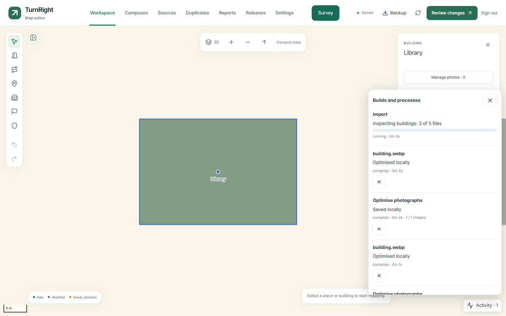

# Build and process progress

The owner's **Activity** button opens **Builds and processes**. It shows local tasks alongside campus-scoped server jobs, with stage text, measured counts when available, errors and supported cancellation/retry actions. It remains available outside modal editing panels; photo editing also displays its active processing stage inside the dialog.



Covered work includes map import uploads and inspection, ArcGIS retrieval, release validation/build/publication, model file parsing/export, photo processing/uploads/approval and offline package preparation. Existing feature-specific status remains beside the initiating action. Percentages come from actual totals; phases without a measurable total show an indeterminate bar and a named stage. Elapsed times are shown only when known.

Owner status refreshes every five seconds during active work and every 30 seconds
when idle, while the page is visible and online. Starting work, reconnecting or
returning to the page wakes the monitor, with a five-second minimum between
requests. Failed refreshes leave the last known stage with an explanation. Local
history retains the latest 30 finished tasks plus active tasks; dismissing a
finished task hides it until its state changes. Server queries include older
active jobs and the terminal state of jobs the current session is watching, even
after they leave the recent-history window. An excessive active queue produces
an explanation instead of silently truncating results. Local processing history
clears when the owner session ends. Server-backed jobs can be reconstructed after
reload. These are task records, not a promise that browser work continues after
closing the tab.

Import cancellation retains the existing run-token protection against stale results. Failed photo uploads can retry from their retained prepared copy. Cancellation is shown only for operations that have a cancellation implementation. A release cannot be safely interrupted at every stage, so its monitor does not invent a cancel action. Use the linked workflow/release error information to recover failed server work.

## Implementation

`process-monitor.ts` provides shared begin/update/finish/fail records. Lazy `ProcessMonitor.tsx` polls the authenticated `process-status` action and merges jobs, releases and imports without returning candidate datasets. Photo queues, image/model workers, validation, API requests and offline downloads publish local events to the same store. Public download UI retains its existing progress display without loading the owner's monitor.

Each poll batches store changes into one notification and keeps unchanged action
callbacks stable. A server job replaces its duplicate release card. The endpoint
selects status fields only and remains scoped to the requested campus.

The Python importer writes stage messages with its active run token. The restricted converter shares file counts through a small progress file. ArcGIS reports retrieved feature counts only after verified batches. `release.mts` records package/model/photo/asset/deployment stages in the existing jobs table; monitoring failures do not cause an otherwise valid release operation to fail. These changes need no database migration.

This covers application-initiated workflows. Ordinary source-code CI/deployment runs still have their detailed logs in GitHub Actions and Vercel; they are not automatically mirrored into the owner database.

```sh
cd web
npx vitest run tests/process-monitor.test.ts
npx playwright test --grep "offline image editor"
```

See [map imports](CAMPUS-IMPORTS.md), [photo editing](PHOTO-EDITING.md) and [deployment](DEPLOYMENT.md).
