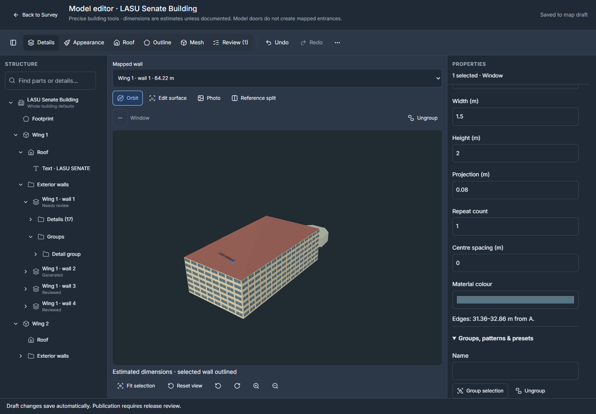
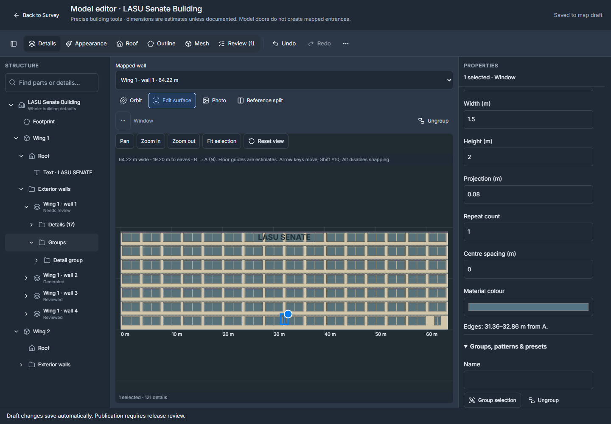
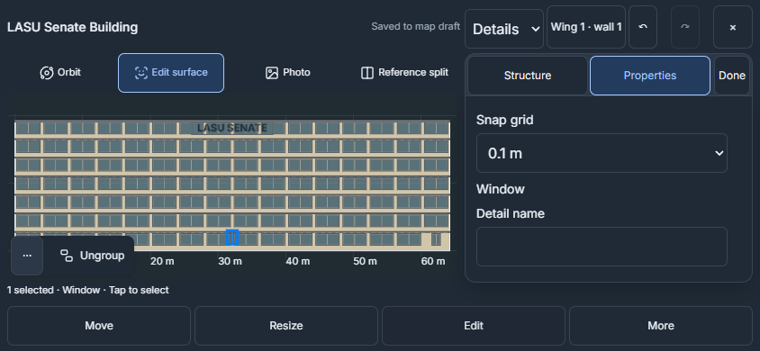
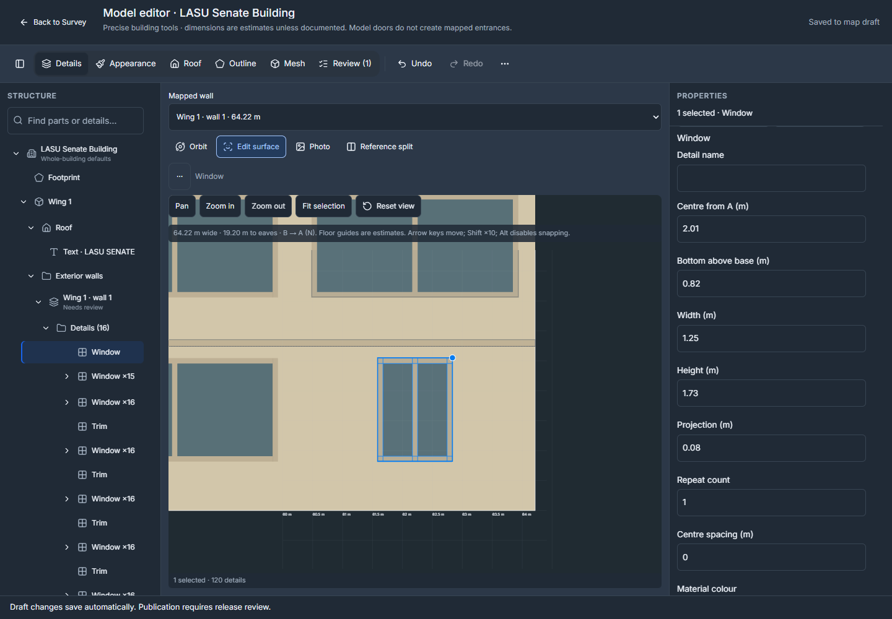
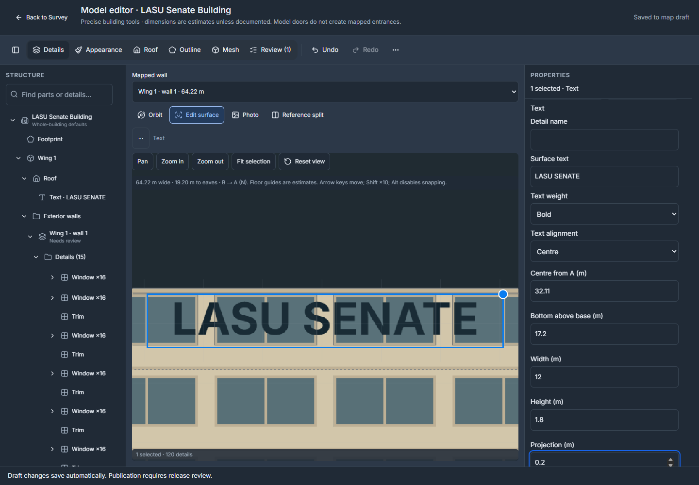
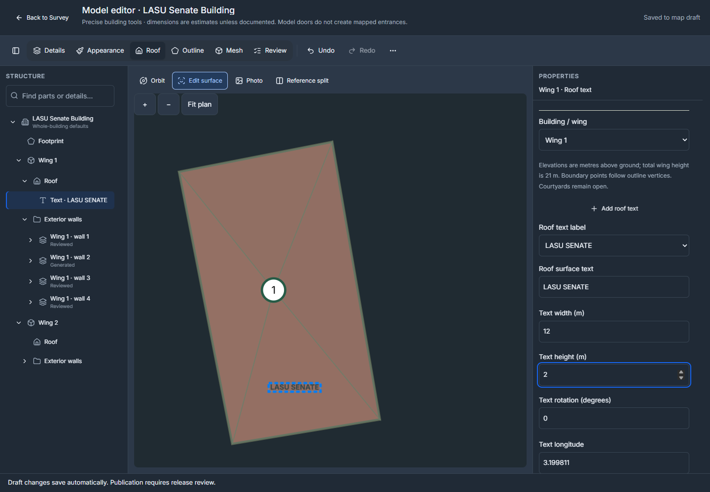
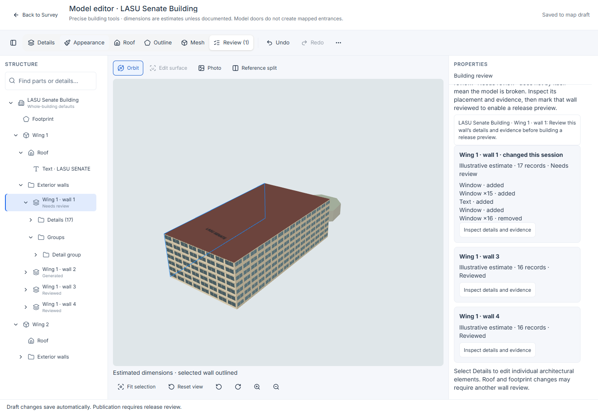
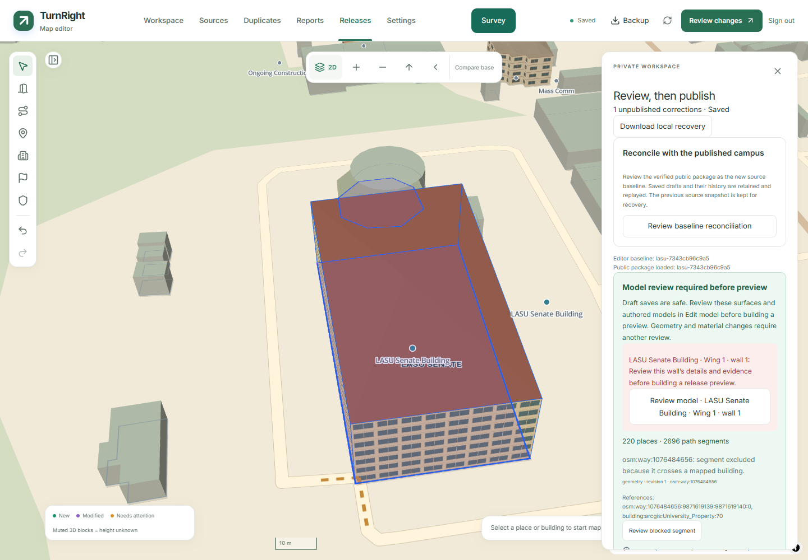

# Unified model editor

The building workspace brings architectural details, appearance, roofs, outlines and review into one draft. Open **Edit model** from a building inspector. Its read-only summary shows wings, recorded height/floors and review status; model forms live inside the workspace. Linked place photographs still belong to their building.

## Choose a surface

The workspace also supports [reference split, exterior curves, mesh editing and model files](MODEL-AUTHORING.md). **Reference split** keeps a photograph beside Orbit/Edit surface when the centre has at least 720 × 320 CSS pixels; its divider and preference are remembered. **Outline → Add wall** creates exterior boundaries, wings or courtyards. **Mesh** provides primitives, profiles, component selection and import/export while preserving the same canvas and history.

Use the searchable building hierarchy or the mapped-wall selector to choose a wing and wall. The workspace opens in **Orbit**. Selecting a part updates its properties without moving the camera. **Edit surface** aligns the same 3D canvas to the selected wall, roof or footprint; **Orbit** restores the previous camera position. If WebGL is unavailable, **Edit surface** automatically uses a 2D drawing with the same editing target, numeric fields, snapping and commands. Wall views face outside, including courtyard walls, and label their A → B or B → A direction. Numeric positions retain their original distance from A; vertical distances are measured from the model base. Selecting a surface or detail does not create a model-history entry.

Desktop uses an icon-toggle structure tree, centre viewport and a 360 px properties panel (320 px below 1200 px). The properties header stays visible while its form scrolls; fields stack at narrower widths. At widths up to 900 px, and on touch devices in short landscape viewports, the workspace gives the canvas the remaining screen. A labelled mode selector keeps Details, Appearance, Roof, Outline and Review reachable. Switch between **Orbit / Edit surface / Photo**. Changing layouts keeps the draft and selection.

**Choose wall** opens the searchable hierarchy. **Add**, **Edit** and **More** open one focused sheet at a time. Expand or collapse it with its labelled controls or drag its handle; **Done** closes the tools. The original **×** button beside Undo/Redo leaves the whole workspace and preserves unfinished inputs. Portrait tools sit below the preview; short landscape screens put a scrollable tool panel beside it. Focused fields expand the panel and scroll into view. Undo, Redo, mode selection and save status stay reachable. Fit-to-selection, reset and photograph zoom help with small details. Before/after comparison uses the building as it was when the workspace opened.

In **3D**, touch and hold a visible detail for about half a second to select it and open its action menu. Duplicate, copy, delete, lock and hide target the selected instance. Whole-row, group and pattern edits require an explicit tree selection. Dragging or adding a second finger cancels the hold and keeps orbit/pinch navigation available. Releasing a completed hold does not select again. Right-click and keyboard selection actions remain available.

The structure tree opens building and wing levels initially. Walls contain Details, Groups and Patterns; collection children reference existing details. Disclosure chevrons, search and selected-ancestor expansion keep the target reachable. Arrow keys navigate and expand, Home/End move to the first/last visible row, typing finds names, Enter selects, and Space toggles detail selection on the current wall. Clearing search restores the previous expansion state. Focus and selection have distinct styling.

## Place and repeat details

Generated and recorded window rows expand into individual windows in the structure tree. Clicking a window in 3D or Edit surface selects that occurrence without converting the wall or adding history. Move, resize, numeric edits, duplicate and delete affect that window. Its first edit preserves neighbours in compact rows and commits once; undo/redo restores the same identities. Explicit row and collection selection remains available for batch work.

Individual changes detach affected linked pattern members so they do not propagate unexpectedly or return during regeneration. Existing record and placement limits still apply; rejected input remains recoverable.

Supported wall details are windows, doors, columns, balconies, canopies, parapets, trim and surface text. These are visual primitives. A decorative door does not create a mapped entrance, walking connection, accessibility observation or vehicle permission.

1. Use **Add window**, **Add door** or another detail button to insert it immediately. Existing generated windows and trim are preserved in the same undoable action. **Preview editable layout** remains available when you want to inspect conversion first.
2. Select a detail on the wall, from the hierarchy or in 3D. Shift-click and a marquee allow multiple selections.
3. On mobile, tap to select, then choose **Move** or **Resize** explicitly. Dragging in selection mode pans. Two fingers pan/zoom; starting a second touch cancels an unfinished edit before navigation. On desktop, drag the selected detail or use its resize handle. **Edit** provides numeric position, dimensions and projection in metres, with decimal input and increment/decrement controls.
4. Choose a 0.01, 0.1 or 1 metre grid. Arrow keys nudge by that increment; Shift multiplies it by ten. Mobile Move also exposes directional nudges; holding a direction creates one command on release. Alt temporarily bypasses snapping during a gesture. Floor guides are illustrative estimates.
5. Complete a drag or finish a numeric field to create one undoable command. Escape cancels the gesture or restores the field. An empty or incomplete numeric field remains editable and is never converted to zero.

Open the **⋯ button on the selected detail**, right-click a detail in the wall/hierarchy/3D view, or press **Shift+F10** to open its actions. Duplicate, Copy, Paste/copy-to, Delete, Lock and Hide live here instead of occupying the properties form. **More → Selection actions** keeps them available when a sheet is open or the selection is hidden. Keyboard shortcuts include Ctrl/Cmd+D, C, V and A; text inputs retain normal text-editing behavior. Escape closes the menu without closing the workspace.

Duplicate makes independent copies with fresh identities. Copy/paste and copy-to-wall/building show a placement preview. Physical dimensions are retained across walls of different lengths; repositioning or scaling requires an explicit action. Invalid placements are highlighted rather than silently clipped. Mobile **Multi-select** provides named checkboxes and a canvas selection tool; overlapping details offer a named selection list.

**Ungroup** appears in selected-item actions for grouped details. An explicitly selected whole row also exposes **Detach instance**. Ordinary individual-window editing performs the necessary separation automatically; manual ungrouping is unnecessary. Both commands remain undoable. Groups, alignment, equal-gap distribution and horizontal mirroring work with selected details. Row/column patterns use explicit counts and metre spacing. Presets are named design copies; changing a preset does not update its earlier insertions. Hiding or locking a detail affects editing only, not the published model.

## Evidence and geometry changes

Illustrative details may be added without photographs and remain labelled as inferred. Observed details need a matching building photograph. Documented dimensions need measurement provenance. Copying a design to another building does not transfer photographic evidence or texture approval.

Use the photograph panel to compare the selected wall and align a texture with labelled corners. Mobile **Align texture** is separate from photo navigation: select a corner, then enable **Move corner**, or use **Edit alignment** for numeric coordinates. Enlarging or navigating the photo does not change the alignment. The original gallery image remains unchanged. Keep plain materials where the photograph does not establish an unobstructed, useful wall view.

Appearance controls retain building defaults and wing/wall overrides. Roof and outline modes use the existing geographic geometry and roof operations. Changing a footprint, wall length, roof or height can invalidate an assignment. Affected details remain available for placement review or rematching; they must not silently stretch onto a different wall.

**Appearance → Building height** edits the whole-building height, recorded floor count, approximate flag and source notes without leaving the workspace. These controls are separate from wing overrides. A missing floor count cannot be invented: enter the recorded value, or explicitly choose height in metres/unknown. Switching wall selectors keeps Appearance and Details on the same wall.

Select the building row, then Appearance, to edit whole-building height and floor defaults. Floor-count mode estimates height at 3 m per floor; selecting that mode without a count stays unfinished until a valid count is entered. Custom roof elevations previously held walls at their old height. **Adjust custom roof elevations with height** now scales the roof's vertical dimensions proportionally by default, flags its wall assignments for review and leaves detail dimensions unchanged. Turn it off to retain recorded roof elevations. **Fit inherited custom roofs** repairs an existing mismatch explicitly. Wings with their own height/floor settings are listed and retain their overrides until **Use building height** is chosen. The complete height/roof adjustment is undoable.

Roof and Outline align the shared model above the target, with automatic 2D fallback when needed; their coordinates and options stay in the focused sheet. Tap a point first and choose **Move point** for a gesture. Review lists changes and unresolved assignments, with actions to open the affected wall or height controls. Review the selected wall explicitly. Saving a draft does not approve every wall, and model review does not establish field-surveyed accuracy.

Adding, duplicating or changing details clears that wall's previous review. **Needs review** alone does not mean its geometry is invalid. Open the issue in Review, inspect the expanded **Evidence & wall review** section, then choose **Mark this wall reviewed**. Placement checks still reject details outside the wall; approval remains limited to that wall.

## Surface text

Use **Add text** on a wall or **Add roof text** in Roof properties. Edit the wording, dimensions, colour, weight and alignment. Wall lettering uses the existing position, resize, snapping, grouping and repetition controls. Roof lettering follows the roof planes across ridges and valleys; select and move its outlined label or enter longitude/latitude and rotation. Text renders locally, including offline, and remains plain text.

Each wing supports up to 20 roof labels. Wording is limited to 160 characters and four lines; roof labels must fit inside the wing and outside courtyard openings. Invalid input is recoverable and does not replace saved geometry. Labels use the existing model JSON, undo history and draft save flow, with no database migration. They become visible on the public model only when the owner publishes the reviewed map through the normal release workflow.

| Wall lettering | Roof lettering |
| --- | --- |
|  |  |

## Saving, undo and recovery

Completed commands use the editor's shared 100-action undo/redo history, optimistic save identities and conflict handling. Selection, camera movement and panel changes remain outside model history.

Unfinished numeric fields and pending roof/detail work use owner-scoped local recovery. Closing the workspace preserves that work; **Discard unfinished input** removes the unfinished values. A local save is distinct from a server-confirmed map draft. Resolve storage errors or conflicts before relying on a remote save. Offline editing cannot upload changes until the connection returns.

If an addition cannot save because of a placement or building validation error, it stays visible as an unfinished wall and recovers when reopened. Resolve the reported issue, then choose **Save unfinished wall**. **Check building height** opens the relevant controls. Rejected appearance values remain with their original building and wall when switching selections; they are not silently cleared or applied elsewhere.

Map-draft saves share one atomic queue. An invalid change to another feature can leave the whole batch saved locally; the save error names that feature and its kind. Repair the named feature through the explorer. The server does not accept a partial batch while silently discarding its invalid changes.

Conflict merging preserves removed wall assignments. If a removal competes with edits to that same wall, choose the complete version to retain. Older recovered drafts can contain an empty wall record: opening Edit model shows **Repair wall records**, with an undoable **Remove empty wall record** action. This removes only the empty entry. Incomplete records that contain observations or other data are preserved for recovery rather than silently discarded.

Installing an app update attempts a server save and then verifies local recovery. A validation error can remain for repair after updating, but failed recovery storage blocks installation so unfinished inputs and history are not lost.

Private names, groups, patterns and presets remain in draft JSON and are excluded from public downloads. Expanded authored models use immutable version-1 model documents referenced by drafts, with migration 012 and a newer-writer guard. Compatible readers and storage deploy before the writing client. Public package schemas 1–3 remain supported; authored materials, normals and textures are additive optional content. See [authoring storage and publication](MODEL-AUTHORING.md#save-review-and-publish).

## Review all recorded walls

In **Review**, choose **Mark all as reviewed** to approve eligible recorded wall assignments in this building together. Current geometry, wall matching and evidence are checked; blocked walls remain listed with their reasons. Finish or discard pending input first. Generated illustrative walls are not silently converted or approved. The batch is one undoable command and does not publish a release or establish field-surveyed accuracy.

## Publication

Use the normal owner preview, validation, publication and rollback workflow. Draft autosave and application deployment do not publish architectural changes. Full publication validation remains authoritative, including geometry, evidence, asset integrity and existing walking/driving restrictions.

The Releases panel checks façade reviews before enabling **Build review preview**. Each blocker names its building, wing and wall; **Review model** opens that exact wall in the workspace. A height or roof edit can invalidate placement review even when the footprint is unchanged. Inspect the retained metre positions and evidence, then **Mark this wall reviewed**. This clears only the selected wall's review flag and remains undoable. A moved or reassigned wall also requires an explicit wall match. Invalid placements still require repair; reviewing does not invent measurements or approve other walls.

Older failed releases keep their original error records. After repairing the current draft, build a new immutable preview rather than trying to publish a failed or stale one.

If the building change itself should be undone, close the workspace and choose **Restore published building** in its inspector. The proposed repair is reviewed before application and can be undone. It restores only that building's saved correction from the current published release; other features and private unfinished inputs remain available.

The workspace is lazy-loaded and included in prepared offline installations. The renderer retains batched materials, bounded texture loading, explicit disposal and the Simple 3D fallback. Continuous gestures update the editing canvas; completed actions request model regeneration, with one active request and only the newest pending request retained.
