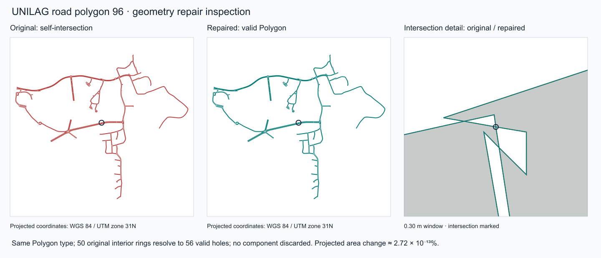

# UNILAG detail and evidence coverage · 30 September 2026

The detail upgrade uses LASU's shared map palette, labels, place icons and 2D/3D presentation while retaining UNILAG's geography and existing route permissions. [Production receipt](PRODUCTION.md) records the actual published version and asset checks.

## Coverage

| Measure | Before | Reviewed release |
| --- | ---: | ---: |
| Map features | 3,646 | 3,928 |
| Buildings | 629 | 723 |
| Destinations | 71 | 116 |
| Road surfaces | 0 | 179 |
| Photographs | 0 | 16, covering 11 buildings |
| Additional landscape polygons | — | 9 |
| Existing private corrections | 188 | All retained |

The 94 additional building footprints come from the downloaded OSM extract. Acceptance requires containment in both the OSM campus boundary and the existing published extent, separation from the detailed survey, minimum area, and no intersection with existing road centrelines. Shifted/overlapping footprints remain review candidates. Existing destinations retain their IDs and coordinates. New destinations have an unmapped arrival state unless independently connected; no route is invented.

All 2,425 existing vegetation features remain available. Classification distinguishes trees, hedges, shrubs, greenspaces, water, parking and sports grounds. Parcels draw subtly beneath more specific geometry. Existing path classes and street names gain display mappings without altering access or graph topology.

Ten footprint-bound architecture references add observed colours, facade/roof notes and conservative model settings. The prepared model build contains 4 detailed, 7 simplified and 712 illustrative extrusion records. The owner's Engineering model is retained. Model detail is not a survey of hidden elevations or precise dimensions.

## Road-width acceptance

The original `Road width.geojson.json` is 748,261 bytes, SHA-256 `82659e26dcbeb4a8829b18fb14c2aa264bec6c877710147aac3ded1125d087b4`. Its exact bytes and raw attributes are preserved in private campus-import storage and verified by read-back. The public patch contains only mapped application properties.

| `NAME` classification | Features |
| --- | ---: |
| Drive-Paved + Tarred-Road | 80 |
| Drive-Unpaved + Untarred-Road | 24 |
| Sidewalk | 75 |
| Total, identified by `OBJECTID_1` | **179** |

Source identity is `bd74d5cc-2b8d-4d42-977a-00165dc70b7e`; accepted layer identity is `UNILAG Road width`. Every ID from 1 through 179 has a valid, nonempty public geometry. Multipart geometry and holes use the same component-preserving importer.

Feature **96** originally self-intersects near 3.39490293674406, 6.51373591493023. Shapely's linework repair returns a valid Polygon, discards no component and changes projected area by approximately **2.72 × 10⁻¹³%**. Its 50 original interior rings resolve to 56 valid holes: the repair splits intersecting rings without filling their empty areas. The receipt retains its original geometry hash, invalidity reason, before/after area and validity, output type and actions. Winding normalization is recorded separately. [Machine-readable receipts](../data/unilag-enrichment/coverage.json).

The inspection compares the complete polygon and a 30 cm window around the reported intersection in WGS 84 / UTM zone 31N. The repair retains the campus-wide road shape; the area threshold uses the importer's local equal-area projection.

Road polygons draw above landscape and below buildings, routes and labels. The client derives clipped centreline display geometry, retaining segments outside the surfaces and inside holes. It never changes the source paths or graph. The prepared effective graph hash is `12551b2a9daa618d4f6d9eb6db1713a70542e69c9879d09c0c409139e653fb26` before and after enrichment.

## Sources reviewed

- Existing accepted ArcGIS survey layers: detailed footprints, roads, parcels, greenspace and the complete Greenland layer. The truncated 1,000-feature Greenland upload was excluded; the accepted 2,425-feature source remains authoritative.
- The downloaded **UNILAG-Akoka-2026-09-27** ArcGIS/OSM bundle: preferred ArcGIS layers, detailed OSM way candidates, tagged point candidates and relation references. Broad ArcGIS building polygons often represent whole compounds; they were not substituted for individual footprints. [Reproduction guide](UNILAG-DOWNLOADS.md).
- Current official university/library notices and historical records, listed below. They inform names and evidence gaps; they do not grant access permissions or a photo reuse licence.
- 115 Wikimedia Commons candidates from seven searches. Sixteen reusable exterior/context photographs were selected. Unrelated institutions, portraits, events, unclear building associations and unsuitable interior/context views were not selected. Every candidate has a disposition in [photo-review.json](../data/unilag-enrichment/photo-review.json).

The [candidate ledger](../data/unilag-enrichment/coverage.json) accounts for 315 included, 172 matched, 110 reference-only, 686 needing review, 13,850 outside-campus, 12 covered by existing landscape and 65 outside the reviewed relation coverage. These are source-candidate dispositions, not unique output feature counts: matching place sources and road surfaces are included. The unusually large outside-campus group comes from OSM relation expansion in the downloaded extract. Node-only locations and incomplete compound associations are held for review rather than promoted automatically.

Reproduce the additive patch with `scripts/enrich_unilag.py`, the original downloads and the captured baseline, followed by `scripts/unilag-building-evidence.mts`. Raw files remain private. `changes.json` contains the mapped additive patch; `coverage.json` contains the complete candidate ledger and repair diagnostics. Preparation validates the current private corrections as well as the public baseline, preserves a private rollback snapshot, and refuses a changed baseline.

## Architecture and unresolved conflicts

| Building / group | Supported detail | Remaining uncertainty |
| --- | --- | --- |
| Senate | Identifiable cream concrete frame, dark glazing and red-brown sun screens; architect describes 14 storeys | Sources report 11–14 using differing conventions. The 42 m display estimate uses 3 m/floor; lower wings/chambers and stepped tower massing need measured treatment. |
| Faculty of Arts | Six visible upper window bands plus ground in the reviewed dated facade view; approximate palette | OSM says four levels; a tender calls it six-storey. The 7-level display estimate applies to the photographed main block; wings need verification. |
| CITS | Three visible levels, yellow walls and red-brown bands | Metre height, rear facade and roof construction unknown. |
| Faculty of Education | Two visible levels and vertical sunshades | Auxiliary-wing heights and current finish unknown. |
| Main Library | Fins, deep canopy and signed identity; three credited reference views | Parcel label points toward small building 97; association uses footprint 96 and identifiable facade. The library FAQ mentions a third floor, not a full floor schedule. Height remains illustrative. |
| Akintunde Ojo Memorial Hall | Signed glazed facade and roof planes | Overhang dimensions and complete heights unknown. |
| Afe Babalola Auditorium | Pale walls, glazing and red pitched roof | Gable is approximate; ridge, pitch and eave height need a roof plan. |
| Engineering | Existing authored model retained; exterior reference added | Courtyard photo does not resolve each wing's dimensions. |
| Science / Management Sciences | Identifiable facade references and colours | Floor totals, roof construction and obscured elevations unknown. |
| Jaja / Moremi / other halls | Names/aliases reconciled where identity is supported; dated Jaja context photo | Makama Bida, Eni Njoku and Shodeinde assignments conflict. High-rise A/B/C pins and footprints are shifted; no automatic association. |
| Medical centre, worship buildings, main auditorium | Landmark names/categories and supported footprint associations reviewed | No confidently reusable matched exterior references in the searched set for several buildings; illustrative treatment retained. |

The 2005 survey table grades **building condition**, not floor count. It is used for historical names only. Official images are not republished without a usable licence. Every unknown building retains an explicit illustrative height; gaps are not filled to reach LASU's counts.

### Factual references

- [UNILAG Library FAQ](https://library.unilag.edu.ng/?page_id=1609): third-floor e-library reference; no complete floor schedule.
- [Remodelled Main Library lobby and makerspace](https://unilag.edu.ng/from-vision-to-reality-unveiling-the-newest-hit-place-on-campus-the-remodelled-unilag-main-library-lobby-and-makerspace/): identity/current use; no access inference.
- [University accommodation update](https://unilag.edu.ng/important-notice-student-accommodation-update/) and [movement into halls](https://unilag.edu.ng/important-notice-update-on-movement-into-halls-of-residence/): residence names and historical operational context.
- [James Cubitt Architects' Senate reference](https://www.linkedin.com/posts/james-cubitt-architects_jamescubittarchitects-throwbackthursday-activity-7480199015004037120-Eema): architect's 14-storey description, retained alongside conflicting sources.
- [Senate facade study](https://www.ijstr.org/final-print/mar2020/Shapes-And-Aesthetic-Perception-A-Case-Study-Of-University-Of-Lagos-Senate-Building-Faade.pdf): architectural reference and conflicting total-height context.
- [Official university report mentioning the 11th floor](https://unilag.edu.ng/seeing-this-here-i-can-say-that-this-is-good-dr-senator-mamora-declares-at-commissioning-of-nceec-administrative-building-in-unilag/): does not resolve all counting conventions.
- [Faculty of Arts procurement notice](https://www.library.procurementmonitor.org/backend/files/Invitation%20for%20Pre-Qualification%20Exercise%20at%20University%20of%20Lagos%2C%20Nigeria%20june%202014.pdf): six-storey wording retained as a conflict.
- [New geosciences centre](https://unilag.edu.ng/energy-giants-combine-to-gift-unilag-geosciences-centre-of-excellence/): published level description includes a semi-basement, but the footprint is not confidently matched; no automatic addition.

## Photographs and attribution

The 16 WebP derivatives total 3,494,520 bytes and retain per-image CC BY-SA 4.0 author/source/licence records. They cover Senate, Main Library, Akintunde Ojo, Arts, CITS, Afe Babalola, Education, Engineering, Science, Management Sciences and Jaja. Captions identify dated/historical views; Jaja's image is context, not a complete elevation.

[Accepted photo metadata](../data/unilag-enrichment/photos.json) · [All candidate dispositions](../data/unilag-enrichment/photo-review.json) · [Architecture records](../data/building-evidence.json) · [Source attribution](../data/ATTRIBUTION.md).

## Verification and limits

The release tests require 179 distinct road identities, expected classifications, valid/nonempty additions, the feature-96 repair receipt and complete candidate accounting. Display clipping tests include holes and uncovered road sections; land/overlay edits must leave routing unchanged. Production preparation checks every existing draft, retains the Engineering model and compares LASU's source/draft hashes before and after.

Browser verification covers both campuses, desktop/mobile, light/dark, 2D/3D, photos and offline packages. Driver checks use the actual pinned GIS image. See [Production](PRODUCTION.md) for results and release identifiers. Physical campus access, actual dimensions, current signage, native device keyboards and real GPS conditions remain separate field/device checks.
